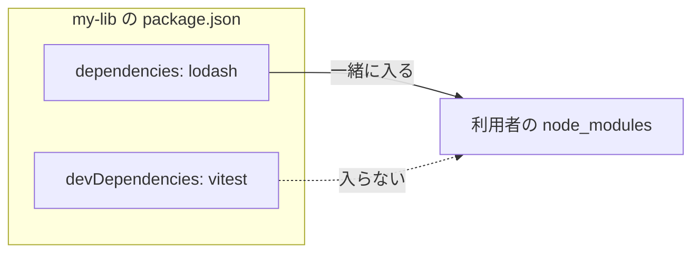
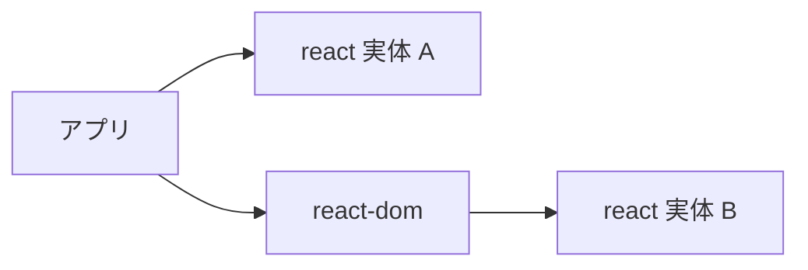
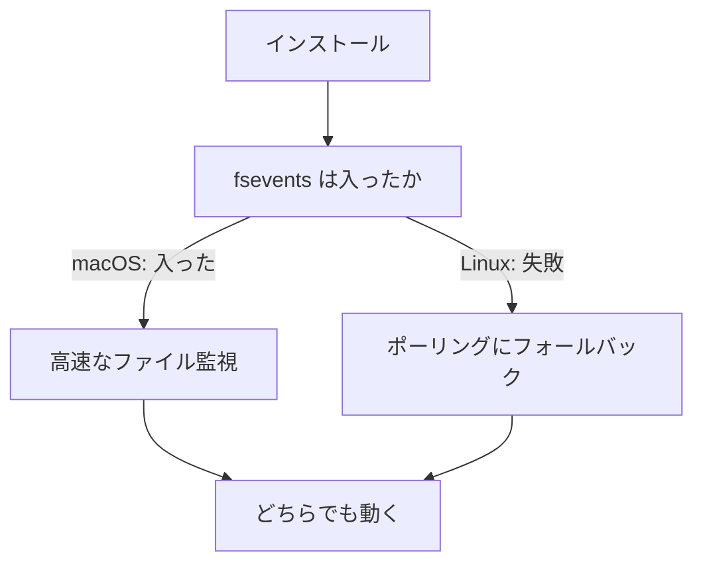

# 2. package.json — 依存の宣言とバージョン範囲

[1章](/basics/01-what-is-a-package-manager)の実験で、`npm install left-pad` が package.json に `"left-pad": "^1.3.0"` と書き込むのを見ました。なぜ `1.3.0` ちょうどではなく `^` 付きなのでしょうか。そもそも、この 1 行はどこに書かれるべきなのでしょうか。

この章で扱うのは、package.json という 1 枚のファイルが担う **2 つの役割**です。1 つは `^` や `~` が表す「**どのバージョンを許すか**」、もう 1 つは dependencies / devDependencies / peerDependencies / optionalDependencies という「**どういう性質の依存か**」。前者がバージョンの軸、後者が置き場所の軸で、この 2 つが揃って初めて 1 つの依存が宣言されます。

::: tip この章でわかること
- package.json の主要フィールドの役割を説明できる
- セマンティックバージョニングの 3 つの数字の意味を説明できる
- `^1.2.3` と `~1.2.3` がそれぞれ許すバージョンの範囲を読み取れる
- dependencies / devDependencies / peerDependencies / optionalDependencies を使い分けられる
- peerDependencies が必要な理由と、`ERESOLVE` / `unmet peer` の読み方がわかる
- lifecycle スクリプト(pre / post / postinstall)の仕組みを説明できる
:::

## package.json はプロジェクトのマニフェスト

package.json は、プロジェクトの**マニフェスト(積荷目録)** です。船の積荷目録に「何をどれだけ積んでいるか」が書かれているように、package.json には「このプロジェクトは何者で、何に依存し、どんなコマンドを持つか」が書かれています。1 章で見た「解決」の工程は、必ずこのファイルを読むところから始まります。

主要なフィールドを見てみましょう。

```json
{
  "name": "my-app",
  "version": "1.0.0",
  "scripts": {
    "dev": "vite",
    "build": "vite build",
    "test": "vitest"
  },
  "dependencies": {
    "react": "^19.2.8"
  },
  "devDependencies": {
    "vite": "^8.2.2",
    "vitest": "^4.1.11"
  }
}
```

- **name / version**: パッケージとしての名前とバージョン。レジストリに publish する場合は世界で一意な名前が必要ですが、アプリ開発では識別用のラベル程度の意味です。
- **scripts**: `npm run dev` のように呼び出せるコマンドの登録簿。詳しくはこの章の後半で扱います。
- **dependencies 系**: 依存パッケージの一覧。実は 4 種類あり、これもこの章の後半で整理します。

大事なのは、dependencies に書かれているのが**具体的なバージョンではなく「要求の範囲」**だという点です。`^19.2.8` は「19.2.8 ちょうど」ではなく「ある条件を満たすバージョンのどれか」を意味します。その読み方の前提となるのが、次のセマンティックバージョニングです。

## セマンティックバージョニング — 3 つの数字の約束

npm の世界のバージョン番号は、**セマンティックバージョニング(Semantic Versioning、通称 semver)**という規約に従います。`MAJOR.MINOR.PATCH` の 3 つの数字で、それぞれ上げる条件が決まっています。

<figure>
  
  <figcaption><span class="fig-num">図 2-1</span> semver の 3 つの数字の意味</figcaption>
</figure>

<!-- 図 2-1 の生成プロンプト(採用版・ページには出しない)

STYLE PRESET (apply exactly; keep consistent with all previous diagrams in this series):
Flat 2D vector infographic in a minimal technical-illustration style. Landscape orientation (3:2).
Pure white background (#FFFFFF). Limited palette: near-black ink #1C1E21 for text and outlines,
blue #2563EB as the single primary accent, light gray #E2E8F0 for container boxes,
orange #F59E0B for highlights only. Uniform medium-weight rounded strokes, simple geometric
icons, generous white space, clear visual hierarchy.
No gradients, no shadows, no 3D, no textures, no photorealism, no decorative background elements.
All labels in English, short (1-3 words), bold sans-serif, high contrast, perfectly legible.
Render every quoted label verbatim, exactly once, with no extra, invented, or duplicated text.
No text other than the labels listed below.

DIAGRAM CONTENT:
LAYOUT: Two horizontal bands. The upper band shows one large version number centered as three
big digits separated by two dots, all on the same baseline. The lower band has three equally
sized rounded rectangles, evenly spaced, each horizontally centered directly below its
corresponding digit. One short vertical line connects each digit straight down to the box below it.
ELEMENTS:
- Upper band: the three digits are "1" in orange, "2" in blue, "3" in near-black, separated by
  two near-black dots, rendered large as one version number
- Lower left box (orange outline, white fill) with two lines of text: "MAJOR" then "breaking change"
- Lower center box (blue outline, white fill) with two lines of text: "MINOR" then "new feature"
- Lower right box (light gray fill) with two lines of text: "PATCH" then "bug fix"
ARROWS: exactly three short plain vertical lines, no arrowheads, each connecting one digit
straight down to the box directly beneath it. No other lines or connectors anywhere.
-->

- **MAJOR(1 桁目)**: 互換性を壊す変更(breaking change)をしたら上げる。利用者のコード修正が必要になるかもしれない合図。
- **MINOR(2 桁目)**: 後方互換な機能追加をしたら上げる。既存コードはそのまま動くはず。
- **PATCH(3 桁目)**: 後方互換なバグ修正をしたら上げる。

つまりバージョン番号は単なる連番ではなく、**「この更新を取り込んでも安全か」を機械が判定できるようにした通信規約**です。「MINOR と PATCH なら壊れないはず」という約束があるからこそ、次に見る「範囲指定」が成立します。

なお、この約束はあくまで公開者の自己申告です。MINOR アップデートのつもりが実際にはバグを含んでいた、という事故は現実に起こります。この「約束は破られうる」という点が、[4章](/basics/04-lockfiles)で見るロックファイルの存在理由につながります。

## `^` と `~` — 範囲指定の読み方

では、1 章のインストールで自動追記された `^1.3.0` の `^` は、正確にはどこまでの更新を許すのでしょうか。semver の約束を前提に、package.json では「どこまでの更新を自動で受け入れるか」を記号で指定します。代表は `^`(キャレット)と `~`(チルダ)の 2 つです。

<figure>
  
  <figcaption><span class="fig-num">図 2-2</span> <code>^1.2.3</code> と <code>~1.2.3</code> が許す範囲の数直線</figcaption>
</figure>

<!-- 図 2-2 の生成プロンプト(採用版・ページには出しない)

STYLE PRESET (apply exactly; keep consistent with all previous diagrams in this series):
Flat 2D vector infographic in a minimal technical-illustration style. Landscape orientation (3:2).
Pure white background (#FFFFFF). Limited palette: near-black ink #1C1E21 for text and outlines,
blue #2563EB as the single primary accent, light gray #E2E8F0 for container boxes,
orange #F59E0B for highlights only. Uniform medium-weight rounded strokes, simple geometric
icons, generous white space, clear visual hierarchy.
No gradients, no shadows, no 3D, no textures, no photorealism, no decorative background elements.
All labels in English, short (1-3 words), bold sans-serif, high contrast, perfectly legible.
Render every quoted label verbatim, exactly once, with no extra, invented, or duplicated text.
No text other than the labels listed below.

DIAGRAM CONTENT:
LAYOUT: Two horizontal number lines stacked vertically, one above the other, sharing exactly
the same length, the same left edge, and the same three tick positions so the two rows can be
compared by eye. Each row has its title on the far left, outside the line. A thick blue bar sits
directly on top of each line, spanning only the allowed range.
ELEMENTS:
- Both number lines have three ticks at the same horizontal positions, labeled below the line:
  "1.2.3" at the left tick, "1.3.0" at the middle tick, "2.0.0" at the right tick
- Top row: title "^1.2.3" on the far left. Its blue bar starts at the "1.2.3" tick and ends just
  before the "2.0.0" tick, so the bar covers the middle tick. A small orange X sits on the
  "2.0.0" tick.
- Bottom row: title "~1.2.3" on the far left. Its blue bar starts at the "1.2.3" tick and ends
  just before the "1.3.0" tick, so the bar stops before the middle tick. A small orange X sits
  on the "1.3.0" tick.
ARROWS: none. No other lines or connectors anywhere in the diagram.
-->

- **`^1.2.3`(キャレット)**: MAJOR を固定し、MINOR と PATCH の更新を許す。つまり `1.2.3` 以上 `2.0.0` 未満。「互換性が保たれる範囲で最新を使う」という意味で、`npm install` の既定はこれです。
- **`~1.2.3`(チルダ)**: MINOR まで固定し、PATCH の更新だけを許す。つまり `1.2.3` 以上 `1.3.0` 未満。より保守的な指定です。
- **`1.2.3`(記号なし)**: そのバージョンちょうどに固定(ピン留め)。

2 つの違いは、具体的なバージョンを範囲に当てはめてみると一目でわかります。

| 指定 | 意味する範囲 | 1.2.4 は | 1.3.0 は | 1.9.9 は | 2.0.0 は |
| --- | --- | :-: | :-: | :-: | :-: |
| `^1.2.3` | 1.2.3 以上 2.0.0 未満 | 許す | 許す | 許す | 拒む |
| `~1.2.3` | 1.2.3 以上 1.3.0 未満 | 許す | 拒む | 拒む | 拒む |
| `1.2.3` | 1.2.3 のみ | 拒む | 拒む | 拒む | 拒む |

覚え方は「`^` は MAJOR だけ守る、`~` は MINOR まで守る」。このほか `>=1.2.0 <2.0.0` のような不等号や、`1.2.x` のようなワイルドカードも書けますが、実務で目にするのはほぼ `^` です。

この判定は手元で確かめられます。semver の判定ロジックそのものが `semver` というパッケージとして公開されており(npm 自身も内部でこれを使っています)、CLI として実行できます。渡したバージョンのうち、範囲を満たすものだけが表示されます。

<TermDemo
  title="zsh — semver 範囲の判定を確かめる"
  :lines="[
    { cmd: 'npx semver -r \'^1.2.3\' 1.2.4 1.3.0 1.9.9 2.0.0' },
    { out: '1.2.4' },
    { out: '1.3.0' },
    { out: '1.9.9' },
    { pause: 400 },
    { cmd: 'npx semver -r \'~1.2.3\' 1.2.4 1.3.0 1.9.9 2.0.0' },
    { out: '1.2.4' },
    { pause: 400 },
    { cmd: 'npx semver -r \'^0.2.3\' 0.2.4 0.3.0' },
    { out: '0.2.4' },
  ]"
/>

```sh
$ npx semver -r '^1.2.3' 1.2.4 1.3.0 1.9.9 2.0.0
$ npx semver -r '~1.2.3' 1.2.4 1.3.0 1.9.9 2.0.0
$ npx semver -r '^0.2.3' 0.2.4 0.3.0
```

(初回は `npx` がパッケージ取得の確認を求めることがあります。y で進めてください)

最後の `^0.2.3` の結果に注目してください。表の規則(MAJOR だけ守る)なら 0.3.0 も通るはずなのに、**弾かれています**。

::: warning つまずきポイント: 0.x 系では `^` の意味が変わる
MAJOR が 0 のバージョン(`0.x.y`)は「まだ何が壊れるかわからない開発版」という扱いで、互換性の約束の対象外です。そのため `^` の解釈も変わります。正確な規則は「**一番左にあるゼロでない数字を固定する**」です。

- `^1.2.3` → `1.2.3` 以上 `2.0.0` 未満(1 を固定)
- `^0.2.3` → `0.2.3` 以上 `0.3.0` 未満(2 を固定。**0.3.0 は含まない**)
- `^0.0.3` → `0.0.3` のみ(3 を固定)

「`^` を付けているのに更新が全然入らない」「0.x のライブラリが MINOR 更新で壊れた」と感じたら、まずここを疑ってください。
:::

::: info なぜ既定が「固定」ではなく `^` なのか
固定すればズレは起きませんが、バグ修正やセキュリティ修正も自動では入らなくなり、数十〜数百の依存を手で上げ続ける羽目になります。`^` は「semver の約束を信頼して、安全なはずの更新は自動で受け取る」という、利便性側に倒したトレードオフです。そして、その信頼だけでは足りない部分を補うのが 4 章のロックファイルです。
:::

## 依存の 4 つの置き場所 — 全体像

dependencies 系のフィールドは 4 種類あります。どれに書くかで「いつ・誰の環境にインストールされるか」が変わります。

<figure>
  
  <figcaption><span class="fig-num">図 2-3</span> dependencies の種類マップ</figcaption>
</figure>

<!-- 図 2-3 の生成プロンプト(採用版・ページには出しない)

STYLE PRESET (apply exactly; keep consistent with all previous diagrams in this series):
Flat 2D vector infographic in a minimal technical-illustration style. Landscape orientation (3:2).
Pure white background (#FFFFFF). Limited palette: near-black ink #1C1E21 for text and outlines,
blue #2563EB as the single primary accent, light gray #E2E8F0 for container boxes,
orange #F59E0B for highlights only. Uniform medium-weight rounded strokes, simple geometric
icons, generous white space, clear visual hierarchy.
No gradients, no shadows, no 3D, no textures, no photorealism, no decorative background elements.
All labels in English, short (1-3 words), bold sans-serif, high contrast, perfectly legible.
Render every quoted label verbatim, exactly once, with no extra, invented, or duplicated text.
No text other than the labels listed below.

DIAGRAM CONTENT:
LAYOUT: A 2x2 grid of four equally sized rounded rectangles, evenly spaced, with generous gaps
between them. Each box contains two lines of text, centered: a title on the first line and a
short descriptor on the second line, plus one small icon above the text.
ELEMENTS:
- Top left box, blue fill with white text, icon of a box being shipped, first line
  "dependencies", second line "ships to users"
- Top right box, light gray fill, icon of a wrench, first line "devDependencies", second line
  "your machine only"
- Bottom left box, light gray fill, icon of a handshake, first line "peerDependencies", second
  line "host provides"
- Bottom right box, light gray fill with an orange outline, icon of a question mark, first line
  "optionalDependencies", second line "may fail"
ARROWS: none. No other lines or connectors anywhere in the diagram.
-->

- **dependencies**: アプリの実行そのものに必要なもの(react、express など)。あなたのパッケージを誰かがインストールしたとき、一緒にインストールされます。
- **devDependencies**: 開発・ビルド・テストにだけ必要なもの(vite、vitest、eslint など)。自分のプロジェクトで `npm install` すれば入りますが、あなたのパッケージの利用者には入りません。`npm install --save-dev`(短縮形 `-D`)でここに追加されます。
- **peerDependencies**: 「私はこれと**一緒に**使われる前提です。ただし実体は利用者側が用意してください」という宣言。実体はインストールされず、要求だけが表明されます。
- **optionalDependencies**: 入れば使うが、インストールに失敗しても全体を止めないもの。OS 依存の高速化モジュールなどに使われます。

アプリ開発での使い分けはシンプルに、「本番コードが `import` するものは dependencies、それ以外は devDependencies」と覚えておけばほぼ困りません。**アプリを書いているだけなら、自分で peerDependencies を書く場面はまずありません**。

——とはいえ、この 1 行で片づけると必ず引っかかるものが 2 つあります。「peerDependencies って結局なんだっけ?」という疑問と、インストール時に流れてくる `unmet peer` の警告です。以降でこの 2 つを、実際に手を動かしながらほどいていきます。

## dependencies と devDependencies を分ける本当の理由

まず前提の確認です。なぜ 2 つに分かれているのでしょうか。答えは「**依存は伝染するが、devDependencies は伝染しない**」からです。

あなたが作った `my-lib` が dependencies に lodash を、devDependencies に vitest を持っているとします。誰かが `npm install my-lib` すると、lodash は一緒に降ってきますが、vitest は来ません。vitest はあなたが `my-lib` を開発するときにだけ必要なもので、`my-lib` を**使う**人には無関係だからです。



この「伝染するかどうか」が判断基準です。判断に迷ったら「**このコードは、利用者の環境で実行されるか?**」と問い直してください。TypeScript の型定義(`@types/*`)が devDependencies でよいのも、型はビルド時に消えて実行時には存在しないからです。

::: warning つまずきポイント: アプリでは区別しなくても「動いてしまう」
アプリ(publish しないプロジェクト)では、`npm install` が両方とも入れてくれるため、**間違った場所に書いても手元では普通に動きます**。困るのは本番デプロイのときです。`npm install --omit=dev`(旧 `--production`)や多くの Docker ビルドは devDependencies を除外するため、そこで初めて「本番にだけモジュールが無い」と発覚します。手元で動くことは、置き場所が正しい証拠にはなりません。
:::

## peerDependencies — 「あなたが持っている方を使わせて」

では本題です。peerDependencies は何のためにあるのでしょうか。

**普通の依存では困る場面がある**からです。具体例で考えます。`react-dom` は React でブラウザに描画するためのパッケージで、当然 React 本体を必要とします。ではなぜ `react-dom` は react を dependencies に書かないのでしょうか。実際に見てみましょう。

<TermDemo
  title="zsh — react-dom が react をどう要求しているか"
  :lines="[
    { cmd: 'npm view react-dom peerDependencies' },
    { out: '{ react: \'^19.2.8\' }' },
  ]"
/>

```sh
$ npm view react-dom peerDependencies
```

```
{ react: '^19.2.8' }
```

dependencies ではなく **peerDependencies** に入っています。もしこれが dependencies だったら何が起きるか。3 章で詳しく見ますが、npm は依存が競合したとき「それぞれの中に別々のコピーを入れる」ことで解決します。つまり、あなたのアプリの react と、react-dom が抱え込んだ react の**2 つの React が同時に存在する**状態になりえます。

もし dependencies だったら、react の実体が 2 つに分かれます。



peerDependencies なら、react-dom は要求を表明するだけなので実体は 1 つに保たれます。


React は内部にグローバルな状態(現在レンダリング中のコンポーネント、フックの呼び出し位置など)を持っています。実体が 2 つあると、アプリが実体 A のフックを呼び、react-dom が実体 B を見て描画する、という食い違いが起きます。これが有名な「Invalid hook call」エラーの主要因の 1 つで、React 公式も原因として「アプリ内に React のコピーが 2 つある」ことを挙げています。

peerDependencies はこれを防ぎます。「**私は react を使うが、実体は持ち込まない。あなた(利用者)の react を使わせてほしい**」——これが peer(同僚・対等な隣人)という名前の意味です。ホストが 1 つだけ持っているものを、プラグイン側が共有して使う。

::: info どんなときに peerDependencies を書くのか
自分がパッケージを publish する側になったとき、次の 3 つに当てはまるなら peerDependencies です。

1. **プラグイン・アドオンである**(`eslint-plugin-*`、`vite-plugin-*`、`@vitejs/plugin-react` など。ホストが読み込んで動かす)
2. **相手がシングルトンでなければ壊れる**(react、vue のようにグローバル状態やコンテキストを持つもの)
3. **利用者がすでに持っているのが自然**(eslint プラグインを入れる人は必ず eslint を持っている)

実例として `eslint-plugin-react` の peerDependencies は `eslint: '^3 || ^4 || ^5 || ^6 || ^7 || ^8 || ^9.7'` です。`||` で複数のメジャーを並べて「この範囲のどれでも動きます」と表明しています。peerDependencies の範囲は**広く取るのが作法**です。狭くすると、利用者側の更新をプラグインが妨げてしまうからです。
:::

## 実験: peer が合わないとどうなるか

「バージョンが合わない場合」は、ツールによって挙動がはっきり違います。文章で読むより見た方が早いので、**わざと壊れた組み合わせ**を作ります。react 18 と、react 19 を要求する react-dom 19 を並べます。

```json
{
  "name": "peer-demo",
  "version": "1.0.0",
  "dependencies": {
    "react": "^18.3.1",
    "react-dom": "^19.2.0"
  }
}
```

npm でインストールすると、**インストール自体が失敗**します。

<TermDemo
  title="zsh — npm は peer 不一致をエラーにする"
  :lines="[
    { cmd: 'npm install' },
    { pause: 500 },
    { out: 'npm error code ERESOLVE' },
    { out: 'npm error ERESOLVE unable to resolve dependency tree' },
    { out: 'npm error' },
    { out: 'npm error While resolving: peer-demo@1.0.0' },
    { out: 'npm error Found: react@18.3.1' },
    { out: 'npm error node_modules/react' },
    { out: 'npm error   react@^18.3.1 from the root project' },
    { out: 'npm error' },
    { out: 'npm error Could not resolve dependency:' },
    { out: 'npm error peer react@^19.2.8 from react-dom@19.2.8' },
  ]"
/>

```sh
$ npm install
```

```
npm error code ERESOLVE
npm error ERESOLVE unable to resolve dependency tree
npm error
npm error While resolving: peer-demo@1.0.0
npm error Found: react@18.3.1
npm error node_modules/react
npm error   react@"^18.3.1" from the root project
npm error
npm error Could not resolve dependency:
npm error peer react@"^19.2.8" from react-dom@19.2.8
npm error node_modules/react-dom
npm error   react-dom@"^19.2.0" from the root project
npm error
npm error Fix the upstream dependency conflict, or retry
npm error this command with --force or --legacy-peer-deps
npm error to accept an incorrect (and potentially broken) dependency resolution.
```

この `ERESOLVE` は、npm を使っていれば必ず一度は出会うエラーです。**読み方さえ分かれば怖くありません**。`Found:` が「いま入れようとしている実体」、`Could not resolve dependency:` の `peer ...` が「誰が何を要求しているか」です。上の例なら「react 18.3.1 を入れようとしたが、react-dom 19.2.8 が react ^19.2.8 を要求している」と読めます。原因のパッケージと必要なバージョンが、そのまま書いてあります。

同じ package.json を pnpm でインストールすると、結果が変わります。

<TermDemo
  title="zsh — pnpm は警告して先に進む"
  :lines="[
    { cmd: 'pnpm install' },
    { pause: 500 },
    { out: 'Packages: +5' },
    { out: 'Progress: resolved 5, reused 5, downloaded 0, added 5, done' },
    { out: '' },
    { out: 'dependencies:' },
    { out: '+ react 18.3.1 (19.2.8 is available)' },
    { out: '+ react-dom 19.2.8' },
    { out: '' },
    { out: '[WARN] Issues with peer dependencies found. Run pnpm peers check to list them.' },
  ]"
/>

pnpm は**エラーにせず警告に留め、インストールを完了します**。何が問題なのかは `pnpm peers check` で確認できます。

```sh
$ pnpm peers check
```

```
Issues with peer dependencies found

✕ unmet peer react
  Installed: 18.3.1
  Wanted:
    ^19.2.8:
      react-dom@19.2.8
```

`Installed`(実際に入ったもの)と `Wanted`(誰が何を求めているか)が分かれていて、npm の ERESOLVE と同じ情報がより読みやすい形で出ています。

::: warning つまずきポイント: `--force` と `--legacy-peer-deps` は「解決」ではない
ERESOLVE に出くわしたとき、エラーメッセージが案内するとおり `--legacy-peer-deps` を付ければインストールは通ります。実際、先ほどの壊れた組み合わせも `npm install --legacy-peer-deps` なら `added 5 packages` で完了します。

しかしこれは、npm 7 より前の「peerDependencies を単に無視する」挙動に戻すオプションです。**矛盾は消えておらず、検出をやめただけ**で、実行時に「Invalid hook call」のような形で表面化します。使ってよいのは「古いライブラリが peer 範囲を更新していないだけで、実際には動くと分かっている」場合に限ります。一時しのぎとして使うなら、なぜ必要かをコメントに残しておくのが安全です。

本来の対処は、エラーが名指ししたパッケージのバージョンを揃えることです。上の例なら react を 19 に上げるか、react-dom を 18 に下げるかの二択です。
:::

**なぜツールで挙動が違うのか**は、npm 自身の歴史がそのまま理由になっています。npm 3〜6 では peerDependencies は警告のみで自動インストールされず、npm 7 で「自動インストール+不一致はエラー」に変わりました。厳格になった結果、**古いライブラリを使うと大量に ERESOLVE が出る**という副作用も生まれました。この経緯は 5 章で扱います。

## optionalDependencies — 失敗してもいい依存

4 つ目は optionalDependencies です。「入れば使うが、入らなくても止まらない」もので、代表例は **OS 固有のネイティブモジュール**です。

vite の package.json を覗いてみましょう。

```sh
$ npm view vite optionalDependencies
```

```
{ fsevents: '~2.3.3' }
```

`fsevents` は macOS のファイル変更検知 API を使うモジュールで、`npm view fsevents os` を見ると `darwin`(macOS)としか書かれていません。Linux や Windows ではインストールが失敗しますが、**失敗しても vite は動きます**。fsevents が無ければポーリング方式のファイル監視にフォールバックするだけで、少し遅くなるだけだからです。



つまり optionalDependencies は「**あれば速い/便利だが、無くても代替手段がある**」ものの置き場所です。逆に言えば、使う側のコードは必ず「無かった場合」を書いておく必要があります。書かなければ、単に壊れるインストールになるだけです。

::: warning つまずきポイント: optional は「ロックファイルの再現性」の穴になる
optionalDependencies は OS や CPU によって入ったり入らなかったりします。ということは、**同じロックファイルからインストールしても、macOS と Linux では node_modules の中身が違う**ということです。「ロックファイルがあれば全員まったく同じ node_modules になる」と思っていると、ここでズレます。4 章で「ロックファイルが固定できるのは解決結果まで」と書くのは、この種の要因があるためです。
:::

なお `dependenciesMeta.<pkg>.optional` を使うと、dependencies に書いたまま個別に「これは省略可」と指定することもできますが、実務で書く場面はほとんどありません。

## 4 つの使い分け早見表

最後に 4 つを 1 つの表にまとめます。判断に迷ったらここに戻ってきてください。

| フィールド | 実体が入るのは | 利用者にも入るか | 典型例 |
| --- | --- | :-: | --- |
| `dependencies` | 常に | 入る | react、express |
| `devDependencies` | 自分の開発時のみ | 入らない | vite、vitest、`@types/*` |
| `peerDependencies` | **入らない**(要求のみ) | — | プラグインが要求する eslint、react |
| `optionalDependencies` | 入れば入る | 入る(入れば) | fsevents |

## 範囲指定が生む「人によって違う」問題

さて、`^` の便利さには代償があります。**範囲指定は「そのとき存在する最新」を選ぶ**ため、インストールする時点が違えば選ばれるバージョンも違うのです。

あなたが 1 月に `"react": "^19.2.0"` と書いてインストールし、19.2.0 が入ったとします。3 月に新メンバーが同じ package.json で `npm install` すると、その時点の最新である 19.2.8 が入るかもしれません。**同じ package.json なのに、手元に入るバージョンが人によって違う**——semver の約束が守られていれば理論上は問題ないはずですが、現実には「私の環境では動くのに」という再現性の問題を引き起こします。

::: warning つまずきポイント: `^` を書いても「勝手に」は更新されない
逆方向の誤解にも注意してください。`^19.2.0` と書いてあっても、新バージョンの公開と同時に手元の node_modules が変わるわけではありません。範囲が評価されるのは**インストールを実行した瞬間だけ**です。つまり問題は「常に最新が入ってしまう」ことではなく、「**インストールした時期によって結果が変わる**」こと。ズレは時間差から生まれます。
:::

この問題は package.json だけでは原理的に解決できません。「範囲」を書いている以上、選択の余地が残るからです。解決策は「実際に選んだ結果」を別のファイルに記録しておくこと——それが [4章](/basics/04-lockfiles)で扱うロックファイルです。この伏線を覚えたまま読み進めてください。

## scripts と lifecycle スクリプト

最後に scripts フィールドです。`"dev": "vite"` と登録しておけば `npm run dev` で実行できる、というコマンドの登録簿ですが、知っておくべき仕組みが 2 つあります。

1 つ目は **pre / post の自動実行**です。`build` に対して `prebuild` / `postbuild` という名前のスクリプトがあると、`npm run build` の前後で自動的に実行されます。名前だけで暗黙に連鎖する点に注意してください。

2 つ目が **lifecycle スクリプト**です。scripts には、コマンドとしてではなく**インストールなどの出来事をフックして**走る特別な名前があります。代表が `postinstall` で、そのパッケージのインストール直後に自動実行されます。ネイティブモジュールのビルドなど正当な用途がある一方、これは「**パッケージを入れただけで、あなたのマシン上で任意のコードが走る**」ということでもあります。1 章で見たとおりレジストリには誰でも publish できるため、postinstall はサプライチェーン攻撃の常套手段になってきました。pnpm がこのスクリプトを既定でブロックするという話を Part III で扱います。ここでは「install は単なるファイルコピーではなく、コード実行を伴いうる」と覚えておいてください。

## 実験: レジストリのバージョン情報を覗く

「解決」の工程がレジストリのメタデータを読む、という 1 章の話を実際に確かめてみます。`npm view` は、インストールせずにメタデータだけを覗くコマンドです。

```sh
$ npm view react version
```

```
19.2.8
```

執筆時点の react の最新は 19.2.8 とわかりました(手元では数字が進んでいるはずです)。次に、公開されている**全バージョン**を見てみます。

```sh
$ npm view react versions --json | wc -l
```

```
    2926
```

なんと約 3,000 行。react は 1 つの「パッケージ」ですが、その下に膨大な数の「バージョン」がぶら下がっていることがわかります。末尾を覗くと──

```sh
$ npm view react versions --json | tail -4
```

```
  "19.3.0-canary-fa50caf5-20251107",
  "19.3.0-canary-fb2177c1-20251114",
  "19.3.0-canary-fd524fe0-20251121",
  "19.3.0-canary-fef12a01-20260413"
]
```

`19.3.0-canary-...` のように、ハイフン以降に**プレリリース識別子**が付いたバージョンが並んでいます。プレリリース版は `^` の範囲には含まれず、明示的に指定した人にだけ入る仕組みです。`npm view react dependencies` や `npm view express dist.tarball` なども試してみると、レジストリのメタデータに何が入っているか実感できます。

## まとめ

- package.json はプロジェクトのマニフェストで、名前・スクリプト・依存の「要求」を記述する
- semver は MAJOR(破壊的変更)/ MINOR(機能追加)/ PATCH(バグ修正)という更新内容の通信規約
- `^1.2.3` は 2.0.0 未満まで、`~1.2.3` は 1.3.0 未満までの更新を許す。npm の既定は `^`
- ただし 0.x 系では `^` の意味が変わる(一番左のゼロでない数字を固定。`^0.2.3` に 0.3.0 は含まれない)
- 依存の置き場所は dependencies / devDependencies / peerDependencies / optionalDependencies の 4 種類。分かれ目は「利用者の環境にも入るか」
- peerDependencies は「実体は持ち込まず、利用者のものを共有して使う」宣言。React の二重化のようなシングルトン破壊を防ぐためにある
- peer 不一致の扱いはツールで違う。npm はエラー(`ERESOLVE`)、pnpm は警告。`--legacy-peer-deps` は矛盾を消さず検出をやめるだけ
- 範囲指定は「同じ package.json でも人によって違うバージョンが入る」問題を生む(4 章で回収)
- postinstall などの lifecycle スクリプトにより、インストールはコード実行を伴いうる(Part III で回収)

次章では、こうして解決された依存たちが実際に配置される場所——node_modules の構造——に踏み込みます。本書で最も重要な章です。
