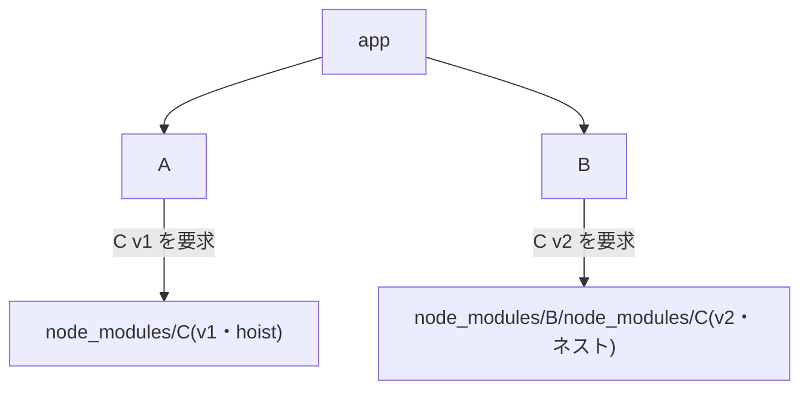

# 3. node_modules の構造

[1章](/basics/01-what-is-a-package-manager)で挙げた 4 つの仕事のうち、まだ中身を見ていないのが「配置(link)」です。解決と取得を終えたパッケージたちを、node_modules にどう並べるか。一見ただのフォルダ整理に思えるこの問題こそ、npm → yarn → pnpm という歴史を動かしてきた本書最大のテーマです。この章は本書の要なので、じっくり読んでください。

::: tip この章でわかること
- 「依存はグラフ、node_modules はツリー」という不一致を説明できる
- npm v2 のネスト構造と npm v3 のフラット構造の違いを図で描ける
- hoisting の 3 つの副作用(幻の依存・非決定性・doppelgänger)を説明できる
- `npm ls` で手元の依存ツリーを読み解ける
:::

## 依存は「グラフ」、node_modules は「ツリー」

まず出発点となる事実を押さえます。パッケージ間の依存関係は**グラフ**です。A が C に依存し、B も同じ C に依存する——複数の矢印が 1 つのノードに合流する、網の目のような構造です。

一方、node_modules は**ファイルシステム上のフォルダ**、つまり**ツリー**です。ツリーでは 1 つのフォルダに置ける同名のものは 1 つだけで、合流も循環も表現できません。

つまり「配置」とは、**グラフをツリーに写し取る**仕事です。ところが網の目を枝分かれだけで表現しようとすれば、どこかに必ず無理が出ます。同じパッケージを複数の場所にコピーして重複させるか、1 か所にまとめて共有するか。この不一致にどんな妥協で折り合いを付けるかが、各パッケージマネージャーの設計思想そのものなのです。

Node.js 側のルールも確認しておきます。`require('foo')` が実行されると、Node.js はまず自分のいるフォルダの `node_modules/foo` を探し、なければ親フォルダの node_modules、さらにその親…と**上へ上へ**遡ります。このルールが以降のすべての設計の前提になります。

## npm v2 — 素直なネスト構造

初期の npm(v2 まで)の答えは素直でした。**依存の依存は、そのパッケージの中にネストして置く**というものです。A が C に依存するなら `node_modules/A/node_modules/C` に置く。B も C に依存するなら `node_modules/B/node_modules/C` にもう 1 つ置く。

この方式の長所は明快さです。各パッケージは自分専用の依存を自分の中に持つので、バージョンの衝突は原理的に起きません。誰が何に依存しているかもフォルダ構造にそのまま現れます。

しかし実務では 2 つの問題が深刻でした。

- **重複によるサイズ肥大**。人気パッケージは何十回もコピーされ、node_modules は際限なく膨らみます。同じファイルが 30 か所にある、という状況が普通に起きました。
- **深すぎるパス**。依存の依存の依存…とネストが続くと、パスはどこまでも深くなります。特に当時の Windows には約 260 文字のパス長制限があり、「深すぎてファイルを削除できない」という悲劇まで起きました。

<!-- 🖼️ 画像プレースホルダー: 生成した画像を docs/public/images/fig-03-1.png に保存し、下の行のコメントを外してください -->
<!--  -->

> **🖼️ 図 3-1|npm v2 のネスト構造と npm v3 のフラット構造の対比**(画像プレースホルダー)
> 生成後は `docs/public/images/fig-03-1.png` に配置してください。

::: details 図 3-1 の ChatGPT 生成プロンプト(クリックで展開)

```text
STYLE PRESET (apply exactly; keep consistent with all previous diagrams in this series):
Flat 2D vector infographic in a minimal technical-illustration style. Landscape orientation (3:2).
Pure white background (#FFFFFF). Limited palette: dark navy #1E293B for text and outlines,
blue #3B82F6 as the single primary accent, light gray #E2E8F0 for container boxes,
orange #F59E0B for highlights only. Uniform medium-weight rounded strokes, simple geometric
icons, generous white space, clear visual hierarchy.
No gradients, no shadows, no 3D, no textures, no photorealism, no decorative background elements.
All labels in English, short (1-3 words), bold sans-serif, high contrast, perfectly legible.
Render every quoted label verbatim, exactly once, with no extra, invented, or duplicated text.
No text other than the labels listed below.

DIAGRAM CONTENT:
LAYOUT: Two side-by-side panels, each a large light gray rounded container representing a
folder tree drawn with indented boxes.
ELEMENTS:
- Left panel titled "npm v2" containing a folder tree: a root folder labeled "node_modules",
  inside it two package boxes labeled "A" and "B", and nested inside each of them a small
  folder holding an orange-highlighted box; the two orange boxes are labeled "C" and "C copy"
- Right panel titled "npm v3" containing a folder tree: a root folder labeled "flat", with
  three package boxes side by side at the same depth labeled "A2", "B2", "C2"
ARROWS: none.
```

:::

## npm v3 — フラット化と hoisting

2015 年の npm v3 は、この問題への大改革でした。方針を逆転させ、**依存の依存もできるだけ node_modules の最上位に引き上げて(hoist)、フラットに置く**ようにしたのです。この引き上げを **hoisting** と呼びます。

A の依存である C を最上位の `node_modules/C` に置いても、先ほどの Node.js の探索ルール(上へ遡る)のおかげで、A からは問題なく `require('C')` できます。B も同じ C を共有できるので重複は消え、ネストしないのでパスも深くなりません。

ただし、フラット化には原理的な限界があります。最上位に同名のフォルダは 1 つしか置けないため、**A が C v1 を、B が C v2 を要求したら、両方は最上位に置けません**。npm v3 の答えは折衷案でした。どちらか一方(たとえば v1)を最上位に置き、あぶれた方(v2)は npm v2 方式で `node_modules/B/node_modules/C` にネストするのです。

この折衷の結果を図にすると次のようになります。



<!-- 🖼️ 画像プレースホルダー: 生成した画像を docs/public/images/fig-03-2.png に保存し、下の行のコメントを外してください -->
<!--  -->

> **🖼️ 図 3-2|hoisting とバージョン衝突時のネスト**(画像プレースホルダー)
> 生成後は `docs/public/images/fig-03-2.png` に配置してください。

::: details 図 3-2 の ChatGPT 生成プロンプト(クリックで展開)

```text
STYLE PRESET (apply exactly; keep consistent with all previous diagrams in this series):
Flat 2D vector infographic in a minimal technical-illustration style. Landscape orientation (3:2).
Pure white background (#FFFFFF). Limited palette: dark navy #1E293B for text and outlines,
blue #3B82F6 as the single primary accent, light gray #E2E8F0 for container boxes,
orange #F59E0B for highlights only. Uniform medium-weight rounded strokes, simple geometric
icons, generous white space, clear visual hierarchy.
No gradients, no shadows, no 3D, no textures, no photorealism, no decorative background elements.
All labels in English, short (1-3 words), bold sans-serif, high contrast, perfectly legible.
Render every quoted label verbatim, exactly once, with no extra, invented, or duplicated text.
No text other than the labels listed below.

DIAGRAM CONTENT:
LAYOUT: One large light gray rounded container representing a folder tree drawn with
indented boxes.
ELEMENTS:
- Root folder labeled "node_modules"
- At the top level inside it, three boxes side by side: a box labeled "A", a box labeled "B",
  and a blue box labeled "C v1" with a small blue tag above it labeled "hoisted"
- Nested one level deeper inside the "B" box, a small folder containing an orange box
  labeled "C v2" with a small orange tag labeled "nested"
ARROWS: a labeled arrow reading "needs v1" pointing from "A" to "C v1"; a labeled arrow
reading "needs v2" pointing from "B" to "C v2".
```

:::

これで npm v2 の 2 大問題(重複と深いパス)はかなり緩和されました。現在の npm もこのフラット方式の延長線上にあります。しかし、この賢い妥協は 3 つの厄介な副作用を生みました。ここからが本章の核心です。

## 副作用① 幻の依存(phantom dependency)

フラット化により、node_modules の最上位には**あなたが宣言していないパッケージ**が大量に並ぶことになりました。そして Node.js の探索ルールは「最上位にあれば見つけてしまう」——つまり、**package.json に書いていないパッケージが `import` できてしまう**のです。これを**幻の依存(phantom dependency)**と呼びます。

<!-- 🖼️ 画像プレースホルダー: 生成した画像を docs/public/images/fig-03-3.png に保存し、下の行のコメントを外してください -->
<!--  -->

> **🖼️ 図 3-3|phantom dependency — 宣言していないのに import できてしまう**(画像プレースホルダー)
> 生成後は `docs/public/images/fig-03-3.png` に配置してください。

::: details 図 3-3 の ChatGPT 生成プロンプト(クリックで展開)

```text
STYLE PRESET (apply exactly; keep consistent with all previous diagrams in this series):
Flat 2D vector infographic in a minimal technical-illustration style. Landscape orientation (3:2).
Pure white background (#FFFFFF). Limited palette: dark navy #1E293B for text and outlines,
blue #3B82F6 as the single primary accent, light gray #E2E8F0 for container boxes,
orange #F59E0B for highlights only. Uniform medium-weight rounded strokes, simple geometric
icons, generous white space, clear visual hierarchy.
No gradients, no shadows, no 3D, no textures, no photorealism, no decorative background elements.
All labels in English, short (1-3 words), bold sans-serif, high contrast, perfectly legible.
Render every quoted label verbatim, exactly once, with no extra, invented, or duplicated text.
No text other than the labels listed below.

DIAGRAM CONTENT:
LAYOUT: Three columns. Left column shows two stacked document icons. Middle column shows a
large light gray container holding two package boxes. Generous space between columns.
ELEMENTS:
- Top left document icon labeled "package.json" with a small blue tag below it labeled
  "declares express"
- Bottom left document icon labeled "app.js"
- Middle container titled "node_modules" holding a blue box labeled "express" and a gray
  box labeled "debug"
- An orange warning triangle near the "debug" box with an orange tag labeled "not declared"
ARROWS: a plain arrow from "package.json" to "express"; a labeled arrow reading
"import debug" pointing from "app.js" to "debug".
```

:::

たとえば express をインストールすると、express 自身の依存である `debug` も最上位に hoist されます。すると、あなたのコードで `require('debug')` と書けば——宣言していないのに——動いてしまいます。

何が問題なのでしょうか。あなたと `debug` の間には**何の契約もない**ことです。express はいつか `debug` への依存をやめるかもしれませんし、バージョンを大きく変えるかもしれません。そのとき、あなたの `require('debug')` は「express を更新しただけ」で突然壊れます。semver の約束([2章](/basics/02-package-json-and-semver))は自分が宣言した依存にしか働かないので、この事故は誰のせいにもできません。しかも普段は問題なく動くため、テストでも発見しにくいのです。

## 副作用②③ 非決定性と doppelgänger

**② インストール経緯による非決定性**。バージョン衝突の際に「どちらを hoist するか」は早い者勝ちの要素があり、フラット化直後の npm v3 では、まっさらから入れた場合とパッケージを 1 つずつ追加した場合とで、**同じ package.json から違う形のツリー**ができることがありました。「同じ入力から同じ結果が出ない」というこの性質は当時の大きな批判点で、後にロックファイル([4章](/basics/04-lockfiles))がツリーの形ごと記録することで抑え込まれていきます。

**③ doppelgänger(ドッペルゲンガー)**。衝突であぶれたパッケージはネストされる、と言いました。あぶれた側が複数の親から要求されていると、**同一バージョンなのに複数の場所にコピーが置かれる**ことになります。この分身たちを doppelgänger と呼びます。単なるディスクの無駄にとどまらず、Node.js から見ると別ファイルは別モジュールなので、「同じライブラリのはずなのに `instanceof` が false になる」「シングルトンのはずの状態が 2 つある」という発見困難なバグの温床になります。

まとめると、フラット化は「重複と深いパス」を解決した代わりに、「正しさ」をいくらか犠牲にした妥協でした。この妥協を妥協のまま受け入れず、「グラフをツリーに無理やり潰すから歪むのだ」と根本から設計をやり直したのが pnpm です。その答えは 9 章で明かします。

## 実験: express で node_modules を観察する

フラット化を実際に見てみましょう。使い捨てディレクトリで express をインストールします。

```sh
$ mkdir -p ~/sandbox/pm-play/flat-lab && cd ~/sandbox/pm-play/flat-lab
$ npm init -y
$ npm install express
```

```
added 68 packages, and audited 69 packages in 930ms
```

インストールしたのは 1 つなのに「68 packages」。1 章で見た推移的依存の実物です。最上位に何個並んでいるか数えてみます。

```sh
$ ls node_modules | wc -l
```

```
      65
```

宣言した覚えのない 60 個以上のパッケージが、あなたのコードから `require` できる位置に並んでいます。express の直接の依存だけを表示すると──

```sh
$ npm ls --depth=1
```

```
flat-lab@1.0.0 /Users/you/sandbox/pm-play/flat-lab
└─┬ express@5.2.1
  ├── accepts@2.0.0
  ├── body-parser@2.3.0
  ├── content-type@1.0.5
  ├── cookie@0.7.2
  ├── debug@4.4.3
  ├── etag@1.8.1
  ...(以下続く)
```

直接の依存は 20 数個で、残りはさらにその依存です。次に「added 68 なのに ls では 65」の謎を解きます。差の 3 つはどこへ行ったのでしょうか。

```sh
$ find node_modules -name node_modules -mindepth 2
```

```
node_modules/type-is/node_modules
node_modules/negotiator/node_modules
node_modules/body-parser/node_modules
```

ネストされた node_modules が 3 か所見つかりました。犯人を特定します。

```sh
$ npm ls content-type
```

```
flat-lab@1.0.0 /Users/you/sandbox/pm-play/flat-lab
└─┬ express@5.2.1
  ├─┬ accepts@2.0.0
  │ └─┬ negotiator@1.1.0
  │   └── content-type@2.1.0
  ├─┬ body-parser@2.3.0
  │ └── content-type@2.1.0
  ├── content-type@1.0.5
  └─┬ type-is@2.1.0
    └── content-type@2.1.0
```

教科書どおりの光景です。express 本体は `content-type` の 1.0.5 を要求してこれが最上位に hoist され、2.1.0 を要求する 3 つのパッケージ(negotiator・body-parser・type-is)の分は、それぞれの中にネストされています。同じ 2.1.0 が 3 か所にコピーされている——doppelgänger の実物もここにいます。

仕上げに、幻の依存を体験してみましょう。`debug` は宣言していませんが──

```sh
$ node -e "const debug = require('debug'); console.log(typeof debug)"
```

```
function
```

動いてしまいました。この「動いてしまう」が、いつか誰かの深夜のデバッグになるわけです。

## まとめ

- 依存関係はグラフ、node_modules はツリー。この不一致の埋め方が各ツールの設計思想を決める
- npm v2 はネスト方式: 衝突は起きないが、重複と深すぎるパスに苦しんだ
- npm v3 はフラット方式: 依存を最上位に hoist し、バージョン衝突したものだけネストする
- hoisting の副作用は ①幻の依存 ②インストール経緯による非決定性 ③doppelgänger の 3 つ
- pnpm はこの妥協自体を設計し直した(9 章で詳説)

次章では、副作用②の抑え込み役として登場したロックファイルを取り上げます。[2章](/basics/02-package-json-and-semver)で張った「人によって違うバージョンが入る」問題の伏線も、いよいよ回収します。
