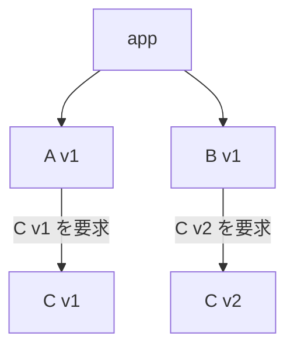
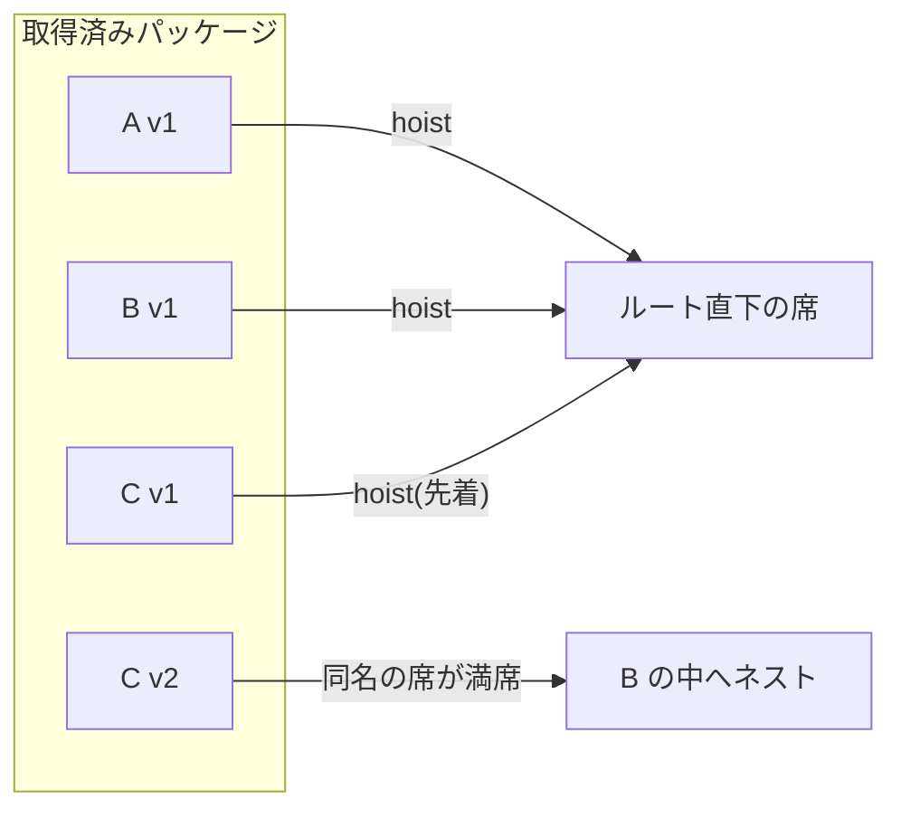
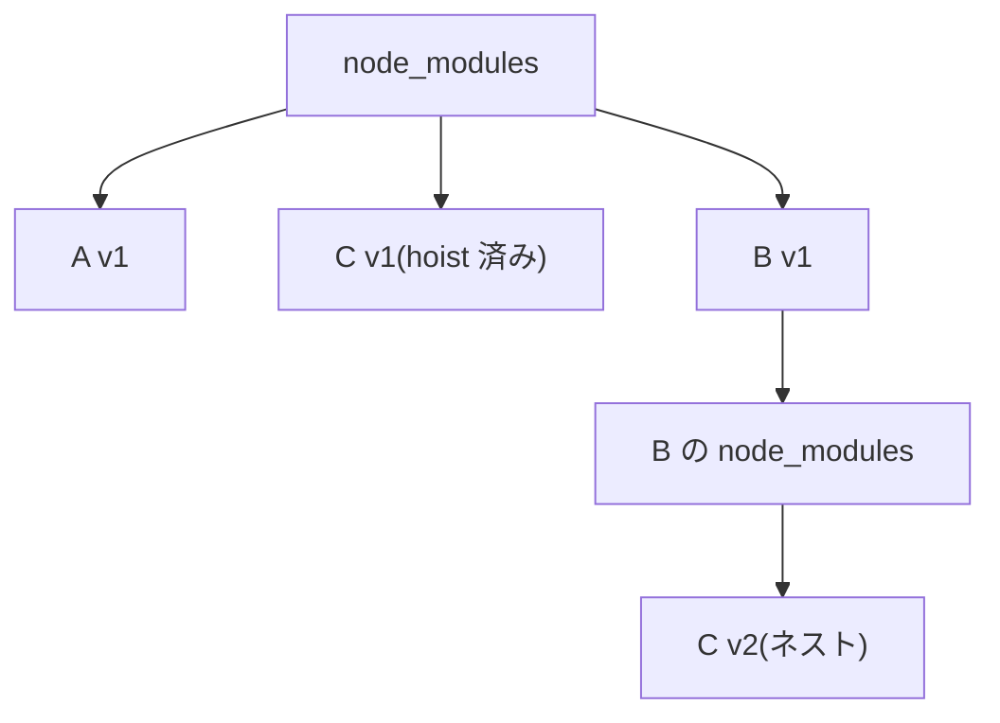

# 3. node_modules の構造

[1章](/basics/01-what-is-a-package-manager)で挙げた 4 つの仕事のうち、まだ中身を見ていないのが「配置(link)」です。解決と取得を終えたパッケージたちを、node_modules にどう並べるか。一見ただのフォルダ整理に思えるこの問題こそ、npm → yarn → pnpm という歴史を動かしてきた本書最大のテーマです。この章は本書の要なので、じっくり読んでください。

::: tip この章でわかること
- 「依存はグラフ、node_modules はツリー」という不一致を説明できる
- hoisting の配置決定を「Before → 操作 → After」の 3 コマで追える
- hoisting の 3 つの副作用(幽霊依存・非決定性・doppelgänger)を実データで説明できる
- `npm ls` で手元の依存ツリーを読み解ける
:::

## 依存は「グラフ」、node_modules は「ツリー」

まず出発点となる事実を押さえます。パッケージ間の依存関係は**グラフ**です。A が C に依存し、B も同じ C に依存する——複数の矢印が 1 つのノードに合流する、網の目のような構造です。

一方、node_modules は**ファイルシステム上のフォルダ**、つまり**ツリー**です。ツリーでは**同じ階層に**置ける同名のものは 1 つだけで、合流も循環もそのままの形では表現できません。

つまり「配置」とは、**グラフをツリーに写し取る**仕事です。ところが網の目を枝分かれだけで表現しようとすれば、どこかに必ず無理が出ます。同じパッケージを複数の場所にコピーして重複させるか、1 か所にまとめて共有するか。この不一致にどんな妥協で折り合いを付けるかが、各パッケージマネージャーの設計思想そのものなのです。

Node.js 側のルールも確認しておきます。`require('foo')` が実行されると、Node.js はまず自分のいるフォルダの `node_modules/foo` を探し、なければ親フォルダの node_modules、さらにその親…と**上へ上へ**遡ります。このルールが以降のすべての設計の前提になります。

## npm v2 — 素直なネスト構造

初期の npm(v2 まで)の答えは素直でした。**依存の依存は、そのパッケージの中にネストして置く**というものです。A が C に依存するなら `node_modules/A/node_modules/C` に置く。B も C に依存するなら `node_modules/B/node_modules/C` にもう 1 つ置く。

この方式の長所は明快さです。各パッケージは自分専用の依存を自分の中に持つので、バージョンの衝突は原理的に起きません。誰が何に依存しているかもフォルダ構造にそのまま現れます。

しかし実務では 2 つの問題が深刻でした。

- **重複によるサイズ肥大**。人気パッケージは何十回もコピーされ、node_modules は際限なく膨らみます。同じファイルが 30 か所にある、という状況が普通に起きました。
- **深すぎるパス**。依存の依存の依存…とネストが続くと、パスはどこまでも深くなります。特に当時の Windows には約 260 文字のパス長制限があり、「深すぎてファイルを削除できない」という悲劇まで起きました。

<figure>
  
  <figcaption><span class="fig-num">図 3-1</span> npm v2 のネスト構造と npm v3 のフラット構造の対比</figcaption>
</figure>

<!-- 図 3-1 の生成プロンプト(採用版・ページには出しない)

STYLE PRESET (apply exactly; keep consistent with all previous diagrams in this series):
Flat 2D vector infographic in a minimal technical-illustration style. Landscape orientation (3:2).
Pure white background (#FFFFFF). Limited palette: near-black ink #1C1E21 for text and outlines,
blue #2563EB as the single primary accent, light gray #E2E8F0 for container boxes,
orange #F59E0B for highlights only. Uniform medium-weight rounded strokes, simple geometric
icons, generous white space, clear visual hierarchy.
No gradients, no shadows, no 3D, no textures, no photorealism, no decorative background elements.
All labels in English, short (1-3 words), bold sans-serif, high contrast, perfectly legible.
Render every quoted label verbatim, exactly once, with no extra, invented, or duplicated text.
No text other than the labels listed below.

DIAGRAM CONTENT:
LAYOUT: Two panels side by side, separated by generous white space, each the same width and
each with its title centered above the panel, outside it. Inside each panel is a folder tree
drawn as nested rounded rectangles with clear indentation, like a file explorer.
ELEMENTS:
- Left panel titled "npm v2". Inside it, a light gray container labeled "node_modules" holding
  two white boxes side by side labeled "A" and "B". Nested inside the "A" box is one orange box
  labeled "C". Nested inside the "B" box is another orange box, also labeled "C".
- Right panel titled "npm v3". Inside it, a light gray container labeled "node_modules" holding
  three white boxes side by side at the same depth, labeled "A", "B", "C", in that order from
  left to right.
ARROWS: none. No other lines or connectors anywhere in the diagram.
-->

## npm v3 — フラット化と hoisting

2015 年の npm v3 は、この問題への大改革でした。方針を逆転させ、**依存の依存もできるだけ node_modules の最上位に引き上げて(hoist)、フラットに置く**ようにしたのです。この引き上げを **hoisting** と呼びます。

A の依存である C を最上位の `node_modules/C` に置いても、先ほどの Node.js の探索ルール(上へ遡る)のおかげで、A からは問題なく `require('C')` できます。B も同じ C を共有できるので重複は消え、ネストしないのでパスも深くなりません。

では、バージョンが衝突したら——**A が C v1 を、B が C v2 を要求したら**——どう配置されるのでしょうか。最上位に同名のフォルダは 1 つしか置けないため、両方をルートには置けません。npm v3 の答えは折衷案でした。どちらか一方だけを最上位に hoist し、あぶれた方は npm v2 方式でネストするのです。

この配置決定を、最小の例で 3 コマに分けて追ってみます。登場するのは、app が直接依存する A と B、そして A が要求する C v1 と B が要求する C v2 です。

**コマ 1(Before)— 依存グラフ**。解決([1章](/basics/01-what-is-a-package-manager))を終えた時点では、依存関係はまだ「グラフ」の形をしています。C というノードに 2 本の矢印が刺さっていますが、要求バージョンが違うので実体は 2 つ必要です。



**コマ 2(配置操作)— ルートの席をめぐる椅子取りゲーム**。インストーラーはこのグラフをたどり、各パッケージをできるだけルート直下の「席」に着かせようとします。A と B は無条件で着席。C は先に処理された **v1 がルートの席を取り**、後から来た v2 は同名の席がもう埋まっているため、自分を要求した B の中へネストされます。



**コマ 3(After)— できあがったツリー**。結果はこうなります。C v1 はルートに、C v2 は B の下に。グラフだったものが、重複を 1 つ抱えたツリーに「潰され」ました。



ポイントは 2 つあります。第一に、この配置で A も B も正しく動きます。A は上へ遡ってルートの C v1 を見つけ、B はまず自分の中を見て C v2 を見つける——冒頭の探索ルールどおりです。第二に、「どちらのバージョンを hoist するか」は**先に処理された者勝ち**で、グラフの形からは一意に決まりません。この「先着順」が、あとで副作用②として牙をむきます。

<figure>
  
  <figcaption><span class="fig-num">図 3-2</span> hoisting とバージョン衝突時のネスト</figcaption>
</figure>

<!-- 図 3-2 の生成プロンプト(採用版・ページには出しない)

STYLE PRESET (apply exactly; keep consistent with all previous diagrams in this series):
Flat 2D vector infographic in a minimal technical-illustration style. Landscape orientation (3:2).
Pure white background (#FFFFFF). Limited palette: near-black ink #1C1E21 for text and outlines,
blue #2563EB as the single primary accent, light gray #E2E8F0 for container boxes,
orange #F59E0B for highlights only. Uniform medium-weight rounded strokes, simple geometric
icons, generous white space, clear visual hierarchy.
No gradients, no shadows, no 3D, no textures, no photorealism, no decorative background elements.
All labels in English, short (1-3 words), bold sans-serif, high contrast, perfectly legible.
Render every quoted label verbatim, exactly once, with no extra, invented, or duplicated text.
No text other than the labels listed below.

DIAGRAM CONTENT:
LAYOUT: One large light gray rounded container representing a folder tree, drawn as nested
rounded rectangles with clear indentation, like a file explorer. Inside it, three equally sized
white boxes sit side by side at the same depth. The rightmost of those three has one smaller box
nested inside it, one level deeper.
ELEMENTS:
- The light gray container is labeled "node_modules"
- Inside it, three equally sized white boxes at the same depth from left to right: a box with a
  thin dark outline labeled "A", a box with a thin dark outline labeled "B", and a box with a
  thick blue outline labeled "C v1". All three have white fill.
- A small blue tag sits directly above the "C v1" box, reading "hoisted"
- Nested one level deeper inside the "B" box is a smaller white box with a thick orange outline,
  labeled "C v2", with a small orange tag directly above it reading "nested"
ARROWS: none. No other lines or connectors anywhere in the diagram.
-->

これで npm v2 の 2 大問題(重複と深いパス)はかなり緩和されました。現在の npm もこのフラット方式の延長線上にあります。しかし、この賢い妥協は 3 つの厄介な副作用を生みました。ここからが本章の核心です。

::: info 現在の npm には配置方式の選択肢がある
本書が「npm のフラットな node_modules」と言うとき、それは npm の**既定の配置方式**を指します。現在の npm には `--install-strategy` という設定があり、`hoisted`(既定=この節で見たフラット方式)のほかに `nested`(hoist しない)、`shallow`(直接依存だけを最上位に)、そして `linked`(`node_modules/.store` に配置してリンクする隔離方式)を選べます。特に `linked` は、このあと見る幽霊依存を検出する目的で npm 公式が開発時の利用を勧めているもので、9 章で扱う pnpm の隔離レイアウトと発想が近い方式です。つまり「フラットであること」は npm の宿命ではなく、既定値の選択なのです。
:::

## 副作用① 幽霊依存(phantom dependency)

フラット化により、node_modules の最上位には**あなたが宣言していないパッケージ**が大量に並ぶことになりました。そして Node.js の探索ルールは「最上位にあれば見つけてしまう」——つまり、**package.json に書いていないパッケージが `import` できてしまう**のです。これを**幽霊依存(phantom dependency)**と呼びます。

<figure>
  
  <figcaption><span class="fig-num">図 3-3</span> phantom dependency — 宣言していないのに import できてしまう</figcaption>
</figure>

<!-- 図 3-3 の生成プロンプト(採用版・ページには出しない)

STYLE PRESET (apply exactly; keep consistent with all previous diagrams in this series):
Flat 2D vector infographic in a minimal technical-illustration style. Landscape orientation (3:2).
Pure white background (#FFFFFF). Limited palette: near-black ink #1C1E21 for text and outlines,
blue #2563EB as the single primary accent, light gray #E2E8F0 for container boxes,
orange #F59E0B for highlights only. Uniform medium-weight rounded strokes, simple geometric
icons, generous white space, clear visual hierarchy.
No gradients, no shadows, no 3D, no textures, no photorealism, no decorative background elements.
All labels in English, short (1-3 words), bold sans-serif, high contrast, perfectly legible.
Render every quoted label verbatim, exactly once, with no extra, invented, or duplicated text.
No text other than the labels listed below.

DIAGRAM CONTENT:
LAYOUT: Two columns side by side with generous white space between them, both vertically
centered on the same axis. The left column has two document icons stacked vertically, each with
its label directly below it. The right column is one large light gray rounded container holding
two equally sized white boxes stacked vertically.
ELEMENTS:
- Left column, upper document icon labeled "package.json"
- Left column, lower document icon labeled "app.js"
- Right container labeled "node_modules", holding two equally sized white boxes stacked
  vertically: an upper box with a thin dark outline labeled "express", and a lower box with a
  thick orange outline labeled "debug"
- A small orange tag sits directly above the "debug" box, reading "not declared"
ARROWS: exactly two arrows. A plain dark arrow labeled "declares" from the "package.json" icon
to the "express" box. A blue arrow labeled "import debug" from the "app.js" icon to the "debug"
box. No other lines or connectors anywhere in the diagram.
-->

たとえば express をインストールすると、express 自身の依存である `debug` や `body-parser` も最上位に hoist されます。すると、あなたのコードで `require('debug')` と書けば——宣言していないのに——動いてしまいます。

ここでらぁめん濃度盛汁流に戻ると、hoisting は**全部乗せ**です。あなたが品書きで頼んだのはチャーシューだけなのに、大将は「せっかくだから」と厨房にある具材を片っ端から丼に乗せてくる。メンマも海苔も味玉も乗っている。**乗っているのだから食べられます**——これが「宣言していない `debug` を require できてしまう」状態です。

そして幽霊依存とは、**その乗っていた具材をあてにして献立を組んでしまうこと**です。今日はたまたま海苔が乗っていたから「海苔がある前提」で味を設計した。ところが大将の気分が変わって海苔をやめた翌日、あなたの一杯は成立しなくなります。頼んでいないものは、いつ消えても文句が言えません。

何が問題なのでしょうか。あなたと `debug` の間には**何の契約もない**ことです。express はいつか `debug` への依存をやめるかもしれませんし、バージョンを大きく変えるかもしれません。そのとき、あなたの `require('debug')` は「express を更新しただけ」で突然壊れます。semver の約束([2章](/basics/02-package-json-and-semver))は自分が宣言した依存にしか働かないので、この事故は誰のせいにもできません。しかも普段は問題なく動くため、テストでも発見しにくいのです。この章の最後の実験で、未宣言の `body-parser` が実際に require できてしまう様子を実測で確かめます。

## 副作用②③ 非決定性と doppelgänger

**② インストール経緯による非決定性**。コマ 2 で見たとおり、バージョン衝突の際に「どちらを hoist するか」は先着順の椅子取りゲームです。フラット化直後の npm v3 では、まっさらから入れた場合とパッケージを 1 つずつ追加した場合とで、**同じ package.json から違う形のツリー**ができることがありました。「同じ入力から同じ結果が出ない」というこの性質は当時の大きな批判点で、後にロックファイル([4章](/basics/04-lockfiles))がツリーの形ごと記録することで抑え込まれていきます。

**③ doppelgänger(ドッペルゲンガー)**。衝突であぶれたパッケージはネストされる、と言いました。あぶれた側が複数の親から要求されていると、**同一バージョンなのに複数の場所にコピーが置かれる**ことになります。この分身たちを doppelgänger と呼びます。

抽象論では想像しにくいので、実物を見ましょう。express@5.2.1 を npm でインストールすると、`content-type` というパッケージがこう配置されます(実測)。

```
node_modules/
├── content-type/                      ← 1.0.5(express 本体が要求・hoist の勝者)
├── body-parser/
│   └── node_modules/
│       └── content-type/              ← 2.1.0(分身 1)
├── negotiator/
│   └── node_modules/
│       └── content-type/              ← 2.1.0(分身 2)
└── type-is/
    └── node_modules/
        └── content-type/              ← 2.1.0(分身 3)
```

express 本体が要求する 1.0.5 が先にルートの席を取り、2.1.0 を要求する 3 つのパッケージ(body-parser・negotiator・type-is)の分は、それぞれの中にネストされました。注目してほしいのは下の 3 つです。**まったく同じ content-type@2.1.0 が、3 か所に丸ごとコピーされています**。バージョン衝突の敗者が複数の親から要求されると、その数だけ分身が生まれる——これが doppelgänger の正体です。

::: warning つまずきポイント — 同じバージョンなのに「別物」扱いになる
doppelgänger は単なるディスクの無駄では済みません。Node.js はモジュールを「解決されたファイルパス」単位でキャッシュするため、上の 3 つの content-type@2.1.0 は**3 回読み込まれ、3 つの独立したモジュールインスタンス**になります。ライブラリが内部にクラスや状態を持っていると、「同じバージョンなのに `instanceof` が false になる」「シングルトンのはずの状態が複数ある」という再現条件の分かりにくいバグが生まれます。「バージョンは揃っているのに直らない」ときは、`npm ls <パッケージ名>` で分身の存在を疑ってください。
:::

まとめると、フラット化は「重複と深いパス」を解決した代わりに、「正しさ」をいくらか犠牲にした妥協でした。この妥協を妥協のまま受け入れず、「グラフをツリーに無理やり潰すから歪むのだ」と根本から設計をやり直したのが pnpm です。その答えは 9 章で明かします。

## 実験: express で node_modules を観察する

フラット化を実際に見てみましょう。使い捨てディレクトリで express をインストールします。

```sh
$ mkdir -p ~/pm-sandbox/flat-lab && cd ~/pm-sandbox/flat-lab
$ npm init -y
$ npm install express
```

```
added 68 packages, and audited 69 packages in 2s
```

インストールしたのは 1 つなのに「68 packages」。1 章で見た推移的依存の実物です。まず「契約」を確認しておきます。

```sh
$ npm ls --depth=0
```

```
flat-lab@1.0.0 /Users/you/pm-sandbox/flat-lab
└── express@5.2.1
```

あなたが宣言した依存は express の 1 個だけ。では、実際の node_modules の規模はどうでしょうか。

```sh
$ ls node_modules | wc -l
      65
$ find node_modules -type f | wc -l
     601
$ du -sh node_modules
3.8M	node_modules
```

宣言はたった 1 行なのに、最上位には 65 個のパッケージがフラットに並び、中身は 601 ファイル・3.8MB。宣言した覚えのない 60 個以上が、あなたのコードから `require` できる位置にいます。

::: warning つまずきポイント — 「added 68」なのに `ls` では 65 個?
差の 3 個は消えたわけではありません。「added 68」は**配置されたパッケージ実体の数**で、同じパッケージがツリーの複数の場所にネストされる分も 1 つずつ数えます。このプロジェクトでは、ルートの 65 個に加えて content-type@2.1.0 の分身が 3 か所にネストされており、65 + 3 = 68。この数字のずれ自体が、hoisting と doppelgänger が起きた痕跡なのです。犯人はすぐ下で特定します。
:::

express の直接の依存だけを表示すると──

```sh
$ npm ls --depth=1
```

```
flat-lab@1.0.0 /Users/you/pm-sandbox/flat-lab
└─┬ express@5.2.1
  ├── accepts@2.0.0
  ├── body-parser@2.3.0
  ├── content-type@1.0.5
  ├── cookie@0.7.2
  ├── debug@4.4.3
  ├── etag@1.8.1
  ...(以下続く)
```

直接の依存は 28 個で、残りはさらにその依存です。次に「added 68 なのに ls では 65」の謎を解きます。差の 3 つはどこへ行ったのでしょうか。

```sh
$ find node_modules -name node_modules -mindepth 2
```

```
node_modules/type-is/node_modules
node_modules/negotiator/node_modules
node_modules/body-parser/node_modules
```

ネストされた node_modules が 3 か所見つかりました。犯人を特定します。

```sh
$ npm ls content-type
```

```
flat-lab@1.0.0 /Users/you/pm-sandbox/flat-lab
└─┬ express@5.2.1
  ├─┬ accepts@2.0.0
  │ └─┬ negotiator@1.1.0
  │   └── content-type@2.1.0
  ├─┬ body-parser@2.3.0
  │ └── content-type@2.1.0
  ├── content-type@1.0.5
  └─┬ type-is@2.1.0
    └── content-type@2.1.0
```

教科書どおりの光景です。express 本体は `content-type` の 1.0.5 を要求してこれが最上位に hoist され、2.1.0 を要求する 3 つのパッケージ(negotiator・body-parser・type-is)の分は、それぞれの中にネストされています。同じ 2.1.0 が 3 か所にコピーされている——本文で見た doppelgänger の実物です。

仕上げに、幽霊依存を体験してみましょう。`body-parser` は express が内部で使うパッケージで、あなたの package.json には一行も書かれていません。次の 2 行だけのファイルを作ります。

```js
// phantom.js — package.json に書いていないパッケージを require してみる
const bp = require('body-parser')
console.log(typeof bp)
```

これを実行すると──

<TermDemo
  title="zsh — 幽霊依存を require してみる(npm)"
  :lines="[
    { cmd: 'node phantom.js' },
    { pause: 400 },
    { out: 'function' },
  ]"
/>

```sh
$ node phantom.js
```

```
function
```

動いてしまいました。宣言していないパッケージが、エラーどころか普通の関数として手に入っています。この「動いてしまう」が、いつか誰かの深夜のデバッグになるわけです。そして [9章](/pnpm/09-how-pnpm-works)では、**まったく同じ phantom.js** が pnpm のプロジェクトでは `Cannot find module` で止まる瞬間を見ます。

## まとめ

- 依存関係はグラフ、node_modules はツリー。この不一致の埋め方が各ツールの設計思想を決める
- npm v2 はネスト方式: 衝突は起きないが、重複と深すぎるパスに苦しんだ
- npm v3 はフラット方式: 依存を最上位に hoist し、バージョン衝突であぶれたものだけネストする。どれを hoist するかは先着順の椅子取りゲーム
- hoisting の副作用は ①幽霊依存 ②インストール経緯による非決定性 ③doppelgänger の 3 つ。express の実測でも「added 68 / ls 65」のずれや content-type@2.1.0 の 3 つの分身として観察できた
- pnpm はこの妥協自体を設計し直した(9 章で詳説)

次章では、副作用②の抑え込み役として登場したロックファイルを取り上げます。[2章](/basics/02-package-json-and-semver)で張った「人によって違うバージョンが入る」問題の伏線も、いよいよ回収します。
