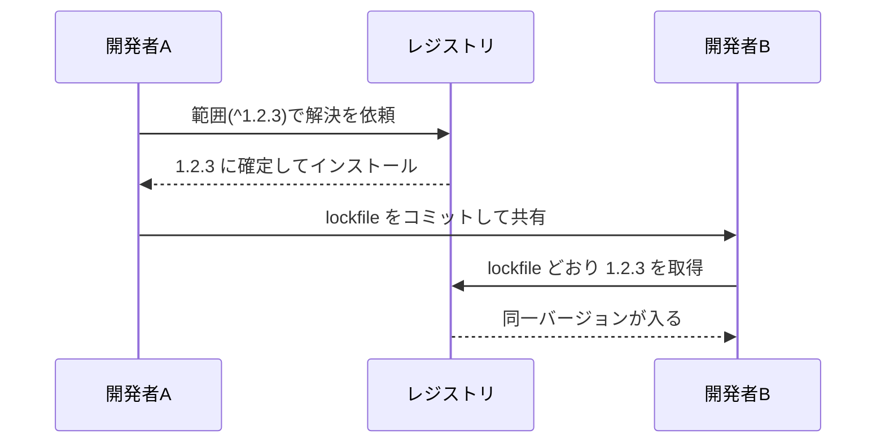
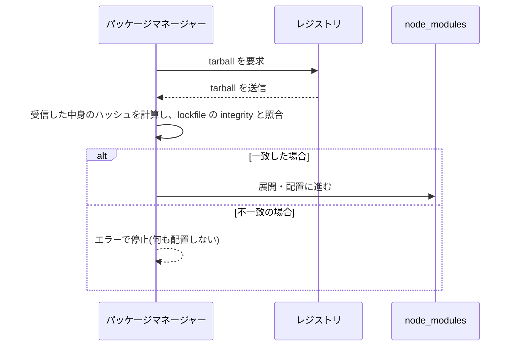

# 4. ロックファイルの役割

[2章](/basics/02-package-json-and-semver)で「同じ package.json なのに人によって違うバージョンが入る」という伏線を張り、[3章](/basics/03-node-modules)では「同じ入力から違う形のツリーができる」非決定性を見ました。Part I の締めくくりとなるこの章では、この 2 つの問題への答え——ロックファイル(lockfile)——の中身と役割を理解します。

::: tip この章でわかること
- 範囲指定とインストール時期のズレが引き起こす問題を説明できる
- ロックファイルの 1 エントリ(version / resolved / integrity)を読み解ける
- ロックファイルをコミットすべき理由を人に説明できる
- `npm ci` と通常の `npm install` の違いを説明できる
:::

## 範囲指定 + 時間差 = チーム内のズレ

まず伏線を回収しましょう。2 章で見たとおり、package.json に書くのは `^1.2.3` のような**範囲**です。ここではまず、**ロックファイルがまだ存在しない世界**を考えます(この節の最後で、それがどう解決されたかに進みます)。範囲の中のどれが選ばれるかは「インストールした時点でレジストリに存在する最新」で決まります。つまり——

- 1 月にセットアップしたあなたには `1.2.3` が入る
- 3 月に入ったメンバーには、その間にリリースされた `1.3.0` が入る
- CI サーバーは毎回まっさらからインストールするので、そのたびに範囲を評価し直し、新しいバージョンを引きうる

semver の約束が完璧なら困らないはずですが、現実には MINOR 更新にバグが紛れ込むことがあります。すると「新メンバーの環境でだけテストが落ちる」「昨日まで通っていた CI が、何もコミットしていないのに今朝から赤い」という、原因究明の難しい事故になります。コードは 1 文字も変わっていないのに、**時間が経っただけで壊れる**のです。

::: warning つまずきポイント: これは「ロックファイルがない場合」の話
念のため強調しておきます。上のズレが起きるのは、**ロックファイルがない(またはコミットされていない)場合**です。いまの npm はインストール時に package-lock.json を自動生成し、それがあれば `npm install` も記録された確定バージョンを使います。「CI は毎回最新を引く」のは現代の既定の挙動ではなく、**ロックファイルが登場する前の世界**、あるいはロックファイルを `.gitignore` に入れてしまったプロジェクトで起きることだと理解してください。この章の残りは、まさにその解決策の話です。
:::

<figure>
  
  <figcaption><span class="fig-num">図 4-1</span> lockfile がないチームで起きるバージョンのズレ</figcaption>
</figure>

<!-- 図 4-1 の生成プロンプト(採用版・ページには出しない)

STYLE PRESET (apply exactly; keep consistent with all previous diagrams in this series):
Flat 2D vector infographic in a minimal technical-illustration style. Landscape orientation (3:2).
Pure white background (#FFFFFF). Limited palette: near-black ink #1C1E21 for text and outlines,
blue #2563EB as the single primary accent, light gray #E2E8F0 for container boxes,
orange #F59E0B for highlights only. Uniform medium-weight rounded strokes, simple geometric
icons, generous white space, clear visual hierarchy.
No gradients, no shadows, no 3D, no textures, no photorealism, no decorative background elements.
All labels in English, short (1-3 words), bold sans-serif, high contrast, perfectly legible.
Render every quoted label verbatim, exactly once, with no extra, invented, or duplicated text.
No text other than the labels listed below.

DIAGRAM CONTENT:
LAYOUT: A symmetric layout. One cloud shape centered at the top. Below it, two identical
branches going down-left and down-right, mirroring each other. Each branch has a person icon
with its label below it, and under that a rounded box. The two branches are at the same height
as each other.
ELEMENTS:
- Cloud at the top labeled "Registry"
- Left branch: a person icon labeled "Developer A", and below it a white box with a thin dark
  outline labeled "1.2.3"
- Right branch: a person icon labeled "Developer B", and below it a white box with a thick
  orange outline labeled "1.3.0"
- Centered between the two boxes, at the same height as them, an orange text label reading
  "same package.json"
ARROWS: exactly two plain dark arrows from the cloud, one to each person icon. The left arrow is
labeled "January", the right arrow is labeled "March". No other lines or connectors anywhere.
-->

原因は package.json が「範囲」しか語らないことにあります。であれば解決策は 1 つ。**実際に選ばれた結果を、ファイルとして記録して共有する**ことです。それがロックファイルです。npm では `package-lock.json`、yarn では `yarn.lock`、pnpm では `pnpm-lock.yaml` という名前で、いずれもインストール時に自動生成・自動更新されます。

lockfile を介して確定バージョンが共有される流れを図にすると次のようになります。



## 注文書と、買い物リストの控え

package.json とロックファイルの関係は、**注文書と買い物リストの控え**にたとえられます。

package.json は注文書です。「牛乳を 1 本。メーカーはどこでもいい」のように、要求を範囲で書きます。一方ロックファイルは、実際に買い物をした人が残した控えです。「◯◯牛乳の 1000ml パック、製造ロット XX を、△△店で購入」——次に買いに行く人がこの控えのとおりに買えば、**誰が行っても寸分違わず同じ結果**になります。

役割の違いをまとめると次のとおりです。

| | package.json | ロックファイル |
| --- | --- | --- |
| 内容 | 要求(範囲) | 結果(確定値) |
| 書く人 | 人間 | パッケージマネージャー |
| 対象 | 直接の依存のみ | 推移的依存も含む全パッケージ |
| 例 | `^1.2.3` | `1.2.3`、取得 URL、ハッシュ |

重要なのは 3 行目です。ロックファイルは、あなたが宣言した数十個だけでなく、[1章](/basics/01-what-is-a-package-manager)で見た「依存の依存」まで含めた**全パッケージ**の確定値を記録します。3 章の非決定性——どれを hoist してどれをネストしたかというツリーの形——も npm のロックファイルには記録されるため、「解決」の工程を丸ごとスキップして同じ node_modules を再現できるのです。

## 1 エントリを読み解く

では、その「控え」には具体的に何が書かれているのでしょうか。中身は決して怖いものではありません。1 章の実験で left-pad を入れたときに生成された package-lock.json から、left-pad のエントリを見てみます。

```json
"node_modules/left-pad": {
  "version": "1.3.0",
  "resolved": "https://registry.npmjs.org/left-pad/-/left-pad-1.3.0.tgz",
  "integrity": "sha512-XI5MPzVNApjAyhQzphX8BkmKsKUxD4LdyK24iZeQGinBN9yTQT3bFlCBy/aVx2HrNcqQGsdot8ghrjyrvMCoEA==",
  "deprecated": "use String.prototype.padStart()",
  "license": "WTFPL"
}
```

主役は 3 つのフィールドです。

- **version**: 範囲 `^1.3.0` から実際に選ばれた確定バージョン。「解決」の結果の記録です。
- **resolved**: tarball を取得した URL。「取得」の行き先の記録です。
- **integrity**: 取得した tarball の**ハッシュ値**(ここでは SHA-512)。ファイルの内容から計算される「指紋」で、1 バイトでも中身が違えば別の値になります。役割は後述します。

エントリのキーが `node_modules/left-pad` という**配置パス**になっている点にも注目してください。3 章で見た「どこに置くか」まで含めて記録されている、ということです。

::: info なぜ package.json と分かれているのか
「最初から確定バージョンを package.json に書けば 1 ファイルで済むのでは」と思うかもしれません。しかし範囲(意図)と確定値(結果)は更新のタイミングが違います。「依存を最新に上げ直す」とき、範囲を保ったままロックファイルだけ作り直せばよい——`npm update` はまさにこれをします。意図と結果を別ファイルに分けたことで、「普段は固定、上げたいときだけ更新」という運用が可能になっているのです。
:::

## コミットすべき理由と `npm ci`

ロックファイルは**必ずリポジトリにコミットしてください**。自動生成されるファイルは `.gitignore` に入れたくなるものですが、ロックファイルは例外です。コミットして初めて「チーム全員と CI が同じ控えで買い物をする」状態になり、図 4-1 のズレが消えます。

::: warning つまずきポイント: コミットするのは lockfile、しないのは node_modules
「自動生成されるものはコミットしない」という経験則を lockfile に当てはめてはいけません。node_modules は**生成物**なのでコミットしない(lockfile から何度でも同じものを再生成できる)。lockfile はその**再生成のレシピそのもの**なのでコミットする——この向きで覚えてください。lockfile が .gitignore に入っているプロジェクトは、この章で見たズレが起きるのを待っている状態です。
:::

<figure>
  
  <figcaption><span class="fig-num">図 4-2</span> lockfile を介した再現可能なインストールフロー</figcaption>
</figure>

<!-- 図 4-2 の生成プロンプト(採用版・ページには出しない)

STYLE PRESET (apply exactly; keep consistent with all previous diagrams in this series):
Flat 2D vector infographic in a minimal technical-illustration style. Landscape orientation (3:2).
Pure white background (#FFFFFF). Limited palette: near-black ink #1C1E21 for text and outlines,
blue #2563EB as the single primary accent, light gray #E2E8F0 for container boxes,
orange #F59E0B for highlights only. Uniform medium-weight rounded strokes, simple geometric
icons, generous white space, clear visual hierarchy.
No gradients, no shadows, no 3D, no textures, no photorealism, no decorative background elements.
All labels in English, short (1-3 words), bold sans-serif, high contrast, perfectly legible.
Render every quoted label verbatim, exactly once, with no extra, invented, or duplicated text.
No text other than the labels listed below.

DIAGRAM CONTENT:
LAYOUT: One document icon on the far left, vertically centered. From it, two horizontal flows go
to the right: an upper row and a lower row, mirroring each other and evenly spaced above and
below the vertical center. Each row has an icon followed by a rounded box to its right, with
both rows using the same horizontal positions so the two boxes line up vertically.
ELEMENTS:
- Far left: a document icon with a thick blue outline, labeled "lockfile"
- Upper row: a laptop icon labeled "local", then to its right a white box with a thick blue
  outline labeled "1.2.3"
- Lower row: a server icon labeled "CI", then to its right a white box with a thick blue
  outline labeled "1.2.3"
- Centered between the two boxes, at the vertical center of the diagram, a blue text label
  reading "same result"
ARROWS: exactly four plain dark arrows. One from "lockfile" to the laptop icon, one from
"lockfile" to the server icon, one from the laptop icon to its box, one from the server icon to
its box. No other lines or connectors anywhere in the diagram.
-->

ここで CI 環境向けの専用コマンド **`npm ci`** が登場します。通常の `npm install` は「ロックファイルがあれば従うが、package.json と食い違っていればロックファイルの方を**書き換えて**しまう」という寛容な動きをします。対して `npm ci` は次のように動きます。

- ロックファイルに**一切従う**。書き換えは絶対にしない
- package.json とロックファイルが矛盾していたら、黙って直さず**エラーで止まる**
- 既存の node_modules を削除してから、まっさらにインストールする

「控えのとおりに買う。控えと注文書が食い違っていたら、勝手に判断せず報告する」という動きです。この 3 つを実際に見てみましょう。[3章](/basics/03-node-modules)の flat-lab(express インストール済み)で `npm ci` を実行したあと、`npm pkg set` で package.json の要求だけを `^4.0.0` に書き換え、わざと矛盾を作ります。

<TermDemo
  title="zsh — npm ci の凍結と矛盾検出"
  :lines="[
    { cmd: 'npm ci' },
    { out: 'added 68 packages, and audited 69 packages in 2s' },
    { pause: 400 },
    { cmd: 'npm pkg set dependencies.express=^4.0.0' },
    { cmd: 'npm ci' },
    { out: 'npm error code EUSAGE' },
    { out: 'npm error `npm ci` can only install packages when your package.json and package-lock.json or npm-shrinkwrap.json are in sync. Please update your lock file with `npm install` before continuing.' },
    { out: 'npm error Invalid: lock file\'s express@5.2.1 does not satisfy express@^4.0.0' },
    { pause: 400 },
    { cmd: 'npm pkg set dependencies.express=^5.2.1' },
  ]"
/>

手元で再現する場合はこちらです。

```sh
$ npm ci
$ npm pkg set dependencies.express=^4.0.0   # わざと矛盾させる
$ npm ci                                    # → エラーで停止する
$ npm pkg set dependencies.express=^5.2.1   # 元に戻す
```

1 回目の `npm ci` は、既存の node_modules を黙って丸ごと削除してから作り直しています(メッセージには出ませんが、node_modules を観察していると消えて再生成されるのがわかります)。そして 2 回目のエラーの核心は `Invalid: lock file's express@5.2.1 does not satisfy express@^4.0.0` の 1 行です。控え(lockfile)は 5.2.1 と言っているのに、注文書(package.json)は 4 系を求めている。`npm ci` はどちらが正しいかを自分で判断せず、人間に差し戻します。

CI やデプロイでは `npm install` ではなく `npm ci` を使うのが定石です。yarn や pnpm では `--frozen-lockfile`(ロックファイルを凍結したままインストールする)というフラグが同じ役割を担い、pnpm 11 では `pnpm ci` コマンドも追加されました。CI の再現性はこの使い分けで守られています。

::: warning つまずきポイント: 「lockfile があれば `npm install` でも同じ」ではない
`npm install` もロックファイルに従います。ただし package.json と食い違ったとき、`npm install` はエラーにせず**lockfile の方を書き換えて**つじつまを合わせます。依存を追加・更新した直後ならそれが正しい動きですが、CI でこれをやると「ズレを検出すべき場面で、ズレを黙って上書きする」ことになります。手元での開発は `npm install`、再現性を保証したい場面は `npm ci`、と使い分けてください。
:::

## integrity — サプライチェーン防御という側面

ロックファイルには再現性のほかに、もう 1 つ重要な顔があります。**セキュリティ装置**としての顔です。

1 章で見たとおり、レジストリは誰でも publish できる開かれた倉庫です。もし通信経路が改ざんされたら? レジストリ(やミラー)が侵害されて、同じバージョン番号のまま中身がすり替えられたら? パッケージの供給網を狙うこうした攻撃を**サプライチェーン攻撃**と呼びます。

ここで integrity フィールドが働きます。パッケージマネージャーは tarball を取得するたびにハッシュを計算し、ロックファイルの integrity と照合します。**1 バイトでも違えばインストールはその場で失敗**します。つまりロックファイルをコミットしておけば、「チームの誰かが最初に検証した、まさにその中身」以外は誰の環境にも入らないのです。

照合の流れを時系列で示すと次のようになります。



ポイントは、照合が「配置の前」に行われることです。すり替えられた tarball は node_modules に触れることすらできず、攻撃はディスクに届く前に遮断されます。

もちろん万能ではありません。integrity が守るのは「記録した時点の中身と同じか」だけで、最初に取り込んだバージョン自体に悪意があれば検出できません。それでも「後からのすり替え」を防げる意義は大きく、ロックファイルをコミットすべきもう 1 つの強い理由になっています。

## 実験: ロックファイルの 1 エントリを覗く

[3章](/basics/03-node-modules)の実験で express を入れたディレクトリに、package-lock.json ができているはずです。まず全体の規模を見てみます。

```sh
$ cd ~/pm-sandbox/flat-lab
$ jq '.packages | length' package-lock.json
```

```
69
```

package.json に書いたのは express の 1 行だけですが、ロックファイルには 69 エントリ(自プロジェクト + 68 パッケージ)が記録されています。推移的依存まで全部、が実感できます。次に 1 エントリを取り出してみます。

```sh
$ jq '.packages["node_modules/debug"]' package-lock.json
```

```json
{
  "version": "4.4.3",
  "resolved": "https://registry.npmjs.org/debug/-/debug-4.4.3.tgz",
  "integrity": "sha512-RGwwWnwQvkVfavKVt22FGLw+xYSdzARwm0ru6DhTVA3umU5hZc28V3kO4stgYryrTlLpuvgI9GiijltAjNbcqA==",
  "license": "MIT",
  "dependencies": {
    "ms": "^2.1.3"
  },
  ...
}
```

version・resolved・integrity が揃っています(jq がなければ `cat package-lock.json` で `debug` を検索しても構いません)。integrity が全エントリにあることも確認できます。

```sh
$ grep -c integrity package-lock.json
```

```
68
```

68 パッケージすべてに指紋が付いています。最後に `npm ci` を体験してみましょう。

```sh
$ npm ci
```

```
added 68 packages, and audited 69 packages in 2s
```

node_modules を丸ごと作り直したのに、結果は前回と完全に同一です。矛盾したときにエラーで止まる動きも、前のセクションの `npm pkg set` の手順で再現できます(確認したら必ず `^5.2.1` に戻しておいてください)。

## まとめ

- 範囲指定 + インストール時期の差が「同じ package.json でも人によって違う」ズレを生む(2 章の伏線回収)
- ロックファイルは推移的依存まで含む全パッケージの確定バージョン・取得 URL・integrity を記録した「買い物リストの控え」
- 必ずコミットする。チームと CI が同じ控えを共有して初めて再現性が生まれる
- CI では `npm ci`(yarn / pnpm では `--frozen-lockfile`)でロックファイルを凍結したままインストールする
- integrity ハッシュは取得物のすり替えを検出する、サプライチェーン攻撃への防御装置でもある

これで Part I は完結です。パッケージマネージャーの 4 つの仕事、package.json と semver、node_modules の構造、そしてロックファイル——現代のパッケージ管理を支える部品がすべて出揃いました。Part II では歴史を辿ります。次章ではまず、これらの部品を最初に組み上げた npm がどのように生まれ、進化してきたかを見ていきます。
