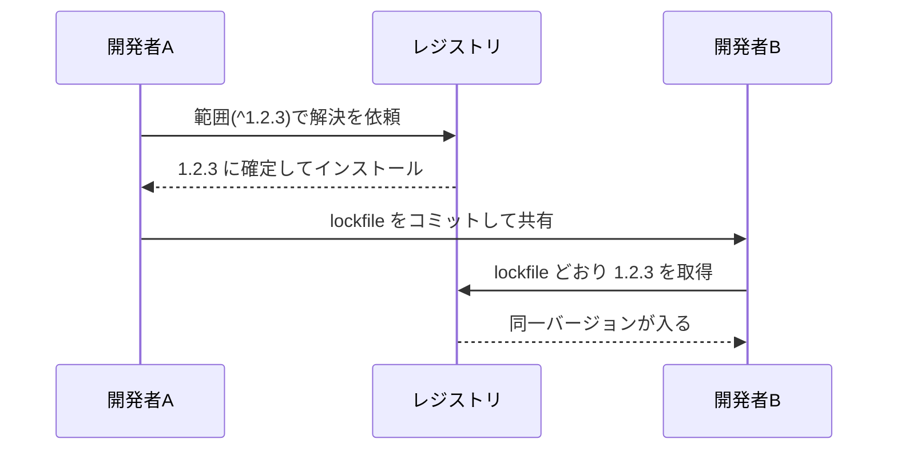

# 4. ロックファイルの役割

[2章](/basics/02-package-json-and-semver)で「同じ package.json なのに人によって違うバージョンが入る」という伏線を張り、[3章](/basics/03-node-modules)では「同じ入力から違う形のツリーができる」非決定性を見ました。Part I の締めくくりとなるこの章では、この 2 つの問題への答え——ロックファイル(lockfile)——の中身と役割を理解します。

::: tip この章でわかること
- 範囲指定とインストール時期のズレが引き起こす問題を説明できる
- ロックファイルの 1 エントリ(version / resolved / integrity)を読み解ける
- ロックファイルをコミットすべき理由を人に説明できる
- `npm ci` と通常の `npm install` の違いを説明できる
:::

## 範囲指定 + 時間差 = チーム内のズレ

まず伏線を回収しましょう。2 章で見たとおり、package.json に書くのは `^1.2.3` のような**範囲**です。範囲の中のどれが選ばれるかは「インストールした時点でレジストリに存在する最新」で決まります。つまり——

- 1 月にセットアップしたあなたには `1.2.3` が入る
- 3 月に入ったメンバーには、その間にリリースされた `1.3.0` が入る
- CI サーバーは毎回まっさらからインストールするので、ビルドのたびに最新を引く

semver の約束が完璧なら困らないはずですが、現実には MINOR 更新にバグが紛れ込むことがあります。すると「新メンバーの環境でだけテストが落ちる」「昨日まで通っていた CI が、何もコミットしていないのに今朝から赤い」という、原因究明の難しい事故になります。コードは 1 文字も変わっていないのに、**時間が経っただけで壊れる**のです。

<!-- 🖼️ 画像プレースホルダー: 生成した画像を docs/public/images/fig-04-1.png に保存し、下の行のコメントを外してください -->
<!--  -->

> **🖼️ 図 4-1|lockfile がないチームで起きるバージョンのズレ**(画像プレースホルダー)
> 生成後は `docs/public/images/fig-04-1.png` に配置してください。

::: details 図 4-1 の ChatGPT 生成プロンプト(クリックで展開)

```text
STYLE PRESET (apply exactly; keep consistent with all previous diagrams in this series):
Flat 2D vector infographic in a minimal technical-illustration style. Landscape orientation (3:2).
Pure white background (#FFFFFF). Limited palette: dark navy #1E293B for text and outlines,
blue #3B82F6 as the single primary accent, light gray #E2E8F0 for container boxes,
orange #F59E0B for highlights only. Uniform medium-weight rounded strokes, simple geometric
icons, generous white space, clear visual hierarchy.
No gradients, no shadows, no 3D, no textures, no photorealism, no decorative background elements.
All labels in English, short (1-3 words), bold sans-serif, high contrast, perfectly legible.
Render every quoted label verbatim, exactly once, with no extra, invented, or duplicated text.
No text other than the labels listed below.

DIAGRAM CONTENT:
LAYOUT: A cloud shape centered at the top. Two person icons at the bottom left and bottom
right, each with a package box beneath them. A jagged divider between the two package boxes.
ELEMENTS:
- Cloud at top labeled "Registry"
- Bottom left person icon labeled "Developer A" with a blue package box under it labeled "1.2.3"
- Bottom right person icon labeled "Developer B" with a gray package box under it labeled "1.3.0"
- An orange lightning bolt between the two package boxes labeled "mismatch"
ARROWS: a labeled arrow reading "install January" pointing from "Registry" to "Developer A";
a labeled arrow reading "install March" pointing from "Registry" to "Developer B".
```

:::

原因は package.json が「範囲」しか語らないことにあります。であれば解決策は 1 つ。**実際に選ばれた結果を、ファイルとして記録して共有する**ことです。それがロックファイルです。npm では `package-lock.json`、yarn では `yarn.lock`、pnpm では `pnpm-lock.yaml` という名前で、いずれもインストール時に自動生成・自動更新されます。

lockfile を介して確定バージョンが共有される流れを図にすると次のようになります。



## 注文書と、買い物リストの控え

package.json とロックファイルの関係は、**注文書と買い物リストの控え**にたとえられます。

package.json は注文書です。「牛乳を 1 本。メーカーはどこでもいい」のように、要求を範囲で書きます。一方ロックファイルは、実際に買い物をした人が残した控えです。「◯◯牛乳の 1000ml パック、製造ロット XX を、△△店で購入」——次に買いに行く人がこの控えのとおりに買えば、**誰が行っても寸分違わず同じ結果**になります。

役割の違いをまとめると次のとおりです。

| | package.json | ロックファイル |
| --- | --- | --- |
| 内容 | 要求(範囲) | 結果(確定値) |
| 書く人 | 人間 | パッケージマネージャー |
| 対象 | 直接の依存のみ | 推移的依存も含む全パッケージ |
| 例 | `^1.2.3` | `1.2.3`、取得 URL、ハッシュ |

重要なのは 3 行目です。ロックファイルは、あなたが宣言した数十個だけでなく、[1章](/basics/01-what-is-a-package-manager)で見た「依存の依存」まで含めた**全パッケージ**の確定値を記録します。3 章の非決定性——どれを hoist してどれをネストしたかというツリーの形——も npm のロックファイルには記録されるため、「解決」の工程を丸ごとスキップして同じ node_modules を再現できるのです。

## 1 エントリを読み解く

中身は決して怖いものではありません。1 章の実験で left-pad を入れたときに生成された package-lock.json から、left-pad のエントリを見てみます。

```json
"node_modules/left-pad": {
  "version": "1.3.0",
  "resolved": "https://registry.npmjs.org/left-pad/-/left-pad-1.3.0.tgz",
  "integrity": "sha512-XI5MPzVNApjAyhQzphX8BkmKsKUxD4LdyK24iZeQGinBN9yTQT3bFlCBy/aVx2HrNcqQGsdot8ghrjyrvMCoEA==",
  "deprecated": "use String.prototype.padStart()",
  "license": "WTFPL"
}
```

主役は 3 つのフィールドです。

- **version**: 範囲 `^1.3.0` から実際に選ばれた確定バージョン。「解決」の結果の記録です。
- **resolved**: tarball を取得した URL。「取得」の行き先の記録です。
- **integrity**: 取得した tarball の**ハッシュ値**(ここでは SHA-512)。ファイルの内容から計算される「指紋」で、1 バイトでも中身が違えば別の値になります。役割は後述します。

エントリのキーが `node_modules/left-pad` という**配置パス**になっている点にも注目してください。3 章で見た「どこに置くか」まで含めて記録されている、ということです。

::: info なぜ package.json と分かれているのか
「最初から確定バージョンを package.json に書けば 1 ファイルで済むのでは」と思うかもしれません。しかし範囲(意図)と確定値(結果)は更新のタイミングが違います。「依存を最新に上げ直す」とき、範囲を保ったままロックファイルだけ作り直せばよい——`npm update` はまさにこれをします。意図と結果を別ファイルに分けたことで、「普段は固定、上げたいときだけ更新」という運用が可能になっているのです。
:::

## コミットすべき理由と `npm ci`

ロックファイルは**必ずリポジトリにコミットしてください**。自動生成されるファイルは `.gitignore` に入れたくなるものですが、ロックファイルは例外です。コミットして初めて「チーム全員と CI が同じ控えで買い物をする」状態になり、図 4-1 のズレが消えます。

<!-- 🖼️ 画像プレースホルダー: 生成した画像を docs/public/images/fig-04-2.png に保存し、下の行のコメントを外してください -->
<!--  -->

> **🖼️ 図 4-2|lockfile を介した再現可能なインストールフロー**(画像プレースホルダー)
> 生成後は `docs/public/images/fig-04-2.png` に配置してください。

::: details 図 4-2 の ChatGPT 生成プロンプト(クリックで展開)

```text
STYLE PRESET (apply exactly; keep consistent with all previous diagrams in this series):
Flat 2D vector infographic in a minimal technical-illustration style. Landscape orientation (3:2).
Pure white background (#FFFFFF). Limited palette: dark navy #1E293B for text and outlines,
blue #3B82F6 as the single primary accent, light gray #E2E8F0 for container boxes,
orange #F59E0B for highlights only. Uniform medium-weight rounded strokes, simple geometric
icons, generous white space, clear visual hierarchy.
No gradients, no shadows, no 3D, no textures, no photorealism, no decorative background elements.
All labels in English, short (1-3 words), bold sans-serif, high contrast, perfectly legible.
Render every quoted label verbatim, exactly once, with no extra, invented, or duplicated text.
No text other than the labels listed below.

DIAGRAM CONTENT:
LAYOUT: A single blue document icon on the left. Two parallel horizontal flows go to the
right, one across the top and one across the bottom, each ending in a folder icon. A tall
bracket on the far right joins the two folders.
ELEMENTS:
- Blue document icon on the left labeled "lockfile"
- Top flow: a laptop icon labeled "local" followed by a folder icon labeled "node_modules"
- Bottom flow: a server icon labeled "CI" followed by a second folder icon labeled "same tree"
- A bracket on the far right joining the two folders, with a blue tag labeled "identical"
ARROWS: a labeled arrow reading "npm ci" pointing from "lockfile" to "local"; a second
labeled arrow reading "npm ci" pointing from "lockfile" to "CI"; a plain arrow from "local"
to "node_modules"; a plain arrow from "CI" to "same tree".
```

:::

ここで CI 環境向けの専用コマンド **`npm ci`** が登場します。通常の `npm install` は「ロックファイルがあれば従うが、package.json と食い違っていればロックファイルの方を**書き換えて**しまう」という寛容な動きをします。対して `npm ci` は次のように動きます。

- ロックファイルに**一切従う**。書き換えは絶対にしない
- package.json とロックファイルが矛盾していたら、黙って直さず**エラーで止まる**
- 既存の node_modules を削除してから、まっさらにインストールする

「控えのとおりに買う。控えと注文書が食い違っていたら、勝手に判断せず報告する」という動きです。CI やデプロイでは `npm install` ではなく `npm ci` を使うのが定石です。yarn や pnpm では `--frozen-lockfile`(ロックファイルを凍結したままインストールする)というフラグが同じ役割を担います。CI の再現性はこの使い分けで守られています。

## integrity — サプライチェーン防御という側面

ロックファイルには再現性のほかに、もう 1 つ重要な顔があります。**セキュリティ装置**としての顔です。

1 章で見たとおり、レジストリは誰でも publish できる開かれた倉庫です。もし通信経路が改ざんされたら? レジストリ(やミラー)が侵害されて、同じバージョン番号のまま中身がすり替えられたら? パッケージの供給網を狙うこうした攻撃を**サプライチェーン攻撃**と呼びます。

ここで integrity フィールドが働きます。パッケージマネージャーは tarball を取得するたびにハッシュを計算し、ロックファイルの integrity と照合します。**1 バイトでも違えばインストールはその場で失敗**します。つまりロックファイルをコミットしておけば、「チームの誰かが最初に検証した、まさにその中身」以外は誰の環境にも入らないのです。

もちろん万能ではありません。integrity が守るのは「記録した時点の中身と同じか」だけで、最初に取り込んだバージョン自体に悪意があれば検出できません。それでも「後からのすり替え」を防げる意義は大きく、ロックファイルをコミットすべきもう 1 つの強い理由になっています。

## 実験: ロックファイルの 1 エントリを覗く

[3章](/basics/03-node-modules)の実験で express を入れたディレクトリに、package-lock.json ができているはずです。まず全体の規模を見てみます。

```sh
$ cd ~/sandbox/pm-play/flat-lab
$ jq '.packages | length' package-lock.json
```

```
69
```

package.json に書いたのは express の 1 行だけですが、ロックファイルには 69 エントリ(自プロジェクト + 68 パッケージ)が記録されています。推移的依存まで全部、が実感できます。次に 1 エントリを取り出してみます。

```sh
$ jq '.packages["node_modules/debug"]' package-lock.json
```

```json
{
  "version": "4.4.3",
  "resolved": "https://registry.npmjs.org/debug/-/debug-4.4.3.tgz",
  "integrity": "sha512-RGwwWnwQvkVfavKVt22FGLw+xYSdzARwm0ru6DhTVA3umU5hZc28V3kO4stgYryrTlLpuvgI9GiijltAjNbcqA==",
  "license": "MIT",
  "dependencies": {
    "ms": "^2.1.3"
  },
  ...
}
```

version・resolved・integrity が揃っています(jq がなければ `cat package-lock.json` で `debug` を検索しても構いません)。integrity が全エントリにあることも確認できます。

```sh
$ grep -c integrity package-lock.json
```

```
68
```

68 パッケージすべてに指紋が付いています。最後に `npm ci` を体験してみましょう。

```sh
$ npm ci
```

```
added 68 packages, and audited 69 packages in 2s
```

node_modules を丸ごと作り直したのに、結果は前回と完全に同一です。試しに package.json の express の行を手で `"express": "^4.0.0"` に書き換えて `npm ci` を実行すると、ロックファイルとの矛盾を検出してエラーで止まることも確認できます(確認したら戻しておいてください)。

## まとめ

- 範囲指定 + インストール時期の差が「同じ package.json でも人によって違う」ズレを生む(2 章の伏線回収)
- ロックファイルは推移的依存まで含む全パッケージの確定バージョン・取得 URL・integrity を記録した「買い物リストの控え」
- 必ずコミットする。チームと CI が同じ控えを共有して初めて再現性が生まれる
- CI では `npm ci`(yarn / pnpm では `--frozen-lockfile`)でロックファイルを凍結したままインストールする
- integrity ハッシュは取得物のすり替えを検出する、サプライチェーン攻撃への防御装置でもある

これで Part I は完結です。パッケージマネージャーの 4 つの仕事、package.json と semver、node_modules の構造、そしてロックファイル——現代のパッケージ管理を支える部品がすべて出揃いました。Part II では歴史を辿ります。次章ではまず、これらの部品を最初に組み上げた npm がどのように生まれ、進化してきたかを見ていきます。
