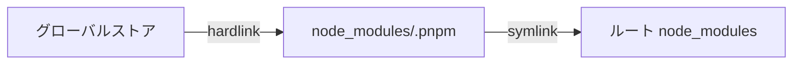

# 9. pnpm の仕組み — ストアとリンク

[8章](/pnpm/08-getting-started)の実験で、pnpm の node_modules には `.pnpm` ディレクトリとシンボリックリンクしかないことを確認しました。[3章](/basics/03-node-modules)で学んだ npm のフラットな node_modules とはまるで別物です。この章では、pnpm がなぜこの構造を選んだのか、その中で何が起きているのかを解き明かします。本書全体の技術的ハイライトなので、じっくり読み進めてください。

::: tip この章でわかること
- content-addressable store が何を意味するかを説明できる
- ストア → ハードリンク → シンボリックリンクの 3 層構造を図で描ける
- `.pnpm` 内のフォルダ名とパスの規則を読み解ける
- phantom dependency が「構造的に」防がれる理由を説明できる
:::

## 全体像 — 3 層構造をつかむ

pnpm のインストール結果は、次の 3 層でできています。

1. **グローバルな content-addressable store** — マシン全体で 1 つ。すべてのパッケージのファイル実体はここにだけ置かれる
2. **プロジェクトの virtual store(`node_modules/.pnpm`)** — ストア内のファイルへの**ハードリンク**として、各パッケージを組み立てた場所
3. **ルートの node_modules** — `.pnpm` 内のパッケージへの**シンボリックリンク**。package.json に宣言した依存の分だけ並ぶ

3 層のつながりを図にすると次のようになります。



図書館に例えると、ストアは**閉架書庫**です。本(ファイル)の実体は書庫に 1 冊だけあります。`.pnpm` は各プロジェクトの**閲覧室**で、そこに置かれているのは本のコピーではなく「同じ本そのものを指す索引カード」(ハードリンク)。そしてルートの node_modules は閲覧室の入口にある**案内板**(シンボリックリンク)で、あなたが借りると申告した本のカードだけが載っています。

<!-- 🖼️ 画像プレースホルダー: 生成した画像を docs/public/images/fig-09-1.png に保存し、下の行のコメントを外してください -->
<!--  -->

> **🖼️ 図 9-1|store → hardlink → symlink の 3 層全体図**(画像プレースホルダー)
> 生成後は `docs/public/images/fig-09-1.png` に配置してください。

::: details 図 9-1 の ChatGPT 生成プロンプト(クリックで展開)

```text
STYLE PRESET (apply exactly; keep consistent with all previous diagrams in this series):
Flat 2D vector infographic in a minimal technical-illustration style. Landscape orientation (3:2).
Pure white background (#FFFFFF). Limited palette: dark navy #1E293B for text and outlines,
blue #2563EB as the single primary accent, light gray #E2E8F0 for container boxes,
orange #F59E0B for highlights only. Uniform medium-weight rounded strokes, simple geometric
icons, generous white space, clear visual hierarchy.
No gradients, no shadows, no 3D, no textures, no photorealism, no decorative background elements.
All labels in English, short (1-3 words), bold sans-serif, high contrast, perfectly legible.
Render every quoted label verbatim, exactly once, with no extra, invented, or duplicated text.
No text other than the labels listed below.

DIAGRAM CONTENT:
LAYOUT: A large cylinder on the left, and a big rounded container on the right holding
two folder boxes side by side.
ELEMENTS:
- Left cylinder (blue, database icon) labeled "Global Store"
- Right container (light gray outline) labeled "Project"
- Inside the container, left folder box labeled ".pnpm"
- Inside the container, right folder box labeled "node_modules"
ARROWS: a labeled arrow reading "hard link" pointing from "Global Store" to ".pnpm",
a labeled arrow reading "symlink" pointing from "node_modules" to ".pnpm".
```

:::

## 第 1 層: content-addressable store

「content-addressable(内容アドレス方式)」とは、ファイルを**名前ではなく内容のハッシュ値で格納する**方式です。`lodash/index.js` という名前で保存するのではなく、ファイル内容から計算したハッシュをキーにして保存します。ストアの場所は `pnpm store path` で確認でき、macOS なら `~/Library/pnpm/store` 配下です。

この方式の帰結は 2 つあります。第一に、**同じ内容のファイルはマシン全体でディスク上に 1 回しか存在しません**。10 個のプロジェクトが同じ lodash を使っていても、実体は 1 つです。第二に、**バージョン更新時は差分ファイルだけが追加されます**。あるパッケージが 100 ファイルからなり、新バージョンで変わったのが 1 ファイルだけなら、ストアに追加されるのはその 1 ファイルだけ。残り 99 ファイルは内容が同じ、つまりハッシュが同じなので、既存の実体がそのまま使われます。

プロジェクトへの配置には**ハードリンク**を使います。ハードリンクとは「1 つのファイル実体に複数の名前(パス)を付ける」仕組みで、コピーと違いディスク消費はほぼゼロ、書き込みも発生しないため高速です。なお v11 ではストアの内部形式が Store v11 に更新され、インデックスに SQLite が採用されています。

<!-- 🖼️ 画像プレースホルダー: 生成した画像を docs/public/images/fig-09-4.png に保存し、下の行のコメントを外してください -->
<!--  -->

> **🖼️ 図 9-4|複数プロジェクトが 1 つの store を共有する図**(画像プレースホルダー)
> 生成後は `docs/public/images/fig-09-4.png` に配置してください。

::: details 図 9-4 の ChatGPT 生成プロンプト(クリックで展開)

```text
STYLE PRESET (apply exactly; keep consistent with all previous diagrams in this series):
Flat 2D vector infographic in a minimal technical-illustration style. Landscape orientation (3:2).
Pure white background (#FFFFFF). Limited palette: dark navy #1E293B for text and outlines,
blue #2563EB as the single primary accent, light gray #E2E8F0 for container boxes,
orange #F59E0B for highlights only. Uniform medium-weight rounded strokes, simple geometric
icons, generous white space, clear visual hierarchy.
No gradients, no shadows, no 3D, no textures, no photorealism, no decorative background elements.
All labels in English, short (1-3 words), bold sans-serif, high contrast, perfectly legible.
Render every quoted label verbatim, exactly once, with no extra, invented, or duplicated text.
No text other than the labels listed below.

DIAGRAM CONTENT:
LAYOUT: One cylinder in the center, three folder boxes arranged around it (top left,
top right, bottom center).
ELEMENTS:
- Center cylinder (blue, database icon) labeled "Global Store"
- Folder box (light gray) labeled "Project A"
- Folder box (light gray) labeled "Project B"
- Folder box (light gray) labeled "Project C"
ARROWS: a labeled arrow reading "hard link" pointing from "Global Store" to "Project A",
a plain arrow from "Global Store" to "Project B",
a plain arrow from "Global Store" to "Project C".
```

:::

## 第 2 層: virtual store `.pnpm` のレイアウト

`.pnpm` の中は、一見すると呪文のようなフォルダ名が並びますが、規則は単純です。パッケージ foo のバージョン 1.0.0 の実体(正確にはストアへのハードリンクの集合)は、必ず次の場所に置かれます。

```
node_modules/.pnpm/foo@1.0.0/node_modules/foo
```

そして foo が bar に依存している場合、その依存は**シンボリックリンク**で表現されます。

```
node_modules/.pnpm/foo@1.0.0/node_modules/bar
  -> ../../bar@1.0.0/node_modules/bar
```

つまり `.pnpm` 直下には「このプロジェクトが使う全パッケージ × 全バージョン」が `` `<pkg>@<version>` `` 形式でフラットに並び、それぞれの依存関係はフォルダの中のシンボリックリンクで張り直されている、という構造です。

<!-- 🖼️ 画像プレースホルダー: 生成した画像を docs/public/images/fig-09-2.png に保存し、下の行のコメントを外してください -->
<!--  -->

> **🖼️ 図 9-2|.pnpm 内のレイアウト詳細**(画像プレースホルダー)
> 生成後は `docs/public/images/fig-09-2.png` に配置してください。

::: details 図 9-2 の ChatGPT 生成プロンプト(クリックで展開)

```text
STYLE PRESET (apply exactly; keep consistent with all previous diagrams in this series):
Flat 2D vector infographic in a minimal technical-illustration style. Landscape orientation (3:2).
Pure white background (#FFFFFF). Limited palette: dark navy #1E293B for text and outlines,
blue #2563EB as the single primary accent, light gray #E2E8F0 for container boxes,
orange #F59E0B for highlights only. Uniform medium-weight rounded strokes, simple geometric
icons, generous white space, clear visual hierarchy.
No gradients, no shadows, no 3D, no textures, no photorealism, no decorative background elements.
All labels in English, short (1-3 words), bold sans-serif, high contrast, perfectly legible.
Render every quoted label verbatim, exactly once, with no extra, invented, or duplicated text.
No text other than the labels listed below.

DIAGRAM CONTENT:
LAYOUT: A large container at the top holding two folder groups side by side, and a wide
cylinder at the bottom.
ELEMENTS:
- Top container (light gray outline) labeled ".pnpm"
- Left folder group: an outer box labeled "foo@1.0.0" containing a smaller blue box labeled "foo"
- Right folder group: an outer box labeled "bar@1.0.0" containing a smaller blue box labeled "bar"
- Bottom cylinder (blue, database icon) labeled "Global Store"
ARROWS: a labeled arrow reading "symlink" pointing from "foo" to "bar",
a labeled arrow reading "hard link" pointing from "Global Store" to "foo@1.0.0",
a plain arrow from "Global Store" to "bar@1.0.0".
```

:::

::: info なぜ `foo@1.0.0` の直下ではなく、さらに `node_modules/foo` と一段深いのか
理由は 2 つあります。①**自己 require を可能にするため**。パッケージが自分自身のモジュールを `require('foo/package.json')` のようにフルパスで参照するケースがあり、Node.js の解決アルゴリズム上、自分の親に `node_modules/foo` が必要です。②**循環シンボリックリンクを避けるため**。依存のリンクを実体と同じ `node_modules` フォルダに並べて置けるので、foo と bar が相互依存していても、リンクはすべて「隣のフォルダへの横方向のリンク」で済み、たどると無限ループになるような循環リンクが生まれません。
:::

もう 1 つ、フォルダ名には重要なバリエーションがあります。peer dependencies を持つパッケージは、**どの peer と組み合わせて解決されたか**がフォルダ名に刻まれます。

```
node_modules/.pnpm/foo@1.0.0(react@16.14.0)/node_modules/foo
```

同じ `foo@1.0.0` でも、react@16 と組む場合と react@17 と組む場合では別フォルダになり、それぞれ正しい peer に解決されます。なお、こうした修飾でパスが長くなりすぎる場合、v10 以降はフォルダ名の一部が SHA256 ハッシュに置き換えられます。

## 第 3 層: ルートの symlink — phantom dependency の防止

いよいよ[3章](/basics/03-node-modules)の伏線回収です。npm のフラットな node_modules では、hoisting によって**宣言していない推移的依存までルート直下に並び**、`import` できてしまうのでした。これが幻の依存(phantom dependency)です。

pnpm のルート node_modules に並ぶシンボリックリンクは、**package.json に直接宣言した依存の分だけ**です。8章の実験で `typescript` と `vite` の 2 つしか見えなかったのはこのためです。vite が内部で使っている rollup や postcss は `.pnpm` の中にはありますが、ルートにリンクがないため、アプリコードから `import 'rollup'` すると **Node.js の解決アルゴリズムの時点で失敗**します。lint ルールや心がけではなく、ディレクトリ構造そのものが未宣言の import を物理的に遮断する。これが pnpm の「厳格さ」の正体です。

正確には、pnpm のデフォルトは「semi-strict(準厳格)」です。すべての依存は `.pnpm/node_modules` という隠れた場所に hoist されており、**依存パッケージ同士**は Node.js の親ディレクトリ探索でそこに届きます。つまり「行儀の悪いライブラリが未宣言の依存を require している」ケースは動いてしまいます(壊さないための互換措置です)。一方、**アプリコードからは届かない**ため、あなたのコードに幻の依存が混入することはありません。この hoist は `hoist` 設定で無効化でき、完全に厳格な構造にもできます。

<!-- 🖼️ 画像プレースホルダー: 生成した画像を docs/public/images/fig-09-3.png に保存し、下の行のコメントを外してください -->
<!--  -->

> **🖼️ 図 9-3|npm の flat な node_modules と pnpm の strict な node_modules の対比**(画像プレースホルダー)
> 生成後は `docs/public/images/fig-09-3.png` に配置してください。

::: details 図 9-3 の ChatGPT 生成プロンプト(クリックで展開)

```text
STYLE PRESET (apply exactly; keep consistent with all previous diagrams in this series):
Flat 2D vector infographic in a minimal technical-illustration style. Landscape orientation (3:2).
Pure white background (#FFFFFF). Limited palette: dark navy #1E293B for text and outlines,
blue #2563EB as the single primary accent, light gray #E2E8F0 for container boxes,
orange #F59E0B for highlights only. Uniform medium-weight rounded strokes, simple geometric
icons, generous white space, clear visual hierarchy.
No gradients, no shadows, no 3D, no textures, no photorealism, no decorative background elements.
All labels in English, short (1-3 words), bold sans-serif, high contrast, perfectly legible.
Render every quoted label verbatim, exactly once, with no extra, invented, or duplicated text.
No text other than the labels listed below.

DIAGRAM CONTENT:
LAYOUT: One box centered at the top, two panels side by side below it.
ELEMENTS:
- Top box (dark navy outline, code icon) labeled "your code"
- Left panel (light gray) labeled "npm" containing a blue box labeled "declared"
  and a gray box labeled "phantom"
- Right panel (light gray) labeled "pnpm" containing a blue box labeled "linked"
  and a gray box behind a dashed border labeled "hidden"
ARROWS: a labeled arrow reading "import" pointing from "your code" to "phantom",
a labeled arrow reading "blocked" (orange, with a small cross mark) pointing from
"your code" to "hidden".
```

:::

## 副産物: ネストの深さが一定になる

npm v2 以前のネスト型 node_modules は、依存の連鎖がそのままディレクトリの深さになり、Windows のパス長制限(伝統的に 260 文字)を突き破る問題を抱えていました([3章](/basics/03-node-modules))。pnpm の構造では、どんなに依存グラフが深くても、物理的なパスは常に `` `node_modules/.pnpm/<pkg>@<version>/node_modules/<pkg>` `` という**一定の深さ**に収まります。グラフの「深さ」はシンボリックリンクという横方向の参照で表現されるため、ディレクトリは深くならないのです。Windows パス長問題は、この設計の副産物として解決されています。

## 実験: リンクを目で確かめる

8章で作った `my-app` を使って、3 層を順に確認します。まず、これから確認する流れを通しで見てみましょう。

<TermDemo
  title="zsh — symlink を目で確かめる"
  :lines="[
    { cmd: 'pnpm store path' },
    { out: '/Users/you/Library/pnpm/store/v11' },
    { pause: 400 },
    { cmd: 'ls -la node_modules' },
    { out: 'drwxr-xr-x   4 you  staff  128  8 29 10:12 .bin' },
    { out: '-rw-r--r--   1 you  staff  607  8 29 10:12 .modules.yaml' },
    { out: 'drwxr-xr-x  14 you  staff  448  8 29 10:12 .pnpm' },
    { out: 'lrwxr-xr-x   1 you  staff   47  8 29 10:12 typescript -> .pnpm/typescript@5.9.2/node_modules/typescript' },
    { out: 'lrwxr-xr-x   1 you  staff   35  8 29 10:12 vite -> .pnpm/vite@7.1.3/node_modules/vite' },
  ]"
/>

同じことを手元でやってみます。最初はストアの場所です。

```sh
$ pnpm store path
/Users/you/Library/pnpm/store/v11
```

次にルート node_modules。シンボリックリンクの矢印(`->`)がすべて `.pnpm` を指していることを確認してください。

```sh
$ ls -la node_modules
```

```
drwxr-xr-x   4 you  staff  128  8 29 10:12 .bin
-rw-r--r--   1 you  staff  607  8 29 10:12 .modules.yaml
drwxr-xr-x  14 you  staff  448  8 29 10:12 .pnpm
lrwxr-xr-x   1 you  staff   47  8 29 10:12 typescript -> .pnpm/typescript@5.9.2/node_modules/typescript
lrwxr-xr-x   1 you  staff   35  8 29 10:12 vite -> .pnpm/vite@7.1.3/node_modules/vite
```

`.pnpm` の中には、宣言していない推移的依存も含めた全パッケージが `` `<pkg>@<version>` `` 形式で並んでいます。

```sh
$ ls node_modules/.pnpm | head
```

```
@esbuild+darwin-arm64@0.25.9
esbuild@0.25.9
fsevents@2.3.3
nanoid@3.3.11
picocolors@1.1.1
postcss@8.5.6
rollup@4.46.2
source-map-js@1.2.1
typescript@5.9.2
vite@7.1.3
```

最後にハードリンクを確認します。`ls -l` の**第 2 フィールドがリンク数**、つまり「このファイル実体を指している名前の個数」です。

```sh
$ ls -l node_modules/.pnpm/picocolors@1.1.1/node_modules/picocolors/picocolors.js
-rw-r--r--  2 you  staff  2634  8 29 10:12 picocolors.js
```

`2` は「ストア内の実体」と「このプロジェクト内のパス」の 2 か所から同じ実体が参照されていることを意味します。別のプロジェクトで同じバージョンをインストールすれば、この数字は 3 になります。コピーではなく共有である証拠を、数字で確かめられました。

## まとめ

- pnpm は「グローバルストア → ハードリンク → シンボリックリンク」の 3 層構造で node_modules を組み立てる
- ストアは content-addressable で、同じ内容のファイルはマシン全体で 1 回だけ保存され、バージョン更新は差分ファイルのみ追加される
- 実体は `` `node_modules/.pnpm/<pkg>@<version>/node_modules/<pkg>` `` に置かれ、一段深い構造は自己 require と循環リンク回避のため。peer は `foo@1.0.0(react@16.14.0)` のようにフォルダ名で区別される
- ルートには宣言済み依存のシンボリックリンクだけが並ぶため、phantom dependency が構造的に防がれる(デフォルトは semi-strict で、依存同士は `.pnpm/node_modules` 経由で解決できる)
- ネスト深度が一定なので、Windows のパス長問題も同時に解決される

次章では、この構造が実務にもたらす具体的なメリット、ディスク効率・速度・厳格さ・セキュリティなどのアドバンテージを総覧します。
