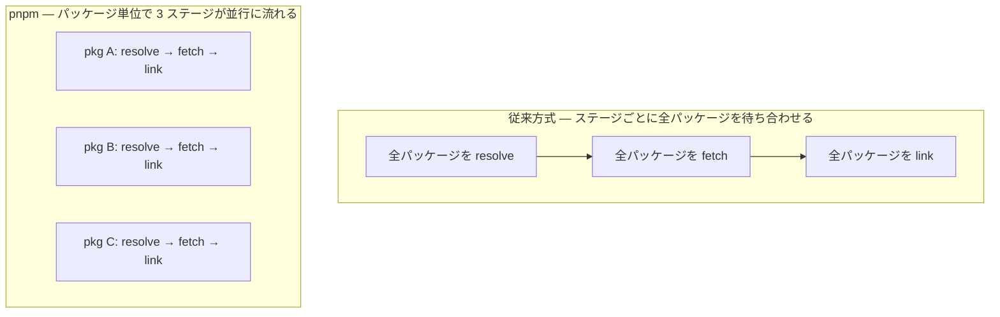

# 10. pnpm のアドバンテージ総覧

[9章](/pnpm/09-how-pnpm-works)で、pnpm のストアとリンクの仕組みを理解しました。この章では、その仕組みが実務に何をもたらすのかを 7 つのアドバンテージに整理します。pnpm の採用を検討・評価する場面で、そのまま判断材料として使える章です。

::: tip この章でわかること
- pnpm のアドバンテージを 7 つに整理して説明できる
- 公式ベンチマークの数値と読み方を押さえられる
- v10 / v11 で強化されたセキュリティ機構を列挙できる
- pnpm を採用すべきかどうかを、自分のプロジェクトの文脈で判断できる
:::

## ① ディスク効率 — プロジェクトが増えるほど効く

同じ express を使うプロジェクトが 2 つあったら、ディスク上の express も 2 つ必要なのでしょうか。9章で見たとおり、pnpm の答えは「いいえ」です。パッケージのファイル実体はマシン全体で 1 つのストアにしか存在せず、各プロジェクトへはハードリンク(macOS/APFS ではコピーオンライトのクローン)で配られます。現場ごとに同じ工具を買い直すのではなく、共用の工具庫から持ち出すイメージです。npm ではプロジェクトごとに node_modules へファイルが展開されるため、同じ依存を使う 10 個のプロジェクトがあれば実体も 10 セット分のディスクを占めますが、pnpm では 2 つ目以降の**追加コストはごくわずか**です(リンクやディレクトリ自体のコストはあるので、厳密にゼロではありません)。マイクロサービスやリポジトリを何個も抱える開発マシン・CI 環境ほど、この効果は効いてきます。実際にどれだけ減るかは依存の重複度合いによるので、気になる場合は手元で `pnpm store path` の消費量と各プロジェクトの実消費を測ってみてください。バージョン更新時も差分ファイルしかストアに増えないため、「少しずつ違うバージョンが大量にある」現実的な状況にも強い設計です。

「ほぼゼロ」を実測で確かめてみましょう。[8章](/pnpm/08-getting-started)で express を追加したときの出力(`reused 51, downloaded 15`、1.4 秒)を覚えているでしょうか。同じマシンに **2 つ目のプロジェクト**を作り、もう一度 `pnpm add express` を実行するとこうなります。

<TermDemo
  title="zsh — 2 つ目のプロジェクトで pnpm add express"
  :lines="[
    { cmd: 'mkdir pnpm-demo2 && cd pnpm-demo2 && pnpm init' },
    { pause: 400 },
    { cmd: 'pnpm add express' },
    { out: 'Packages: +66' },
    { out: 'Progress: resolved 66, reused 66, downloaded 0, added 66, done' },
    { out: 'Done in 413ms' },
  ]"
/>

```sh
$ mkdir pnpm-demo2 && cd pnpm-demo2 && pnpm init
$ pnpm add express
```

```
Packages: +66
+++++++++++++
Progress: resolved 66, reused 66, downloaded 0, added 66, done

dependencies:
+ express 5.2.1

Done in 413ms
```

`reused 66, downloaded 0` — ネットワークに一度も出ることなく、初回 1.4 秒に対して **413 ミリ秒**で完了しました。66 パッケージぶんのファイルはすべてストアの実体を指しているだけなので、ディスクの物理的な消費もほとんど増えていません。

::: warning つまずきポイント
ここで `du -sh node_modules` を実行すると、1 つ目のプロジェクトと同じ **3.7M** と表示されます。「共有されていないのでは?」と疑いたくなりますが、du が数えているのは各パスから見えた**論理サイズ**です。実体のディスクブロックはストアと共有されており、macOS/APFS のクローンでは、書き換えが起きたファイルだけがその時点で実体化します。「du の数字が同じ = 節約されていない」ではありません。
:::

<figure>
  
  <figcaption><span class="fig-num">図 10-1</span> store 共有によるディスク節約</figcaption>
</figure>

<!-- 図 10-1 の生成プロンプト(採用版・ページには出しない)

STYLE PRESET (apply exactly; keep consistent with all previous diagrams in this series):
Flat 2D vector infographic in a minimal technical-illustration style. Landscape orientation (3:2).
Pure white background (#FFFFFF). Limited palette: near-black ink #1C1E21 for text and outlines,
blue #2563EB as the single primary accent, light gray #E2E8F0 for container boxes,
orange #F59E0B for highlights only. Uniform medium-weight rounded strokes, simple geometric
icons, generous white space, clear visual hierarchy.
No gradients, no shadows, no 3D, no textures, no photorealism, no decorative background elements.
All labels in English, short (1-3 words), bold sans-serif, high contrast, perfectly legible.
Render every quoted label verbatim, exactly once, with no extra, invented, or duplicated text.
No text other than the labels listed below.

DIAGRAM CONTENT:
LAYOUT: Two panels side by side, separated by generous white space, each the same width and
height, and each with its title centered above the panel, outside it. Inside the left panel,
three equally sized boxes are stacked vertically, and each one contains a smaller box inside it.
Inside the right panel, three equally sized boxes are stacked vertically on the right side, and
one tall cylinder stands on the left side, with three arrows going from the cylinder to the
three boxes.
ICON STYLE: every icon is a simple line-art outline drawing, drawn with the same uniform dark
stroke as the boxes, with no fill, no color, no gradient, and no 3D shading. Icons must look
like monochrome outline pictograms, not illustrations.
ELEMENTS:
- Left panel titled "npm". Its three white boxes with thin dark outlines are labeled "Project A",
  "Project B", "Project C". Each contains one smaller box with a thick orange outline, and each
  of those three inner boxes is labeled "files".
- Right panel titled "pnpm". Its three white boxes with thin dark outlines are labeled
  "Project A", "Project B", "Project C", and none of them contains an inner box. The cylinder
  has a thick blue outline and white fill, no icon, and is labeled "store".
ARROWS: exactly three plain dark arrows, all inside the right panel, one from the cylinder to
each of the three boxes. No arrow labels. No other lines, arrows, or connectors anywhere.
-->

## ② 速度 — 公式ベンチマークで見る

仕組みが美しくても、体感できなければ意味がありません。では、実際どれくらい速いのでしょうか。pnpm 公式サイトは、主要シナリオのインストール速度ベンチマークを**週次で自動更新**しています。以下は 2026-08-28 時点の結果です(alotta-files フィクスチャ、50ms RTT / 200Mbit/s のエミュレート回線。現行の公式ベンチマークに Yarn は含まれていません)。

| シナリオ | npm | pnpm v11(JS 版) | pnpm v12(Rust 版) |
| --- | --- | --- | --- |
| クリーンインストール | 45.9s | 8.2s | 5s |
| lockfile あり | 11.5s | 4.7s | 3.2s |
| cache あり | 10.9s | 4s | 964ms |
| cache + lockfile | 7.2s | 2.1s | 635ms |
| cache + node_modules | 1.4s | 598ms | 48ms |
| 3 つ全部 | 1s | 472ms | 15ms |

数値は環境で変わるので絶対値より傾向を見てください。ポイントは 2 つです。第一に、**どのシナリオでも pnpm が npm を大きく上回る**こと。速さの源泉は、依存の解決(resolve)・取得(fetch)・リンク(link)を段階ごとに全パッケージ待ち合わせるのではなく、**パッケージ単位のパイプラインとして並行に流す**設計と、9章のハードリンク/CoW クローン(ファイルコピーが不要)にあります。第二に、Rust 版の v12 では cache が効く日常シナリオがミリ秒単位に入りつつあることです。

「パイプラインとして並行に流す」の違いを図にすると次のとおりです。



従来方式は、全員の注文が揃うまで 1 品も調理を始めない宴会コースです。pnpm は注文が通った皿から順に握って流す回転寿司で、A の取得を待っている間に B の解決が進み、解決の終わったパッケージから順にリンクされていきます。遅いパッケージが 1 つあっても、全体がそこで止まらないのです。

## ③ 厳格さ — 「動いていたのに壊れる」を未然に防ぐ

phantom dependency の何が怖いかというと、**壊れるタイミングを自分で選べない**ことです。未宣言のまま import していた推移的依存は、どこか遠くのライブラリが依存を整理した瞬間、こちらの変更ゼロで消えます。「昨日まで動いていたのに今日の `npm install` で壊れた」の典型パターンです。9章で見たとおり、pnpm はこれを構造的に遮断するので、問題は**導入した日に全部露見し、以後は起きません**。痛みを「いつか本番で」から「今日ローカルで」に前倒しできるのが厳格さの価値です。

この違いは 1 行で実証できます。express だけを宣言したプロジェクトを npm と pnpm でそれぞれ用意し、package.json に**書いていない** body-parser(express の内部依存)を require してみると:

```sh
# npm でインストールしたプロジェクト
$ node -e "require('body-parser')"    # 何も起きない = 成功してしまう

# pnpm でインストールしたプロジェクト
$ node -e "require('body-parser')"
Error: Cannot find module 'body-parser'
```

npm は幽霊依存を黙って通し、pnpm は入口で止める。npm 側でこうなる理由は[3章](/basics/03-node-modules)の hoisting、pnpm 側でこうなる理由は[9章](/pnpm/09-how-pnpm-works)のシンボリックリンク構造で説明したとおりです。

もう 1 つ、hoisting 由来の **doppelgänger(分身)問題**も解消します。npm/yarn v1 のフラット化では、hoist 位置の競合により**同じバージョンの同じパッケージがツリー内に複数コピー**されることがあり、シングルトンの二重化や `instanceof` の不一致といった不可解なバグを生みました。pnpm では 1 つのバージョンのファイル実体は `.pnpm` 内に 1 つで、hoist 位置の競合による分身は生まれません。ただし peer dependencies を持つパッケージだけは例外で、**どの peer と組み合わせて解決されたか**ごとに別エントリが作られます(`foo@1.0.0(react@18.3.1)` のような命名)。これは npm の doppelgänger のような「事故による重複」ではなく、正しい peer 解決のために必要な区別で、ファイルの実体はリンクで共有されるためディスクはほとんど増えません。

## ④ モノレポ第一級サポート

pnpm はワークスペース機能を後付けではなく中核機能として磨いてきました。ルートの `pnpm-workspace.yaml` にパッケージの場所を宣言し、`workspace:` プロトコルで「必ずローカルのパッケージを使う(レジストリへ勝手にフォールバックしない)」参照を張れます。v9.5.0 で導入された **catalogs** はワークスペース全体の依存バージョンを一元管理する仕組みで、`--filter` による対象指定と合わせて、モノレポ運用の道具が標準装備されています。詳しくは[11章](/pnpm/11-workspaces)で 1 章かけて解説します。

## ⑤ セキュリティ — サプライチェーン攻撃への多層防御

npm エコシステムへの攻撃が現実の脅威になった 2020 年代後半、pnpm はデフォルト設定の厳格化でいち早く応答しました。

- **lifecycle スクリプトのデフォルト無効(v10)**: 依存パッケージの postinstall 等を勝手に実行しません。Rspack がサプライチェーン攻撃を受け、postinstall 経由でマルウェアが配布された事件への直接の対応です。ビルドが必要なパッケージだけを `pnpm approve-builds` で対話的に承認します(v11 では許可リストが **`allowBuilds`** に統合されました。全許可の `dangerouslyAllowAllBuilds`(既定 `false`)も用意されていますが、名前のとおり使用は勧められません)
- **`minimumReleaseAge`(v11)**: デフォルト 1440 分、つまり**公開から 1 日経っていないバージョンを解決しない**設定です。乗っ取られたパッケージの悪意あるバージョンは公開直後に発見・削除されることが多いため、空港の検疫のように「入国前に 1 日待たせる」だけで大半を回避できます。`0` で無効化、`10080` で 1 週間に延長、除外は `minimumReleaseAgeExclude`。`pnpm dlx` にも適用されます
- **`blockExoticSubdeps: true`(v11)**: 推移的依存が git や tarball の URL を直接指すことをブロックします
- **`strictDepBuilds: true`(v11)**: 未承認のビルドスクリプトを検出したらインストール自体を失敗させます
- **`pnpm audit --fix`**: 脆弱なバージョンを回避する overrides を自動追記します(v11 から GHSA ベース)
- **`pnpm sbom`(v11)**: SBOM(ソフトウェア部品表)を生成し、監査・コンプライアンス要求に応えます

<!-- 🖼️ 画像プレースホルダー: 生成した画像を docs/public/images/fig-10-2.png に保存し、下の行のコメントを外してください -->
<!--  -->

> **🖼️ 図 10-2|pnpm のセキュリティ多層防御**(画像プレースホルダー)
> 生成後は `docs/public/images/fig-10-2.png` に配置してください。

<!-- 図 10-2 の生成プロンプト(採用版・ページには出しない)

STYLE PRESET (apply exactly; keep consistent with all previous diagrams in this series):
Flat 2D vector infographic in a minimal technical-illustration style. Landscape orientation (3:2).
Pure white background (#FFFFFF). Limited palette: near-black ink #1C1E21 for text and outlines,
blue #2563EB as the single primary accent, light gray #E2E8F0 for container boxes,
orange #F59E0B for highlights only. Uniform medium-weight rounded strokes, simple geometric
icons, generous white space, clear visual hierarchy.
No gradients, no shadows, no 3D, no textures, no photorealism, no decorative background elements.
All labels in English, short (1-3 words), bold sans-serif, high contrast, perfectly legible.
Render every quoted label verbatim, exactly once, with no extra, invented, or duplicated text.
No text other than the labels listed below.

DIAGRAM CONTENT:
LAYOUT: A horizontal pipeline from left to right: a box on the far left, four vertical
shield-shaped gates in a row, and a box on the far right.
ELEMENTS:
- Far left box (light gray, cloud icon) labeled "Registry"
- Shield gate 1 (blue) labeled "Release Age"
- Shield gate 2 (blue) labeled "Exotic Block"
- Shield gate 3 (blue) labeled "Build Approval"
- Shield gate 4 (blue) labeled "Audit"
- Far right box (light gray, folder icon) labeled "Your Project"
ARROWS: a labeled arrow reading "package" pointing from "Registry" through the four
shield gates to "Your Project".
-->

## ⑥ 非破壊的な進化の哲学

yarn 2(Berry)が PnP への方向転換でエコシステムを分断したのとは対照的に、pnpm は「**ユーザーの資産を壊さずに進化する**」姿勢を貫いています。コマンド体系は npm 互換の UX([8章](/pnpm/08-getting-started)の読み替え表がほぼ 1 対 1 だったことを思い出してください)。そして 2026 年の v12 では本体を Rust で書き直すという大手術をしながら、**コマンド・フラグ・設定・lockfile を v11 から引き継ぎ**、「これはマイグレーションではない」と宣言しました(とはいえ破壊的変更が皆無なわけではないので、移行時は公式のリリースノートを確認してください)。`pnpm self-update next-12` で試し、問題があれば戻ればよい。採用したツールが「ある日突然、別物になる」リスクの低さは、長期運用するチームにとって速度以上に重要な資質です。

## ⑦ 勢い — 安心して選べるだけの採用実績

技術選定では「良いか」だけでなく「選んでも孤立しないか」が問われます。pnpm のダウンロード数は 2024 年比で 3 倍に伸び、2026 年 4 月時点で**週間約 6,000 万ダウンロード**、同年 8 月末には**約 1 億 7,500 万**に達しました(いずれも 2026-08-30 に npm レジストリの API で実測)。開発者調査 State of JS の retention(「また使いたい」と答えた割合)では **2 年連続で Yarn を上回っています**。npm は Node.js 同梱の地位で最大シェアを維持し、Yarn は v4(Berry)が大規模組織を中心に使われ、Bun が速度面の対抗馬として控える——**本書が参照したこれらの指標の範囲では**、「乗り換え先」として最も選ばれているのが pnpm、と言えます。

なお、ダウンロード数は CI の実行回数などにも左右される指標で、実利用者数とは一致しません。retention も回答者の偏りがあります。ここでの数字は「傾向をつかむ材料」として読んでください。

<!-- 🖼️ 画像プレースホルダー: 生成した画像を docs/public/images/fig-10-3.png に保存し、下の行のコメントを外してください -->
<!--  -->

> **🖼️ 図 10-3|7 つのアドバンテージの俯瞰マップ**(画像プレースホルダー)
> 生成後は `docs/public/images/fig-10-3.png` に配置してください。

<!-- 図 10-3 の生成プロンプト(採用版・ページには出しない)

STYLE PRESET (apply exactly; keep consistent with all previous diagrams in this series):
Flat 2D vector infographic in a minimal technical-illustration style. Landscape orientation (3:2).
Pure white background (#FFFFFF). Limited palette: near-black ink #1C1E21 for text and outlines,
blue #2563EB as the single primary accent, light gray #E2E8F0 for container boxes,
orange #F59E0B for highlights only. Uniform medium-weight rounded strokes, simple geometric
icons, generous white space, clear visual hierarchy.
No gradients, no shadows, no 3D, no textures, no photorealism, no decorative background elements.
All labels in English, short (1-3 words), bold sans-serif, high contrast, perfectly legible.
Render every quoted label verbatim, exactly once, with no extra, invented, or duplicated text.
No text other than the labels listed below.

DIAGRAM CONTENT:
LAYOUT: One circle in the center with seven rounded boxes arranged evenly around it,
connected to the center by plain spokes.
ELEMENTS:
- Center circle (blue, gem icon) labeled "pnpm"
- Box (light gray, disk icon) labeled "Disk"
- Box (light gray, lightning icon) labeled "Speed"
- Box (light gray, lock icon) labeled "Strictness"
- Box (light gray, grid icon) labeled "Monorepo"
- Box (light gray, shield icon) labeled "Security"
- Box (light gray, puzzle icon) labeled "Compatibility"
- Box (orange, rocket icon) labeled "Momentum"
ARROWS: plain lines from "pnpm" to each of the seven boxes.
-->

## アドバンテージを実務の力に変える

ここまでで「pnpm を選ぶ理由」は揃いました。ただし、道具の真価は日々の運用で発揮されます。Part III の残り 2 章では、pnpm の実力を現場で引き出す機能を見ていきます。特に次章のワークスペースは、複数パッケージを扱う開発体験を大きく左右する機能です。

## まとめ

- ディスク効率: ストア共有(ハードリンク、macOS/APFS では CoW クローン)により、節約効果はプロジェクト数に比例して大きくなる。2 プロジェクト目の express は `downloaded 0`・413ms
- 速度: 公式ベンチマーク(2026-08-28 時点・週次更新)で全シナリオ npm を大きく上回り、Rust 版 v12 はさらに速い
- 厳格さ: phantom dependency と doppelgänger を構造的に防ぎ、「動いていたのに壊れる」を未然に断つ
- セキュリティ: lifecycle スクリプト無効(v10)、`minimumReleaseAge`・`allowBuilds`・`blockExoticSubdeps`・`pnpm sbom`(v11)の多層防御
- モノレポ第一級サポート・非破壊的な進化の哲学・採用の勢いが、長期運用の安心材料になる

次章では、pnpm のワークスペース機能とモノレポ運用(`pnpm-workspace.yaml`、`workspace:` プロトコル、catalogs、`--filter`)を説明します。
