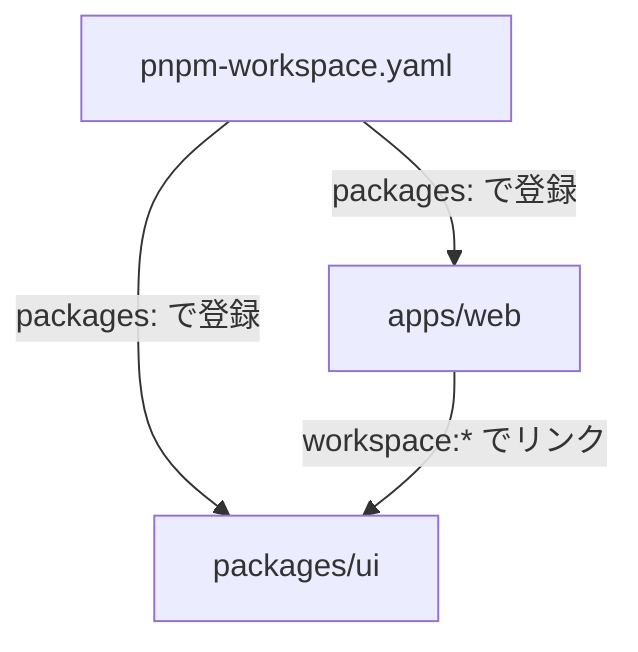

# 11. ワークスペースとモノレポ

[10章](/pnpm/10-advantages)までは、1 つの package.json を持つ「単体プロジェクト」を前提に pnpm の強みを見てきました。しかし現代のフロントエンド開発では、複数のパッケージを 1 つのリポジトリで育てる「モノレポ」が当たり前になりつつあります。この章では、pnpm がモノレポをどう支えるのか、`pnpm-workspace.yaml`・`workspace:` プロトコル・catalogs という 3 つの道具を軸に見ていきます。

::: tip この章でわかること
- モノレポがフロントエンドの現場で増えた理由を説明できる
- `pnpm-workspace.yaml` と `workspace:` プロトコルでパッケージ同士をリンクできる
- `--filter` と `-r` で対象パッケージを絞ってコマンドを実行できる
- catalogs で依存バージョンを 1 箇所に集約できる
:::

## モノレポという選択

モノレポ(monorepo)とは、関連する複数のパッケージを 1 つのリポジトリ(mono = 単一の repo)で管理するスタイルです。たとえば「Web アプリ本体」「管理画面」「共有 UI コンポーネント集」「共通の型定義」を、それぞれ別リポジトリではなく 1 つのリポジトリの `apps/` と `packages/` に同居させます。

フロントエンドの現場でモノレポが増えた理由は、大きく 3 つあります。

- **共有 UI ライブラリ**: デザインシステムのボタンやフォームを `packages/ui` に切り出し、複数のアプリから使う。別リポジトリだと「ui を修正 → publish → アプリ側で更新」という往復が発生しますが、モノレポなら修正が即座に反映されます。
- **型の共有**: API のリクエスト/レスポンス型をフロントとバックエンドで共有すれば、型の不一致をコンパイル時に検出できます。
- **アトミックな変更**: 「UI ライブラリの破壊的変更」と「それを使う全アプリの追従」を 1 つのコミット・1 つのプルリクエストで完結できます。リポジトリをまたぐ変更の「順番待ち」がなくなります。

モノレポは、各世帯が独立しつつ廊下でつながった集合住宅のようなものです。それぞれのパッケージ(世帯)は自分の package.json を持ちますが、共用設備(依存の解決、lockfile、スクリプト実行)は建物全体で 1 つに集約されます。この「共用設備」を提供するのがパッケージマネージャーのワークスペース(workspace)機能です。

## pnpm-workspace.yaml — 専用ファイルという設計

pnpm でワークスペースを有効にするには、リポジトリのルートに `pnpm-workspace.yaml` を置き、`packages:` にパッケージの場所を glob で列挙します。

```yaml
packages:
  - "apps/*"
  - "packages/*"
```

これだけで、`apps/` と `packages/` 直下の各ディレクトリ(package.json を持つもの)がワークスペースのメンバーになります。

定義ファイルとパッケージの関係を図にすると次のようになります。



[6章](/history/06-yarn)で見た yarn v1 のワークスペースは、ルートの package.json に `workspaces` フィールドを書く方式でした。pnpm はこれを採用せず、**専用ファイルに分離**しています。package.json は「パッケージとして publish される可能性のあるファイル」なので、リポジトリの構成というローカルな情報を混ぜない、という設計判断です。この分離は後述するとおり、v11 で「pnpm 設定全般の置き場」へと発展します。

なお、ワークスペース内のパッケージ同士が自動でリンクされるかどうかは `linkWorkspacePackages` 設定で決まり、デフォルトは `false` です。つまり pnpm の既定では、次に説明する `workspace:` プロトコルを**明示的に書いたときだけ**リンクされます。暗黙の魔法に頼らない、pnpm らしい既定値です。

<!-- 🖼️ 画像プレースホルダー: 生成した画像を docs/public/images/fig-11-1.png に保存し、下の行のコメントを外してください -->
<!--  -->

> **🖼️ 図 11-1|モノレポの全体構造(apps/packages と共有 lockfile)**(画像プレースホルダー)
> 生成後は `docs/public/images/fig-11-1.png` に配置してください。

::: details 図 11-1 の ChatGPT 生成プロンプト(クリックで展開)

```text
STYLE PRESET (apply exactly; keep consistent with all previous diagrams in this series):
Flat 2D vector infographic in a minimal technical-illustration style. Landscape orientation (3:2).
Pure white background (#FFFFFF). Limited palette: dark navy #1E293B for text and outlines,
blue #2563EB as the single primary accent, light gray #E2E8F0 for container boxes,
orange #F59E0B for highlights only. Uniform medium-weight rounded strokes, simple geometric
icons, generous white space, clear visual hierarchy.
No gradients, no shadows, no 3D, no textures, no photorealism, no decorative background elements.
All labels in English, short (1-3 words), bold sans-serif, high contrast, perfectly legible.
Render every quoted label verbatim, exactly once, with no extra, invented, or duplicated text.
No text other than the labels listed below.

DIAGRAM CONTENT:
LAYOUT: One large light gray rounded container filling most of the canvas, titled "monorepo root" at its top-left corner. Inside, the top row holds two file icons side by side; the bottom row holds two white package boxes side by side.
ELEMENTS: In the top row, a file icon with a blue accent labeled "pnpm-workspace.yaml" and a file icon with an orange highlight labeled "pnpm-lock.yaml". In the bottom row, a white rounded box labeled "apps/web" with a simple browser-window icon, and a white rounded box labeled "packages/ui" with a simple building-blocks icon.
ARROWS: A labeled arrow reading "defines" pointing from "pnpm-workspace.yaml" down toward the two package boxes. A labeled arrow reading "locks all" pointing from "pnpm-lock.yaml" down toward the two package boxes.
```

:::

## workspace: プロトコル — 「隣の部屋」への確実なリンク

ワークスペース内のパッケージを依存として使うには、バージョン範囲の代わりに `workspace:` プロトコルを書きます。

```json
{
  "dependencies": {
    "@myapp/ui": "workspace:*"
  }
}
```

書き方は 3 種類あり、違いが出るのは publish のときです。

| 記法 | 開発時 | publish 時の置換(ui が 1.5.0 の場合) |
|---|---|---|
| `workspace:*` | ワークスペース内の ui にリンク | `1.5.0`(完全固定) |
| `workspace:^` | 同上 | `^1.5.0` |
| `workspace:~` | 同上 | `~1.5.0` |

`workspace:` プロトコルの最大の価値は、**レジストリへのフォールバックを禁止する**ことです。yarn v1 では通常のバージョン範囲(`"^1.0.0"` など)でワークスペースを参照するため、範囲が合わないとレジストリから同名パッケージを黙って取得してしまうことがありました。「同じ家に住む家族に渡すつもりの手紙が、郵便局経由で赤の他人に配達される」ような事故です。`workspace:` を書いておけば、ワークスペース内で解決できないときはインストールがエラーで止まり、事故が起きる前に気づけます。

一方、publish 時には `workspace:^` が `^1.5.0` のような**実バージョンに自動置換**されます。利用者のもとに `workspace:` という内部事情が漏れることはありません。[2章](/basics/02-package-json-and-semver)で学んだ `^` と `~` の意味の違いが、そのままここに現れます。なお、`pnpm add` でワークスペース内パッケージを追加したときにどんな記法で保存するかは `saveWorkspaceProtocol` 設定(デフォルト `rolling`)で制御できます。

<!-- 🖼️ 画像プレースホルダー: 生成した画像を docs/public/images/fig-11-2.png に保存し、下の行のコメントを外してください -->
<!--  -->

> **🖼️ 図 11-2|workspace: プロトコルのリンクと publish 時の置換**(画像プレースホルダー)
> 生成後は `docs/public/images/fig-11-2.png` に配置してください。

::: details 図 11-2 の ChatGPT 生成プロンプト(クリックで展開)

```text
STYLE PRESET (apply exactly; keep consistent with all previous diagrams in this series):
Flat 2D vector infographic in a minimal technical-illustration style. Landscape orientation (3:2).
Pure white background (#FFFFFF). Limited palette: dark navy #1E293B for text and outlines,
blue #2563EB as the single primary accent, light gray #E2E8F0 for container boxes,
orange #F59E0B for highlights only. Uniform medium-weight rounded strokes, simple geometric
icons, generous white space, clear visual hierarchy.
No gradients, no shadows, no 3D, no textures, no photorealism, no decorative background elements.
All labels in English, short (1-3 words), bold sans-serif, high contrast, perfectly legible.
Render every quoted label verbatim, exactly once, with no extra, invented, or duplicated text.
No text other than the labels listed below.

DIAGRAM CONTENT:
LAYOUT: Left half shows local development, right half shows the registry after publishing. A wide horizontal labeled arrow connects the two halves across the middle.
ELEMENTS: On the left, a light gray container titled "develop" holding a white box labeled "app" with a small blue tag reading "workspace:^" attached to it, and below it a white box labeled "ui". On the right, a light gray container titled "registry" with a simple cloud icon, holding an orange tag reading "^1.5.0" with a small caption label "replaced" next to it.
ARROWS: A labeled arrow reading "symlink" pointing from "app" down to "ui" inside the left container. A wide labeled arrow reading "pnpm publish" pointing from the left container to the right container.
```

:::

## --filter と -r — 対象を絞って実行

モノレポでは「web アプリだけ dev サーバーを立てたい」「変更があったパッケージだけテストしたい」という場面が頻繁にあります。pnpm では `--filter` でパッケージを選択します。

```sh
$ pnpm --filter web dev
```

これは `web` という名前のパッケージで `dev` スクリプトを実行します。glob(`--filter "@myapp/*"`)や、依存関係をたどる記法も使えます。特に CI で強力なのが、**Git の変更ベースの絞り込み**です。

```sh
$ pnpm --filter "...[origin/main]" run test
```

`[origin/main]` は「origin/main と比べて変更のあったパッケージ」を選び、先頭の `...` は「それに依存しているパッケージ」まで対象を広げます。つまり「ui を変更したら、ui と、ui を使うすべてのアプリをテストする」が 1 行で書けます。モノレポが大きくなっても CI 時間が線形に伸びない仕掛けです。

全パッケージを対象にするなら `-r`(`--recursive`)です。

```sh
$ pnpm -r run build
```

`-r` は依存グラフの順序(トポロジカル順)を守って実行するため、「ui をビルドしてから app をビルドする」といった順番を自分で管理する必要がありません。

## 共有 lockfile — 台帳は 1 冊

[4章](/basics/04-lockfiles)で、lockfile は「買い物リストの控え」だと説明しました。モノレポで pnpm を使うと、この控えはリポジトリ全体で 1 冊になります。`sharedWorkspaceLockfile` 設定(デフォルト `true`)により、ルートの `pnpm-lock.yaml` にすべてのワークスペースパッケージの解決結果が記録されるのです。

利点は 3 つあります。第一に、**インストールが 1 回で済む**こと。ルートで `pnpm install` すれば全パッケージの依存が揃います。第二に、**バージョン解決が全体で一貫する**こと。同じ範囲なら同じバージョンに解決されやすく、重複が減ります。第三に、**CI やレビューで見るファイルが 1 つ**であること。lockfile の差分レビューも 1 箇所を見れば済みます。

## catalogs — バージョンの「レシピ帳」

モノレポが 30 パッケージ規模になると、新しい問題が生まれます。「React のバージョンを 30 個の package.json で揃える」問題です。1 つだけ `^18` のまま取り残されると、型の不一致や二重バンドルという厄介なバグになります。

pnpm 9.5.0 で導入された catalogs(カタログ)は、これを 1 箇所で解決します。`pnpm-workspace.yaml` にバージョン範囲の一覧を定義し、各 package.json からは `catalog:` で参照するのです。全店舗が共通のレシピ帳を見て調理する、チェーン店の厨房のような仕組みです。

```yaml
packages:
  - "apps/*"
  - "packages/*"

catalog:
  react: ^19.1.0
  react-dom: ^19.1.0

catalogs:
  react18:
    react: ^18.3.1
    react-dom: ^18.3.1
```

package.json 側はバージョンを書かず、カタログを指します。

```json
{
  "dependencies": {
    "react": "catalog:",
    "react-dom": "catalog:"
  }
}
```

`"catalog:"` はデフォルトカタログ(`catalog:` セクション)を参照します。移行途中のパッケージだけ古い React を使いたい場合は、名前付きカタログを `"react": "catalog:react18"` のように指定します。React を上げるときに編集するのは `pnpm-workspace.yaml` の 1 行だけ。30 個の package.json を grep して回る作業は過去のものになります。publish 時には `workspace:` と同様、実バージョンに置換されます。

関連設定として `catalogMode` があり、`manual`(既定)/ `strict` / `prefer` の 3 値で「`pnpm add` したときにカタログをどう使うか」を制御できます。`strict` にすると、カタログに載っているパッケージはカタログ経由でしか追加できなくなり、バージョンの一元管理を強制できます。

<!-- 🖼️ 画像プレースホルダー: 生成した画像を docs/public/images/fig-11-3.png に保存し、下の行のコメントを外してください -->
<!--  -->

> **🖼️ 図 11-3|catalog による一元管理**(画像プレースホルダー)
> 生成後は `docs/public/images/fig-11-3.png` に配置してください。

::: details 図 11-3 の ChatGPT 生成プロンプト(クリックで展開)

```text
STYLE PRESET (apply exactly; keep consistent with all previous diagrams in this series):
Flat 2D vector infographic in a minimal technical-illustration style. Landscape orientation (3:2).
Pure white background (#FFFFFF). Limited palette: dark navy #1E293B for text and outlines,
blue #2563EB as the single primary accent, light gray #E2E8F0 for container boxes,
orange #F59E0B for highlights only. Uniform medium-weight rounded strokes, simple geometric
icons, generous white space, clear visual hierarchy.
No gradients, no shadows, no 3D, no textures, no photorealism, no decorative background elements.
All labels in English, short (1-3 words), bold sans-serif, high contrast, perfectly legible.
Render every quoted label verbatim, exactly once, with no extra, invented, or duplicated text.
No text other than the labels listed below.

DIAGRAM CONTENT:
LAYOUT: On the left, one light gray container titled "pnpm-workspace.yaml" holding a highlighted blue rounded box. On the right, three white boxes stacked vertically.
ELEMENTS: The blue box inside the left container is labeled "catalog" and contains a single book icon with the label "react". The three white boxes on the right are labeled "app", "ui", and "docs"; the top box "app" has a small orange tag reading "catalog:" attached to its left edge.
ARROWS: A labeled arrow reading "resolve" pointing from "app" to the blue "catalog" box. Two unlabeled arrows pointing from "ui" and "docs" to the same blue "catalog" box.
```

:::

## 設定ファイルとしての pnpm-workspace.yaml

`pnpm-workspace.yaml` の役割は、ワークスペースの定義だけではありません。pnpm 10 の途中から pnpm の設定をこのファイルに書けるようになり、**v11 で置き場が確定**しました。すなわち、プロジェクトの pnpm 設定は `pnpm-workspace.yaml` に、グローバル設定は `~/.config/pnpm/config.yaml` に、環境変数は `pnpm_config_*` に書き、**`.npmrc` は認証情報とレジストリ URL の専用ファイル**になりました。

```yaml
packages:
  - "apps/*"
  - "packages/*"

# ここから下は pnpm の設定(v11 以降の標準的な置き場)
minimumReleaseAge: 10080
```

「設定は YAML で構造化して書き、秘密情報(auth トークン)だけ `.npmrc` に隔離する」という分業です。モノレポでないプロジェクトでも、設定を書くために `packages:` なしの `pnpm-workspace.yaml` を置くのが v11 以降の流儀です。次章で見るセキュリティ設定や overrides も、すべてこのファイルに書きます。

::: info なぜ「未知の設定」がエラーになるのか
pnpm 12 では、`pnpm-workspace.yaml` に pnpm が知らない設定キーを書くと `ERR_PNPM_UNRECOGNIZED_WORKSPACE_SETTINGS` エラーになります。タイポした設定が黙って無視される(＝効いているつもりで効いていない)事故を防ぐための、意図的な厳格化です。
:::

## 実験: 最小モノレポで workspace リンクを確認する

app と ui の 2 パッケージだけの最小モノレポを作ってみます。まず骨組みを用意してください。

```sh
$ mkdir monorepo-lab && cd monorepo-lab
$ pnpm init
$ mkdir -p apps/app packages/ui
```

ルートに `pnpm-workspace.yaml` を作ります。

```yaml
packages:
  - "apps/*"
  - "packages/*"
```

`packages/ui/package.json` と `apps/app/package.json` をそれぞれ次の内容で作ります。app は ui を `workspace:*` で参照します。

```json
{
  "name": "@lab/ui",
  "version": "1.0.0",
  "scripts": { "build": "echo build ui" }
}
```

```json
{
  "name": "@lab/app",
  "version": "1.0.0",
  "dependencies": { "@lab/ui": "workspace:*" },
  "scripts": { "build": "echo build app" }
}
```

ルートで `pnpm install` を実行し、リンクを確認します。

```sh
$ pnpm install
Scope: all 3 workspace projects
Done in 421ms

$ ls -l apps/app/node_modules/@lab
lrwxr-xr-x  1 you  staff  24  8 29 14:02 ui -> ../../../../packages/ui
```

[9章](/pnpm/09-how-pnpm-works)で見たシンボリックリンクが、今度はレジストリのパッケージではなく**隣のディレクトリ**を指しています。ui のソースを編集すれば、publish もインストールもなしに app へ即反映されます。

最後に `pnpm -r run build` を実行します。

```sh
$ pnpm -r run build
Scope: 2 of 3 workspace projects
packages/ui build$ echo build ui
│ build ui
└─ Done in 48ms
apps/app build$ echo build app
│ build app
└─ Done in 45ms
```

app が ui に依存しているため、**ui のビルドが先に実行される**ことに注目してください。順序の管理は pnpm がやってくれます。

## まとめ

- モノレポは共有 UI・型の共有・アトミックな変更のために、フロントエンドの現場で標準的な構成になった
- pnpm のワークスペースは package.json ではなく専用の `pnpm-workspace.yaml` の `packages:` glob で定義する
- `workspace:*` / `workspace:^` / `workspace:~` はレジストリへのフォールバックを禁止し、publish 時に実バージョンへ自動置換される
- `--filter` と `-r` で対象を絞れる。`--filter "...[origin/main]"` の変更ベース実行は CI で特に有効
- catalogs(v9.5.0〜)はバージョン定義を `pnpm-workspace.yaml` に集約する。v11 以降、このファイルは pnpm 設定全般の置き場でもある

次章では、`pnpm patch` や overrides、ビルドスクリプト制御など、日々の実務とトラブル対応で効いてくる機能たちを説明します。
