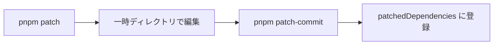

# 12. 実務で効く機能たち

[11章](/pnpm/11-workspaces)でワークスペースという「土台」が整いました。この章では、日々の開発とトラブル対応で真価を発揮する pnpm の実務機能を一気に見ていきます。依存の調査、推移的依存の強制、パッケージへのパッチ当て、そしてサプライチェーン攻撃への防御。どれも「知っているかどうか」で対応時間が桁で変わる機能です。

::: tip この章でわかること
- `pnpm why` / `pnpm outdated` / `pnpm licenses list` で依存を調査できる
- overrides と `pnpm patch` で「他人のパッケージの問題」に対処できる
- v10/v11 のビルドスクリプト制御と `minimumReleaseAge` の意図を説明できる
- `pnpm dlx` / `pnpm create` を適切な場面で使い分けられる
:::

## 日々の調査系コマンド

「このパッケージ、誰が入れたんだっけ?」— node_modules を眺めて途方に暮れた経験は誰にでもあるはずです。`pnpm why` は、あるパッケージが**なぜインストールされているのか**を依存グラフを遡って表示します。

```sh
$ pnpm why picomatch
dependencies:
vite 7.1.3
└─┬ tinyglobby 0.2.14
  └── picomatch 4.0.3
```

「picomatch は vite が使う tinyglobby の依存」と一目でわかります。脆弱性報告への対応で「うちのプロジェクトはこのパッケージを使っているか? どの経路で?」を調べる最初の一手です。

`pnpm outdated` は、宣言した範囲より新しいバージョンが出ていないかを一覧します。

```sh
$ pnpm outdated
┌────────────┬─────────┬────────┐
│ Package    │ Current │ Latest │
├────────────┼─────────┼────────┤
│ react      │ 19.1.0  │ 19.1.4 │
├────────────┼─────────┼────────┤
│ typescript │ 5.8.3   │ 5.9.2  │
└────────────┴─────────┴────────┘
```

`pnpm licenses list` は依存のライセンスを集計します。`--prod`(本番依存のみ)や `--json` と組み合わせれば、会社のライセンス監査への提出物が 1 コマンドで作れます。

## overrides — 依存グラフへの「上書き命令」

推移的依存(依存の依存)に脆弱なバージョンが混ざっているが、直接の依存はまだ修正版に追従していない — 実務で頻出する状況です。overrides は、依存グラフ全体に対して「このパッケージはこのバージョンを使え」と強制します。書く場所は前章で見たとおり `pnpm-workspace.yaml` です。

```yaml
overrides:
  lodash: 4.17.21
  "vite>esbuild": ^0.25.0
```

1 行目は「グラフ中のすべての lodash を 4.17.21 に」、2 行目は「vite の下の esbuild だけ」という限定指定です。建築にたとえるなら、各業者(直接依存)がどんな資材(推移的依存)を持ち込もうと、施主が「断熱材はこの型番に統一」と仕様書で上書きするようなものです。

yarn を使ってきた読者なら「`resolutions` と同じでは?」と気づいたはずです。そのとおりで、**overrides は yarn v1 の `resolutions` に相当します**。yarn から乗り換える場合も、`resolutions` の内容をこの overrides に書き写せばほぼそのまま機能します。

<figure>
  
  <figcaption><span class="fig-num">図 12-3</span> overrides が依存グラフを書き換える図</figcaption>
</figure>

<!-- 図 12-3 の生成プロンプト(採用版・ページには出しない)

STYLE PRESET (apply exactly; keep consistent with all previous diagrams in this series):
Flat 2D vector infographic in a minimal technical-illustration style. Landscape orientation (3:2).
Pure white background (#FFFFFF). Limited palette: near-black ink #1C1E21 for text and outlines,
blue #2563EB as the single primary accent, light gray #E2E8F0 for container boxes,
orange #F59E0B for highlights only. Uniform medium-weight rounded strokes, simple geometric
icons, generous white space, clear visual hierarchy.
No gradients, no shadows, no 3D, no textures, no photorealism, no decorative background elements.
All labels in English, short (1-3 words), bold sans-serif, high contrast, perfectly legible.
Render every quoted label verbatim, exactly once, with no extra, invented, or duplicated text.
No text other than the labels listed below.

DIAGRAM CONTENT:
LAYOUT: Two columns. The left column has two boxes side by side, horizontally centered on the
vertical middle of the canvas. The right column has three boxes stacked vertically and evenly
spaced: an upper box, a middle box, and a lower box. The left column connects to the right
column's upper and lower boxes.
ELEMENTS:
- Left column, first box: white with a thin dark outline, labeled "app"
- Left column, second box: white with a thin dark outline, labeled "lib"
- Right column, upper box: white with a dashed orange outline, labeled "vulnerable"
- Right column, middle box: white with a thick blue outline, labeled "overrides"
- Right column, lower box: white with a thick blue outline, labeled "safe version"
ARROWS: exactly four arrows. One plain dark arrow from "app" to "lib". One dashed orange line
from "lib" to the "vulnerable" box that ends in a small orange cross mark instead of an
arrowhead, labeled "blocked". One plain dark arrow from "lib" to the "safe version" box,
labeled "rewired". One short blue arrow pointing straight down from the "overrides" box to the
"safe version" box directly beneath it, labeled "forces". No other lines or connectors anywhere.
-->

## pnpm patch — fork せずにその場で繕う

依存パッケージにバグを見つけたとき、従来の選択肢は重いものでした。upstream に PR を出して待つか、リポジトリを fork して自前で npm publish するか。後者は「服のほつれを直すために仕立て屋を開業する」ようなものです。`pnpm patch` なら、その場で針と糸を出して繕えます。

フローは 4 ステップです。

1. `pnpm patch <pkg>@<version>` — パッケージの編集用コピーが一時ディレクトリに展開される
2. そのコピーを直接編集する
3. `pnpm patch-commit <path>` — 差分が `patches/` に `.patch` ファイルとして保存され、`patchedDependencies` 設定に自動登録される
4. 以後の `pnpm install` で全員に自動適用される

このフローを図にすると次のようになります。



`.patch` ファイルはリポジトリにコミットするので、チームメイトも CI も同じ修正を受け取ります。不要になったら `pnpm patch-remove` で外せます。パッチの適用先は `lodash@4.17.21` のような完全一致指定が最優先で、バージョン範囲指定、名前のみ指定の順に優先度が下がります。章末の実験で実際に試します。

::: warning つまずきポイント
パッチは「当てた瞬間のバージョンのコード」に対する diff です。`lodash@4.17.21` のような完全一致で当てたパッチは、依存を更新した時点で対象から外れます。範囲や名前のみで当てていた場合も、新バージョンでコードが変わっていれば diff の適用に失敗し、インストールが止まります。依存の更新時は「このパッチはまだ必要か(upstream で直っていないか)」を確認し、必要なら `pnpm patch` からやり直してください。パッチはあくまで応急処置で、恒久対応は upstream への報告や PR です。
:::

<figure>
  
  <figcaption><span class="fig-num">図 12-1</span> patch のワークフロー(4 ステップ)</figcaption>
</figure>

<!-- 図 12-1 の生成プロンプト(採用版・ページには出しない)

STYLE PRESET (apply exactly; keep consistent with all previous diagrams in this series):
Flat 2D vector infographic in a minimal technical-illustration style. Wide landscape orientation
(2:1 aspect ratio, e.g. 2560 x 1280).
Pure white background (#FFFFFF). Limited palette: near-black ink #1C1E21 for text and outlines,
blue #2563EB as the single primary accent, light gray #E2E8F0 for container boxes,
orange #F59E0B for highlights only. Uniform medium-weight rounded strokes, simple geometric
icons, generous white space, clear visual hierarchy.
No gradients, no shadows, no 3D, no textures, no photorealism, no decorative background elements.
All labels in English, short (1-3 words), bold sans-serif, high contrast, perfectly legible.
Render every quoted label verbatim, exactly once, with no extra, invented, or duplicated text.
No text other than the labels listed below.

DIAGRAM CONTENT:
LAYOUT: A single horizontal pipeline arranged as one straight row, all items vertically centered
on the same horizontal axis and spanning the full width of the canvas with even margins on the
left and right. Four equally sized rounded boxes are evenly spaced, connected left to right by
three arrows. Each box has one small icon above its text.
ICON STYLE: every icon is a simple line-art outline drawing, drawn with the same uniform dark
stroke as the boxes, with no fill, no color, no gradient, and no 3D shading. Icons must look
like monochrome outline pictograms, not illustrations.
ELEMENTS:
- Box 1: white with a thin dark outline, an outline icon of a folder, with two lines of text:
  "1" then "pnpm patch"
- Box 2: white with a thin dark outline, an outline icon of a pencil, with two lines of text:
  "2" then "edit copy"
- Box 3: white with a thin dark outline, an outline icon of a document, with two lines of text:
  "3" then "patch-commit"
- Box 4: white with a thick blue outline, an outline icon of a checkmark, with two lines of
  text: "4" then "auto apply"
ARROWS: exactly three plain dark arrows, one between each adjacent pair of boxes, all pointing
right. No arrow labels. No other lines or connectors anywhere in the diagram.
-->

## pnpm audit — 脆弱性の検知から封じ込めまで

`pnpm audit` は依存ツリーを既知の脆弱性データベースと突き合わせます。pnpm 11 からは識別子が CVE ではなく **GHSA(GitHub Security Advisory)ベース**になりました。`--audit-level` で報告する深刻度の下限を、`--prod` で本番依存だけを対象にできます。

覚えておきたいのが `pnpm audit --fix` です。修正版が存在する脆弱性について、先ほどの **overrides を自動で追記**してくれます。「検知(audit)→ 封じ込め(overrides)」が 1 コマンドでつながっているわけです。

一方、「この警告は当プロジェクトには影響しない」と判断した脆弱性は、`pnpm-workspace.yaml` の `audit.ignore` に GHSA 形式で列挙して抑制できます。

```yaml
audit:
  ignore:
    - GHSA-9c47-m6qq-7p4h
```

黙って無視するのではなく、無視する判断そのものをコードレビューの対象に載せられるのがポイントです。

## ビルドスクリプト制御 — postinstall は「承認制」へ

[7章](/history/07-pnpm-and-next-gen)で触れたサプライチェーン攻撃の主要な侵入経路は、インストール時に自動実行される lifecycle スクリプト(postinstall など)でした。pnpm 10 は、Rspack がこの手口で攻撃された事件を受けて、**依存パッケージの lifecycle スクリプトをデフォルトで実行しない**という破壊的変更に踏み切りました。

とはいえ esbuild のように、正当な理由で postinstall を必要とするパッケージもあります。そこで pnpm は対話的な承認コマンド `pnpm approve-builds` を用意しました。実行すると「ビルドスクリプトを持つ依存」が一覧され、選んだものだけが許可リストに載ります。対話 UI の様子はおおよそ次のとおりです。スペースキーで選択し、Enter で確定します。

```
$ pnpm approve-builds
? Choose which packages to build (Press <space> to select,
  <a> to toggle all, <i> to invert selection)
● esbuild
○ sharp
✔ The next packages will now be built: esbuild.
Do you approve? (y/N) · yes
```

空港の税関で申告品を 1 つずつ見せるように、「インストール時にスクリプトを走らせたいパッケージ」を 1 つずつ申告して通す仕組みです。v10 では許可リストは `onlyBuiltDependencies` という設定でしたが、**v11 で `allowBuilds` に統合**され、`onlyBuiltDependencies` / `neverBuiltDependencies` / `ignoredBuiltDependencies` の 3 設定を置き換えました。あわせて v11 では `strictDepBuilds: true` がデフォルトになり、未承認のビルドスクリプトは警告ではなく**インストール失敗**として扱われます。

```yaml
allowBuilds:
  - esbuild
  - sharp
```

::: warning dangerouslyAllowAllBuilds は使わない
全パッケージのビルドを無条件に許可する `dangerouslyAllowAllBuilds`(既定 `false`)という逃げ道もありますが、名前のとおり使うべきではありません。これを有効にすると pnpm 10/11 が積み上げた防御が丸ごと無効になります。面倒でも `pnpm approve-builds` で個別に承認してください。承認リストの差分はプルリクエストに現れるので、「新しく postinstall を実行するようになった依存」にレビューで気づけます。
:::

## minimumReleaseAge — 公開直後のパッケージを掴まない

近年のサプライチェーン攻撃には共通パターンがあります。メンテナーのアカウントを乗っ取り、マルウェア入りバージョンを publish し、被害が広がるのは**公開直後の数時間**、というものです。悪意あるバージョンはたいていその間に発見・削除されるため、**公開直後のバージョンを即座に掴まない**だけで、多くのケースをすり抜けられます。「時間が経てば安全になる」わけではなく、あくまで**時間的な緩衝帯**を置く仕組みだと理解してください。

pnpm 11 の `minimumReleaseAge` はこの性質を利用します。**公開から指定分数が経過していないバージョンを解決しない**設定で、デフォルトは 1440 分(= 1 日)です。`0` で無効化、`10080` にすれば 1 週間の「検疫期間」になります。裏返しのコストとして、正規のバグ修正版も公開直後は同じだけ待たされます。社内パッケージなど「待てない」ものだけを `minimumReleaseAgeExclude` で除外する、が基本の運用です。

```yaml
minimumReleaseAge: 10080
minimumReleaseAgeExclude:
  - "@mycompany/*"
```

重要なのは、この防御が後述の `pnpm dlx` にも効くことです。「X(旧 Twitter)で話題の CLI を `dlx` で即実行したら公開 2 時間のマルウェアだった」という最悪のシナリオを、設定 1 行で塞げます。

<figure>
  
  <figcaption><span class="fig-num">図 12-2</span> サプライチェーン攻撃の侵入経路と pnpm の防御ポイント</figcaption>
</figure>

<!-- 図 12-2 の生成プロンプト(採用版・ページには出しない)

STYLE PRESET (apply exactly; keep consistent with all previous diagrams in this series):
Flat 2D vector infographic in a minimal technical-illustration style. Wide landscape orientation
(2:1 aspect ratio, e.g. 2560 x 1280).
Pure white background (#FFFFFF). Limited palette: near-black ink #1C1E21 for text and outlines,
blue #2563EB as the single primary accent, light gray #E2E8F0 for container boxes,
orange #F59E0B for highlights only. Uniform medium-weight rounded strokes, simple geometric
icons, generous white space, clear visual hierarchy.
No gradients, no shadows, no 3D, no textures, no photorealism, no decorative background elements.
All labels in English, short (1-3 words), bold sans-serif, high contrast, perfectly legible.
Render every quoted label verbatim, exactly once, with no extra, invented, or duplicated text.
No text other than the labels listed below.

DIAGRAM CONTENT:
LAYOUT: A single horizontal flow arranged as one straight row, all items vertically centered on
the same horizontal axis and spanning the full width of the canvas with even margins on the left
and right. From left to right: one rounded box, then a second rounded box, then two shield
shapes side by side, then one final rounded box. Arrows connect them left to right along the row.
ICON STYLE: every icon is a simple line-art outline drawing, drawn with the same uniform dark
stroke as the boxes, with no fill, no color, no gradient, and no 3D shading. Icons must look
like monochrome outline pictograms, not illustrations.
ELEMENTS:
- Far left: a white box with a thick orange outline, an outline icon of a hooded figure, labeled
  "attacker"
- Second: a white box with a thin dark outline, an outline icon of a cloud, labeled "registry"
- Third: a shield shape with a thick blue outline and white fill, labeled "release age"
- Fourth: a shield shape with a thick blue outline and white fill, labeled "build approval"
- Far right: a white box with a thin dark outline, an outline icon of a folder, labeled
  "your project"
ARROWS: exactly two arrows. One plain dark arrow from the "attacker" box to the "registry" box,
labeled "malicious update". One dashed orange line starting at the "registry" box and pointing
right toward the first shield, ending in a small orange cross mark just before that shield,
labeled "blocked". No arrow reaches "your project". No other lines or connectors anywhere.
-->

## pnpm dlx と pnpm create — 一時実行の作法

プロジェクトの雛形生成やワンショットの CLI 実行に、パッケージを依存へ追加する必要はありません。`pnpm dlx`(エイリアス `pnpx`)は、パッケージを**依存に追加せず一時取得して実行**します。npm の `npx` に相当するコマンドです。

```sh
$ pnpm dlx cowsay "hello pnpm"
```

雛形生成には専用の `pnpm create` があります。

```sh
$ pnpm create vite my-app
```

これは `create-vite` を一時取得して実行する糖衣構文です。前述のとおり、v11 からは dlx / create にも `minimumReleaseAge` が適用されるため、「実行するだけのコマンド」にも検疫期間が効きます。

## 高度な機能 — 存在だけ知っておく

最後に、深入りはしないものの「存在を知っておくと、いつか助かる」機能を 2 つ紹介します。

- **injected dependencies**: package.json の `dependenciesMeta.<pkg>.injected` を `true` にすると、ワークスペースパッケージをシンボリックリンクではなく**ハードリンク(macOS/APFS ではコピーオンライトのクローン)によるコピー**として注入します。通常のリンクでは ui パッケージの実体は 1 つなので peer dependency も 1 通りにしか解決できませんが、injected にすると「react@18 のアプリと react@19 のアプリが同じ ui を使う」といった消費側ごとの peer 解決が可能になります。
- **configDependencies**: 通常の依存より**先に**インストールされる特殊な依存です。`.pnpmfile.mjs` フックやパッチ、カタログといった「設定そのもの」をパッケージ化し、複数リポジトリで共有できます。大規模組織で pnpm の運用ルールを配布する用途に向いています。

どちらも必要になったときに公式ドキュメントを読めば十分です。「pnpm にはその道がある」と覚えておくことが、この節の目的です。

## 実験: pnpm patch でパッチ運用を確認する

実際にパッチを当ててみます。題材として lodash に「バージョン文字列を書き換える」だけの無害な変更を加えます。まず、4 ステップの流れを通しで見てみましょう。

<TermDemo
  title="zsh — pnpm patch の 4 ステップ"
  :lines="[
    { cmd: 'pnpm patch lodash@4.17.21' },
    { out: 'Patch: You can now edit the package at:' },
    { out: '  /private/var/folders/qy/3fk2m91d5xg/T/e6bb5413-lodash@4.17.21/user' },
    { pause: 400 },
    { cmd: 'code /private/var/folders/qy/3fk2m91d5xg/T/e6bb5413-lodash@4.17.21/user/lodash.js' },
    { pause: 600 },
    { cmd: 'pnpm patch-commit /private/var/folders/qy/3fk2m91d5xg/T/e6bb5413-lodash@4.17.21/user' },
    { pause: 400 },
    { cmd: 'grep patched node_modules/lodash/lodash.js' },
    { out: '  var VERSION = \'4.17.21-patched\';' },
  ]"
/>

同じことを手元で再現していきます。

```sh
$ mkdir patch-lab && cd patch-lab
$ pnpm init
$ pnpm add lodash@4.17.21
$ pnpm patch lodash@4.17.21
Patch: You can now edit the package at:

  /private/var/folders/qy/3fk2m91d5xg/T/e6bb5413-lodash@4.17.21/user

To commit your changes, run:

  pnpm patch-commit '/private/var/folders/qy/3fk2m91d5xg/T/e6bb5413-lodash@4.17.21/user'
```

表示された一時ディレクトリの `lodash.js` をエディタで開き、`var VERSION = '4.17.21';` の行を `'4.17.21-patched'` に書き換えて保存してください。編集できたら、表示されていたコマンドをそのまま実行します。

```sh
$ pnpm patch-commit '/private/var/folders/qy/3fk2m91d5xg/T/e6bb5413-lodash@4.17.21/user'
```

すると `patches/lodash@4.17.21.patch` が生成され、`pnpm-workspace.yaml` に登録が追記されます。

```yaml
patchedDependencies:
  lodash@4.17.21: patches/lodash@4.17.21.patch
```

パッチファイルの中身は見慣れた diff 形式です。

```diff
--- a/lodash.js
+++ b/lodash.js
@@ -8,7 +8,7 @@
-  var VERSION = '4.17.21';
+  var VERSION = '4.17.21-patched';
```

適用されたか確認しましょう。

```sh
$ node -e "console.log(require('lodash').VERSION)"
4.17.21-patched
```

node_modules を消して `pnpm install` し直しても同じ結果になります。`patches/` ディレクトリと `pnpm-workspace.yaml` をコミットすれば、チーム全員と CI に同じ修正が行き渡ります。試し終えたら `pnpm patch-remove lodash@4.17.21` で外してください。

## まとめ

- `pnpm why` / `pnpm outdated` / `pnpm licenses list` が日々の依存調査の基本 3 点セット
- overrides(`pnpm-workspace.yaml` に記述)は推移的依存のバージョンを強制する。yarn v1 の `resolutions` に相当し、`pnpm audit --fix` が自動追記してくれる
- `pnpm patch` → 編集 → `pnpm patch-commit` で、fork せずに依存パッケージを修正できる。依存を更新したらパッチの要否を見直す
- v10 で postinstall はデフォルト無効になり、v11 では承認リストが `allowBuilds` に統合された。`dangerouslyAllowAllBuilds` には頼らない
- `minimumReleaseAge`(デフォルト 1440 分)は公開直後のパッケージを掴まない検疫期間で、`pnpm dlx` にも効く

これで本書の本編は終わりです。パッケージマネージャーの仕組みから歴史、そして pnpm の内部構造と実務機能まで、`npm install` の下にあるものを一段ずつ潜ってきました。手元のプロジェクトで `ls -la node_modules` を打ったとき、以前とは違う景色が見えているはずです。

このあとは付録が控えています。日々の作業では[付録A. コマンド対照表](/appendix/a-command-cheatsheet)を、用語の確認には[付録B. 用語集](/appendix/b-glossary)をどうぞ。
