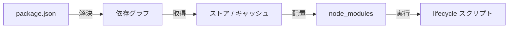

> 出典: Node.js Package Manager Guide(npmg) — https://npmg.yamauz.workers.dev/basics/01-what-is-a-package-manager.html

# 1. パッケージマネージャーとは何か

私たちは毎日のように `npm install` と打ちます。数秒待てば `node_modules` が現れ、`import` が通るようになる。では、その数秒の間に何が起きているのでしょうか。この章では、パッケージマネージャーという道具の役割を「それがない世界」から出発して整理し、本書全体の見取り図を手に入れます。

**[ヒント] この章でわかること**

- パッケージマネージャーがなかった時代の依存管理の苦労を説明できる
- パッケージマネージャーの 4 つの仕事(解決・取得・配置・実行)を列挙できる
- レジストリの役割と、メタデータ・tarball の関係を説明できる
- `npm install` の前後で package.json と node_modules に起きる変化を観察できる

## パッケージマネージャーがない世界

想像してみてください。あなたは 2008 年ごろの Web 開発者で、ページに日付処理のライブラリを入れたいとします。やることはこうです。まず配布サイトを探して zip をダウンロードし、解凍した `.js` ファイルをプロジェクトの `lib/` フォルダにコピーする。そして HTML に script タグを 1 行足す。ライブラリが 3 つなら script タグも 3 行。読み込み順を間違えると `undefined` エラーで動きません。

この方式のつらさは、入れるときより「入れたあと」に現れます。

- **更新が手作業**。新バージョンが出たか自分で見に行き、また zip を落としてファイルを差し替える。どのプロジェクトがどのバージョンを使っているかは誰も覚えていない。
- **依存の依存**。ライブラリ A が内部でライブラリ B を使っていると、A のドキュメントを読んで B も自分で入れる必要がある。B がさらに C を使っていたら…この連鎖を人間が追いかけるのは、数個ならまだしも数十個では破綻します。
- **チームでの共有**。「動く lib/ フォルダ」を zip でメールしたり、リポジトリにライブラリ本体ごとコミットしたりしていました。

つまり「どのライブラリの、どのバージョンを、どこから持ってきて、どこに置くか」という管理を、すべて人間の記憶とコピー&ペーストでやっていたのです。パッケージマネージャーは、この一連の作業を機械にやらせるための道具です。

## 全体像 — 登場人物は 4 つ

パッケージマネージャーを取り巻く登場人物は、突き詰めると 4 つしかいません。①コマンドを打つ**開発者**、②npm や pnpm などの **CLI ツール本体**、③パッケージの置き場である**レジストリ(registry)**、④手元の置き場である **node_modules** です。

[図 1-1 パッケージマネージャーを取り巻く 4 つの登場人物]

開発者が `npm install` と打つと、CLI はレジストリに問い合わせ、必要なファイルを取り寄せ、node_modules に書き込みます。npm・yarn・pnpm という本書の主役たちは、いずれもこの図の「CLI ツール本体」の座を争ってきたプレイヤーです。矢印の中身——「何を問い合わせ、何をどう書き込むか」——の設計こそが各ツールの個性であり、本書の残り全部のテーマです。

## 4 つの仕事 — 解決・取得・配置・実行

`npm install` の数秒間を分解すると、大きく 4 つの仕事に整理できます。これは npm や pnpm が公式にそう定義しているわけではなく、**本書が理解しやすさのために採用する整理**ですが、どのツールの動きもこの枠で読み解けます。

[図 1-2 パッケージマネージャーの 4 つの仕事のパイプライン]

1. **解決(resolution)**。package.json に書かれた「`react` の 19 系がほしい」のような**要求**を、「`react` の 19.2.8 を使う」という**具体的なバージョンの一覧**に確定させる仕事です。依存の依存も含めてすべてを洗い出し、依存関係の全体像(グラフ)を組み立てます。
2. **取得(fetch)**。確定した各パッケージの実体(tarball という圧縮ファイル)をレジストリからダウンロードします。一度取得したものはマシン内にキャッシュされ、2 回目以降は通信せずに済みます。
3. **配置(link)**。取得したファイルを node_modules に展開・配置します。実はここが各ツールの個性が最も出る工程で、[3章](https://npmg.yamauz.workers.dev/basics/03-node-modules)と 9 章で深掘りします。
4. **実行(run scripts)**。パッケージが「インストール後にこれを実行してほしい」と指定したスクリプト(lifecycle スクリプト)を走らせます。ネイティブコードのビルドなどに使われますが、セキュリティ上の論点にもなります([2章](https://npmg.yamauz.workers.dev/basics/02-package-json-and-semver)で紹介します)。なお、この段階だけは必ず走るとは限りません。`--ignore-scripts` で無効にできますし、pnpm は v10 以降これを既定で実行しません(Part III で詳しく扱います)。

このうち最もイメージしづらいのが「解決」でしょう。具体例で考えます。package.json の `"react": "^19.2.0"` という記述は、「19.2.0 ちょうど」ではなく「19.2.0 以上 20.0.0 未満ならどれでもよい」という**範囲**の宣言です(記号の読み方は次章で説明します)。一方、レジストリには 19.2.0、19.2.5、19.2.8…と多数のバージョンが公開されています。パッケージマネージャーはこの一覧と範囲を突き合わせ、「今回は 19.2.8 を使う」と **1 つに決めます**。この「範囲から 1 つに決める」作業を、依存の依存も含めた全パッケージについて繰り返した結果が依存グラフです。

4 段階のつながりを図にすると次のようになります。



「解決 → 取得 → 配置 → 実行」。この 4 語を覚えておくと、この先どのツールの話になっても「いまはどの工程の話か」で迷子にならずに済みます。

**[コラム] 一杯のラーメンにたとえる**

4 つの仕事は、言葉だけ並べるとどうしても手触りがありません。ここで、本書に何度か顔を出すことになる一軒のラーメン屋に登場してもらいます。屋号は **らぁめん濃度盛汁流**。

[名物 依存地獄らぁめん]

あなたが作りたいアプリケーションは、この店が出す**一杯のラーメン**です。すると 4 つの仕事はそのまま厨房の段取りになります。

- **解決** — 品書きに「豚バラ、3 枚から 5 枚」と幅で書いてある。今日は 4 枚と決める。同じことを、タレやメンマ、さらに「タレを作るための醤油」まで含めた全部について決める
- **取得** — 決まった具材を市場から仕入れてくる。前に買ったものが蔵に残っていれば、市場まで行かなくていい
- **配置** — 仕入れた具材を厨房の手の届く場所に並べる。**どう並べるかは店の流儀で違う**——ここが後の章でツールごとに大きく分かれるところです
- **実行** — 仕込みが要る具材に火を通す。チャーシューは煮る、味玉は漬ける

つまり `npm install` とは「品書きを見て、仕入れて、並べて、仕込む」までを一息にやる号令です。丼にラーメンが出てくるのは、そのあと `node index.js` と打った瞬間になります。

## 「依存の依存」がすべてを複雑にする

先ほどの手作業時代の苦労のうち、パッケージマネージャーの設計を最も難しくしているのが**推移的依存(transitive dependency)**、つまり「依存の依存」です。

あなたが package.json に書くのは `express` の 1 行だけでも、express 自身が `body-parser` や `debug` に依存し、`debug` はさらに `ms` に依存し…と連鎖します。1 行の宣言が、実際には数十個のパッケージのインストールを意味するのです。

[図 1-3 1 つの宣言から依存の依存がツリーに広がる]

推移的依存があるおかげで、私たちはライブラリの内部事情を知らなくても使えます。一方でパッケージマネージャーには難題が生まれます。同じパッケージを複数の親が別々のバージョンで要求したらどうするか。この依存関係全体(グラフ)を、ディスク上のフォルダ(ツリー)にどう写し取るか。この問いが [3章](https://npmg.yamauz.workers.dev/basics/03-node-modules)の主役であり、npm → yarn → pnpm という歴史を駆動してきたエンジンです。

## レジストリ — 誰でも公開できる巨大な倉庫

では、CLI が問い合わせている相手——**レジストリ**とは、実際のところ何者なのでしょうか。答えは「パッケージ置き場として動いている、ただの Web サーバー」です。Node.js の世界では npm レジストリ(`https://registry.npmjs.org`)が事実上の標準で、npm だけでなく yarn も pnpm も、既定ではこの同じレジストリと通信します。ツールを乗り換えてもパッケージの品揃えが変わらないのはこのためです。

**[注意] つまずきポイント: 「npm」は 3 つの別物を指す**

「npm」という言葉は、①CLI ツール(`npm` コマンド)、②npm レジストリ(registry.npmjs.org)、③それを運営する組織、という 3 つの意味で使われます。特に①と②の混同に注意してください。yarn や pnpm が置き換えるのは①だけで、②はそのまま共有します。「yarn に乗り換えたら使えるパッケージが減る」ことはありませんし、pnpm で入れたパッケージも出どころは同じ npm レジストリです。

レジストリが各パッケージについて持っている情報は、大きく 2 種類に分かれます。

- **メタデータ**: パッケージ名、公開されている全バージョンの一覧、各バージョンの依存関係などを記した JSON。「解決」の工程はこれを読んで行われます。
- **tarball**: 各バージョンのコード本体を固めた圧縮ファイル(`.tgz`)。「取得」の工程でダウンロードされるのはこちらです。

「ただの Web サーバー」であることは、パッケージマネージャーを介さずに curl で直接話しかけてみると実感できます。

```sh
$ curl -s https://registry.npmjs.org/left-pad/latest | jq -r .version
1.3.0
$ curl -s https://registry.npmjs.org/left-pad/latest | jq -r .dist.tarball
https://registry.npmjs.org/left-pad/-/left-pad-1.3.0.tgz
```

手元で試す場合はこちらをどうぞ(JSON 整形ツールの jq がなければ、パイプより前だけ実行して生の JSON を眺めても構いません)。

```sh
$ curl -s https://registry.npmjs.org/left-pad/latest | jq -r .version
$ curl -s https://registry.npmjs.org/left-pad/latest | jq -r .dist.tarball
```

`https://registry.npmjs.org/<パッケージ名>/latest` という URL に GET リクエストを送るとメタデータの JSON が返り、その中の `dist.tarball` に書かれた URL からコード本体の圧縮ファイルをダウンロードできます。どちらもブラウザのアドレスバーに貼っても開ける、ごく普通の HTTP です。`npm install` の「解決」と「取得」は、本質的にはこの 2 種類のリクエストの自動化であって、魔法ではありません。

レジストリの際立った特徴は、**誰でも publish できる**ことです。アカウントを作れば、あなたも今日から `npm publish` で世界にパッケージを公開できます。この開放性のおかげで npm レジストリは数百万パッケージという他言語に類を見ない規模に成長しましたが、裏返せば「中身の品質や安全性は保証されない」ということでもあります。取得したファイルが改ざんされていないかの検証([4章](https://npmg.yamauz.workers.dev/basics/04-lockfiles)の integrity)や、インストール時スクリプトの扱いが重要になる理由は、ここにあります。

**[補足] なぜ「パッケージ」と呼ぶのか**

npm の世界でのパッケージとは、正確には「package.json を持つフォルダ(を固めたもの)」です。コード本体に「名前・バージョン・依存関係」という荷札を付けて梱包したものだから、パッケージ(小包)。荷札の書き方は次章で詳しく見ます。

## 実験: left-pad のインストールを観察する

言葉の説明はここまでにして、実際に `npm install` の前後を観察してみます。まず、これから行う実験の流れを通しで見てみましょう。

```sh
$ npm init -y
$ npm install left-pad
npm warn deprecated left-pad@1.3.0: use String.prototype.padStart()
added 1 package, and audited 2 packages in 631ms
found 0 vulnerabilities
$ ls node_modules
left-pad
```

同じことを手元で再現していきます。実験には、文字列の左側を埋めるだけの小さなパッケージ `left-pad` を使います。使い捨てのディレクトリを作ってください。

```sh
$ mkdir -p ~/pm-sandbox/hello-pm
$ cd ~/pm-sandbox/hello-pm
$ npm init -y
```

`npm init -y` は package.json の雛形を作るコマンドです。この時点では依存はゼロで、node_modules も存在しません。続いてインストールします。

```sh
$ npm install left-pad
```

```
npm warn deprecated left-pad@1.3.0: use String.prototype.padStart()

added 1 package, and audited 2 packages in 631ms

found 0 vulnerabilities
```

「left-pad は非推奨(deprecated)。標準の `String.prototype.padStart()` を使って」という警告が出ました。公開者がレジストリのメタデータに残したメッセージが、インストール時にそのまま表示されているわけです。今回は実験なので気にせず進みます。変化を確認しましょう。

```sh
$ ls node_modules
```

```
left-pad
```

```sh
$ cat package.json
```

```json
{
  "name": "hello-pm",
  "version": "1.0.0",
  ...
  "dependencies": {
    "left-pad": "^1.3.0"
  }
}
```

node_modules に `left-pad` フォルダが現れ、package.json には `"left-pad": "^1.3.0"` という 1 行が追記されました。この `^1.3.0` という書き方(`1.3.0` ちょうどではない)の意味は次章のメインテーマです。また、よく見るとディレクトリには `package-lock.json` という見慣れないファイルも生まれています。これは [4章](https://npmg.yamauz.workers.dev/basics/04-lockfiles)の主役なので、いまは「そういうものができる」とだけ覚えておいてください。

最後に、入れたパッケージが動くことを確認します。

```sh
$ node -e "const leftPad = require('left-pad'); console.log(leftPad('7', 3, '0'))"
```

```
007
```

ダウンロードもファイル配置も読み込みパスの設定も、すべてコマンド 1 つで済みました。手作業時代と比べたとき、この「当たり前」がどれだけの仕事の上に成り立っているかが、この章の要点です。

**[注意] つまずきポイント: node_modules は「生成物」**

node_modules は package.json(と 4 章で説明するロックファイル)から**いつでも作り直せる生成物**です。挙動がおかしいと感じたら丸ごと削除して `npm install` し直して構いません。逆に、中のファイルを直接編集してはいけません(次のインストールで消えます)し、Git にコミットするものでもありません。コミットして共有すべきは package.json とロックファイルの側です。

**[補足] なぜ left-pad が有名なのか**

left-pad は 2016 年に作者がレジストリから削除(unpublish)し、これに依存していた無数のパッケージのインストールが世界中で一斉に失敗した事件で知られています。わずか十数行のコードが巨大なエコシステムの急所だったこの事件は「依存の依存」の影響力を示す教材として、いまも語り継がれています。詳しくは Part II の歴史編で触れます。

## まとめ

- パッケージマネージャー以前は、ライブラリの入手・更新・依存の連鎖をすべて人間が手作業で管理していた
- パッケージマネージャーの仕事は「解決 → 取得 → 配置 → 実行」の 4 段階に整理できる。「解決」とはバージョンの範囲を具体的な 1 つに決めること
- 登場人物は開発者・CLI・レジストリ・node_modules の 4 つで、npm / yarn / pnpm の違いは CLI の設計の違い
- レジストリの実体はメタデータ(JSON)と tarball を HTTP で配る「誰でも publish できる」Web サーバーで、npm / yarn / pnpm は既定で同じ npm レジストリを使う
- 「依存の依存(推移的依存)」こそが複雑さの源泉で、本書全体を貫くテーマになる

次章では、実験で書き換わった package.json の中身——マニフェストとしての役割と、`^1.3.0` のようなバージョン範囲の読み方——を説明します。
