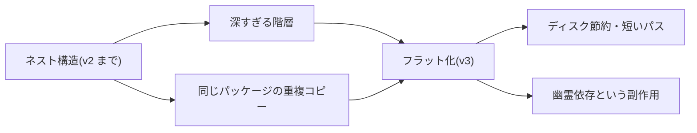
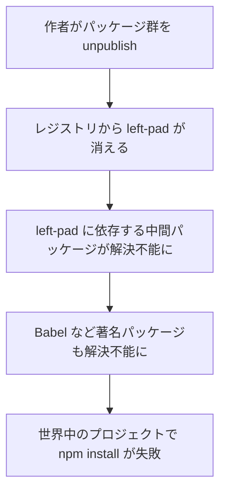

> 出典: Node.js Package Manager Guide(npmg) — https://npmg.yamauz.workers.dev/history/05-npm.html

# 5. npm の誕生と進化

Part I では、パッケージマネージャーが「何を」「どういう手順で」しているかを、package.json・node_modules・ロックファイルという 3 つの部品から見てきました。Part II では視点を変えて、「なぜ npm・yarn・pnpm という複数のツールが存在するのか」を歴史から解き明かします。すべての出発点は npm です。

**[ヒント] この章でわかること**

- npm が Node.js の「事実上の標準」になった経緯を説明できる
- npm v3 のフラット化と npm v5 のロックファイル導入が、それぞれ何を解決したかを言える
- left-pad 事件(2016)から「依存グラフの脆さ」という教訓を読み取れる
- GitHub 買収後の npm の現在地を把握できる

## Node.js とともに歩みはじめた npm

npm は 2010 年 1 月、Isaac Schlueter 氏によって公開されました。当時の Node.js はまだ生まれたばかりで、ライブラリを使いたければ GitHub からコードをコピーしてくるような時代です。npm は「レジストリにパッケージを登録し、コマンド一発で取得する」という仕組みを Node.js コミュニティに持ち込みました。1 章で見た「パッケージマネージャーの基本形」は、この時点でほぼ完成していたことになります。

では、npm はなぜ「事実上の標準」と呼べるほどの地位を得たのでしょうか。品質や機能が優れていたから——だけではありません。**Node.js 本体に同梱された**ことが大きいのです。Node.js をインストールすれば `npm` コマンドも一緒に入る——この配布形態によって、npm は「選ぶもの」ではなく「最初からそこにあるもの」になりました。水道の蛇口をひねれば水が出るように、`npm install` と打てばパッケージが降ってくる。npm レジストリは JavaScript エコシステムの水道網のような公共インフラへと成長していきます。

この「同梱による標準化」は、本章以降のすべての話の前提になります。yarn も pnpm も、パッケージの取得先は基本的に同じ npm レジストリです。競争が起きたのはあくまで「クライアント側のツール」であって、レジストリという水道網そのものは、今日まで npm が一手に担い続けています。

[図 5-1 npm の年表(2010〜現在の主要イベント)]

## フラット化とロックファイル — v3 と v5

npm 自身も、大きな構造変更を重ねてきました。本書ですでに学んだ 2 つの仕組みは、実はどちらも npm のメジャーバージョンアップの産物です。では、npm はなぜ node_modules の作り方を途中で丸ごと変えるような大工事に踏み切ったのでしょうか。

1 つめは **npm v3(2015)のフラット化**です。[3章](https://npmg.yamauz.workers.dev/basics/03-node-modules)で見たとおり、初期の npm(v2 まで)は依存を入れ子(ネスト)構造で配置していました。ネストは「誰が何に依存しているか」をディレクトリ構造がそのまま表す、素直で正確な方式です。しかし依存の依存がどこまでも深くなり、同じパッケージの重複コピーでディスクが膨らみ、Windows ではパス長の上限に激突する——正確さの代償が実用の限界を超えたため、v3 は依存をできるだけ node_modules 直下へ引き上げる(hoisting)方式へ舵を切りました。

この転換の因果をひとつの図にまとめます。ネストの問題を解決した引き換えに、新しい副作用を 1 つ抱え込んだ点に注目してください。



図の右下——宣言していないパッケージまで import できてしまう「幽霊依存(phantom dependency)」こそ、v3 が支払った代償です。この副作用は以後の npm でも解決されないまま残り、7 章で pnpm が登場する伏線になります。

2 つめは **npm v5(2017)の package-lock.json 導入**です。[4章](https://npmg.yamauz.workers.dev/basics/04-lockfiles)で説明したように、ロックファイルがなければ「同じ package.json でも、インストールする日によって入るバージョンが違う」という非決定的な状態になります。npm は v5 でようやく、インストール結果を固定するロックファイルを標準搭載しました。「ようやく」と書いたのは理由があります。次章で見るとおり、これは 2016 年に登場した yarn への対抗策という側面が強いのです。

同じ v5 系のリリース(2017)では、**npx** というコマンドも同梱されるようになりました。パッケージをプロジェクトにインストールせず、一時的に取得してそのまま実行するツールです。`npx create-react-app my-app` のような「一度きりのコマンド実行」が定番の使い方で、のちに pnpm の `dlx` など各ツールが同等機能を備えていきます。

**[注意] つまずきポイント**

v3 のフラット化と v5 のロックファイルは、どちらも「npm の大改修」ですが、解決した問題は別物です。v3 が答えたのは「解決した依存を**どこに置くか**」という配置の問題。v5 が答えたのは「範囲指定が**どのバージョンに確定するかを再現できない**」という決定性の問題。この 2 つを混同すると、次章の「yarn は何が新しかったのか」(答えは後者)が見えなくなります。

## left-pad 事件 — 11 行が世界を止めた日

2016 年 3 月、npm の歴史でもっとも有名な事件が起きます。**left-pad 事件**です。

left-pad は、文字列の左側を指定文字で埋めるだけの、本体わずか 11 行のパッケージでした。作者はパッケージ名をめぐるトラブルをきっかけに、自身が公開していたパッケージ群をレジストリから一斉に取り下げ(unpublish)ます。その中に left-pad が含まれていました。

すると何が起きたか。Babel をはじめとする著名パッケージが、依存グラフの奥深くで left-pad に(間接的に)依存していたため、世界中の `npm install` が「left-pad が見つからない」というエラーで一斉に失敗しはじめたのです。自分では left-pad の名前すら知らない開発者のビルドが、次々に止まりました。ジェンガのタワーから、最下段の小さなブロックを 1 つ抜いたら全体が崩れた——そんな事件でした。

連鎖の様子を図で確認しましょう。倒されたのは末端の小さなブロック 1 つなのに、崩れたのは頂上までの全部でした。



注目すべきは、この連鎖の当事者のほぼ全員が left-pad を**直接は使っていない**ことです。本章冒頭の水道網の比喩でいえば、浄水場の小さなバルブが 1 つ閉じただけで、蛇口しか知らない全世帯が断水した——依存グラフの「深さ」が、そのまま被害の「広さ」に変換されたのです。

[図 5-2 left-pad 事件 — 小さな 1 ブロックを抜くと崩れるタワー]

事件が示した教訓は 2 つあります。第一に、**依存グラフは自分が見えている範囲よりはるかに深く、脆い**ということ。直接依存が 10 個でも、間接依存を含めれば数百〜数千になり、そのどれか 1 つが消えるだけで全体が壊れます。第二に、**レジストリはもはや公共インフラであり、「作者の自由」だけでは運営できない**ということ。npm はこの事件を受けて、一度公開して一定条件を満たしたパッケージは原則 unpublish できないようポリシーを改めました。

**[補足] なぜ 11 行のために依存を増やすのか**

「11 行なら自分で書けばいいのに」と思うかもしれません。当時の JavaScript には標準の `padStart` がなく(ES2017 で追加)、「小さな処理も再利用する」文化が npm の強みでもありました。細粒度パッケージ文化は生産性の源泉であると同時に、依存グラフを深く脆くする——left-pad 事件はその二面性を突きつけた出来事でした。

## GitHub 傘下の npm、そして現在

2020 年 3 月、GitHub が npm, Inc. を買収しました。レジストリの運営は個人や小さな企業が支えるには巨大になりすぎており、GitHub(その親会社は Microsoft)という大資本の傘下に入ったことで、少なくとも「レジストリが資金難で止まる」心配は遠のきました。

現在の npm は、Node.js 同梱という配布力を背景に**依然として最大シェア**のパッケージマネージャーです。基本機能は成熟し、ロックファイル・workspaces・`npm audit` など、かつて他ツールの専売特許だった機能もひととおり取り込みました。一方で、left-pad 事件で露呈した「依存グラフの脆さ」は、その後**サプライチェーン攻撃(supply chain attack)**という形でより深刻な脅威に変わっていきます。パッケージが「消える」のではなく、「悪意あるコードにすり替わる」時代への対応は、7 章と Part III で扱う各ツールの重要テーマになります。

## 実験: left-pad をレジストリで見てみる

事件の主役 left-pad は、いまもレジストリに残っています(事件後に復旧されました)。`npm view` で確認してみます。

```sh
$ npm view left-pad
```

```
left-pad@1.3.0 | WTFPL | deps: none | versions: 15
String left pad

DEPRECATED ⚠️  - use String.prototype.padStart()

dist
.tarball: https://registry.npmjs.org/left-pad/-/left-pad-1.3.0.tgz
.integrity: sha512-XI5MPzVNApjAyhQzphX8BkmKsKUxD4LdyK24iZeQGinBN9yTQT3bFlCBy/aVx2HrNcqQGsdot8ghrjyrvMCoEA==

maintainers:
- stevemao <maoshuoyu@gmail.com>
```

注目してほしいのは 2 点です。まず `DEPRECATED` の表示。unpublish(削除)ではなく deprecate(非推奨化)が、いまのレジストリで推奨される「引退」の作法です。もう 1 つは `.integrity` のハッシュ値。4 章で見たとおり、ロックファイルはこの値を使って「取得したファイルが改ざんされていないか」を検証しています。11 行のパッケージにも、エコシステムを守る仕組みがきちんと適用されているわけです。

## まとめ

- npm は 2010 年に Isaac Schlueter 氏が公開し、Node.js への同梱によって事実上の標準になった
- npm v3(2015)のフラット化はネスト構造の問題を解決したが、phantom dependency という副作用を生んだ
- npm v5(2017)で package-lock.json と npx が加わった。ロックファイル導入は yarn への対抗という文脈がある
- left-pad 事件(2016 年 3 月)は、11 行のパッケージの unpublish がエコシステム全体を止め、依存グラフの脆さを世に示した
- 2020 年 3 月に GitHub が npm, Inc. を買収。npm は現在も最大シェアを維持している

次章では、この章で何度か名前の出た yarn を取り上げます。2016 年の npm が抱えていた課題と、yarn v1 がそれをどう解決したか、そしてなぜ「yarn 2」で道が分かれたのかを見ていきます。→ [6章 yarn の登場と分岐](https://npmg.yamauz.workers.dev/history/06-yarn)
