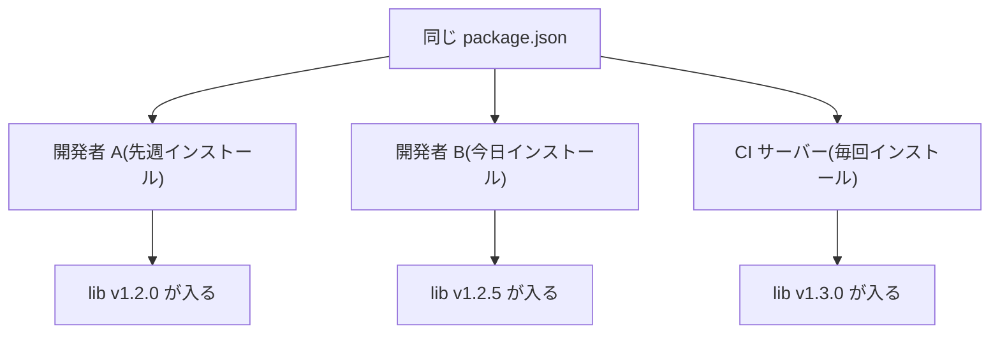
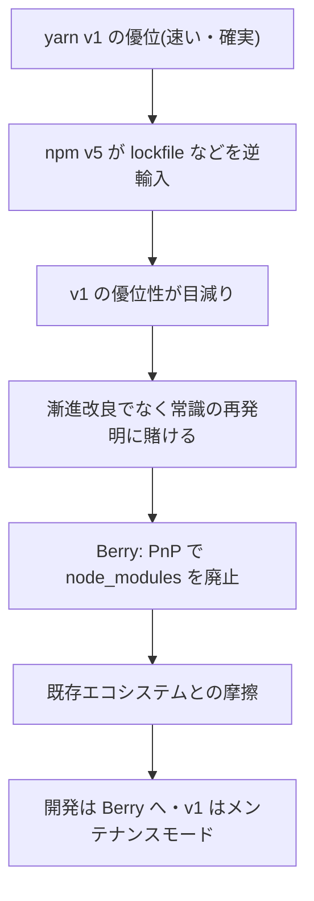

> 出典: Node.js Package Manager Guide(npmg) — https://npmg.yamauz.workers.dev/history/06-yarn.html

# 6. yarn の登場と分岐

前章では、npm が Node.js の標準となる一方で、left-pad 事件が依存グラフの脆さを露呈させた 2016 年までを見ました。実はその同じ 2016 年、npm の牙城に初めて本格的な競争を持ち込むツールが現れます。yarn です。この章では、yarn v1 が何を解決し、なぜ「yarn 2」で道が分かれ、その結果いま多くの現場がどんな状況に置かれているのかを追いかけます。

**[ヒント] この章でわかること**

- 2016 年当時の npm が抱えていた 3 つの課題を挙げられる
- yarn v1 の革新(yarn.lock・並列ダウンロード・オフラインキャッシュ・workspaces)を説明できる
- yarn 2「Berry」の方向転換と、v1 がメンテナンスモードになった経緯を説明できる
- 「yarn v1 に取り残された現場」という、本書の読者自身の現在地を言語化できる

## 2016 年、npm への不満が頂点に

yarn は 2016 年 10 月、Facebook(現 Meta)が Google・Exponent・Tilde と共同で公開しました。では、世界最大級の開発組織を「標準ツールを捨てて自前のパッケージマネージャーを作る」ところまで追い込んだものは、いったい何だったのでしょうか。不満は大きく 3 つありました。

1 つめは**遅さ**です。当時の npm はパッケージをおおむね逐次的に処理しており、依存が数千個規模になるプロジェクトではインストールに何分も待たされました。CI が回るたびにこの待ち時間が発生します。

2 つめは**非決定性**です。ここで、いまの読者にはかえって想像しにくい前提を、はっきり書いておきます。**2016 年の npm に、ロックファイルは存在しませんでした**。前章で見たとおり package-lock.json が入るのは 2017 年の v5 から。[4章](https://npmg.yamauz.workers.dev/basics/04-lockfiles)で学んだ「仕入れ伝票」に当たるものが、当時は何もなかったのです。

伝票のない世界で何が起きるかを図にすると、次のとおりです。



範囲指定(`^1.2.0` など)を使う限り、レジストリに新バージョンが公開されるたびにインストール結果は静かにずれていきます。同じレシピなのに作るたびに味の変わる料理のようなもので、「自分の手元では動くのに」という不毛なトラブルの温床でした。

3 つめは**オフラインへの弱さ**です。一度インストールしたパッケージでも、ネットワークが不調ならインストールは失敗します。レジストリの障害が、そのまま全世界の開発停止につながる構造は left-pad 事件でも明らかになったとおりです。

[図 6-1 yarn v1 が解決した 3 つの課題]

## yarn v1 の革新

yarn v1 はこの 3 つに、真正面から答えを出しました。

**yarn.lock** は、依存グラフの解決結果をすべて記録するロックファイルです。[4章](https://npmg.yamauz.workers.dev/basics/04-lockfiles)で学んだ「誰がいつどこでインストールしても同じ node_modules になる」という決定性を、JavaScript エコシステムに初めて標準機能として持ち込んだのが yarn でした。lockfile という発明自体は他言語(Ruby の Bundler など)に先例がありますが、npm の世界ではこれが事実上の初体験だったのです。

**[注意] つまずきポイント**

「lockfile は npm が作った標準機能で、yarn はその改良版」と思っていたら、歴史の順序が逆です。**先に yarn が 2016 年に lockfile を持ち込み、npm が 2017 年に追いかけました**。いまの `npm install` が package-lock.json を当たり前に生成するのは、この競争の結果であって、最初からの姿ではありません。

**並列ダウンロード**は、複数パッケージの取得を同時に走らせることでインストールを大幅に高速化しました。**オフラインキャッシュ**は、一度ダウンロードした tarball を手元に保存し、2 回目以降はネットワークなしでもインストールを完了できるようにしました。

**[補足] 濃度盛汁流・二代目**

前章の初代大将は、腕はいいが伝票を付けない人でした。二代目にあたる yarn が最初にやったのは、**その日使った具材を一枚残らず書き留めること**です。「◯◯精肉店の豚バラ、ロット XX を 4 枚」。翌週も、隣の店舗でも、同じ伝票さえあれば同じ一杯が出る(yarn.lock)。

二代目はさらに、仕入れを**手分けして同時に走らせ**(並列ダウンロード)、一度買った具材を**蔵に取っておく**ようにしました(オフラインキャッシュ)。市場が閉まっていても店は開けられます。

面白いのはこのあとです。初代は二代目に客を取られて、ようやく重い腰を上げ、自分でも伝票を付けはじめました(npm v5)。**この本に出てくる改良の多くは、こういう追い越しと追いつきの繰り返し**で起きています。二代目が偉いのでも初代が怠慢なのでもなく、競争があったから両方の味が上がった、という話です。

ただし二代目も、初代から受け継いだ**全部乗せの癖**だけはそのままでした。丼の上が散らかっている問題に手を付けるのは、三代目([7章](https://npmg.yamauz.workers.dev/history/07-pnpm-and-next-gen))になります。

そしてもう 1 つ、後の歴史に効いてくるのが **workspaces** です。1 つのリポジトリに複数のパッケージを置き、依存をまとめて管理する——今日「モノレポ(monorepo)」と呼ばれる開発スタイルを、パッケージマネージャーのレベルで最初に本格サポートしたのは yarn v1 でした。この機能があったからこそ、多くの企業のモノレポが yarn v1 の上に築かれ、そして後述するとおり、その上に「取り残される」ことにもなります。

## npm への逆輸入 — 競争がもたらした恩恵

yarn の登場は npm に強烈な危機感を与えました。前章で見た **npm v5(2017)の package-lock.json は、yarn.lock への直接の回答**です。インストール速度も大きく改善され、キャッシュも強化されました。競争によって、どちらを使っても「決定的で、そこそこ速い」水準に到達したわけです。

これは利用者にとって朗報でしたが、yarn にとっては悩ましい状況でした。「npm より速くて確実」という v1 の売りは、数年のうちに「npm と大差ない」へと目減りしていきます。yarn チームが次の一手として選んだのは、小さな改善の積み重ねではなく、パッケージ管理の常識そのものを作り替える賭けでした。

## Berry への跳躍 — yarn 2 と Plug'n'Play

2020 年 1 月、yarn 2(開発コード名 **Berry**)がリリースされます。Berry は v2 以降の世代そのものを指す呼び名で、その代表的な機能が **Plug'n'Play(PnP)** ——なんと **node_modules の廃止**です(Berry = PnP ではなく、Berry では PnP 以外に `node_modules` リンカーも選べます)。

PnP は、依存パッケージを node_modules に展開する代わりに、圧縮ファイル(zip)のまま保持し、「どのパッケージがどこにあるか」の対応表(`.pnp.cjs`)を生成して、Node.js のモジュール解決処理そのものをフックで置き換えます。3 章で見た「node_modules をディレクトリ階層で表現する」方式の非効率(大量の小ファイル、遅いコピー、phantom dependency)を、根こそぎ排除する設計です。理屈のうえでは、これは正しい急進でした。

しかし現実のエコシステムは node_modules の存在を前提に組み上がっていました。「`node_modules/` 配下のファイルを直接読む」ツール、エディタの補完、ネイティブモジュール——走っている電車の線路を丸ごと敷き替えるような変更に、既存プロジェクトの多くは追随できず、互換モードの設定や周辺ツールの対応を待つ日々が続きます。そして yarn チームの開発リソースは Berry 系(v2 以降、現在は v4)へ移り、**yarn v1 はメンテナンスモード**——重大な修正のみで新機能は入らない状態——になりました。

この分岐に至る因果をひとつの鎖にすると、次のようになります。どの輪も、前の輪から必然的に続いていることを確認してください。



[図 6-2 yarn v1 と Berry の分岐年表]

**[補足] なぜ v2 を「別物」にしてしまったのか**

yarn チームには「v1 のコードベースは限界で、漸進的改良では npm との差別化も維持もできない」という判断がありました。互換性を守って停滞するか、互換性を捨てて理想を追うか。Berry は後者を選び、その理想(PnP、zip インストール、強力なプラグイン機構)は現在の v4 で大規模組織を中心に評価されています。ただし「既存ユーザーを連れて行く」ことには、部分的にしか成功しませんでした。

## 取り残された yarn v1 の現場

ここで、この本の読者の多くが立っている場所の話をします。

2016〜2019 年に始まったプロジェクトの相当数が、当時のベストプラクティスとして yarn v1 を採用しました。workspaces でモノレポを組み、CI に `yarn install --frozen-lockfile` を書き、チーム全員が `yarn dev` を指に覚えさせた。ところが本家は Berry へ進み、v1 は新機能も性能改善も入らないメンテナンスモードのまま年を重ねています。**「動いてはいるが、未来のない土台の上にいる」**——これが 2026 年現在、多くの yarn v1 プロジェクトの偽らざる現状です。

**[注意] つまずきポイント**

「yarn 2」という名前から「v1 の次のバージョン」を想像すると、移行の見積もりを大きく誤ります。v1 → Berry は、node_modules の有無という土台からして異なる**事実上の別ツール**です。`yarn` というコマンド名が同じままであることが、かえってこの断絶を見えにくくしています。

移行先は 2 つ考えられます。1 つは本家の後継である yarn v4(Berry)へ上がる道。ただし PnP を中心とした設計思想の違いは、v1 からの移行というより「別ツールへの乗り換え」に近い作業になります。もう 1 つが、node_modules という馴染みの土台を維持したまま、速度・厳格さ・モノレポ対応を手に入れられる pnpm への移行です。どちらの道が合理的かは、次章で pnpm そのものを知ってから判断してください。

## 実験: yarn.lock を観察する

yarn v1 が持ち込んだ決定性の実物を見てみます。使い捨てディレクトリで、npx 経由で yarn v1 を実行し(グローバルインストール不要)、前章にも登場した left-pad を追加してみます。

```sh
$ mkdir -p ~/pm-sandbox/yarn-demo && cd ~/pm-sandbox/yarn-demo
$ npm init -y
$ npx yarn@1 add left-pad
$ head -9 yarn.lock
```

```
# THIS IS AN AUTOGENERATED FILE. DO NOT EDIT THIS FILE DIRECTLY.
# yarn lockfile v1

left-pad@^1.3.0:
  version "1.3.0"
  resolved "https://registry.yarnpkg.com/left-pad/-/left-pad-1.3.0.tgz#5b8a3a7765dfe001261dde915589e782f8c94d1e"
  integrity sha512-XI5MPzVNApjAyhQzphX8BkmKsKUxD4LdyK24iZeQGinBN9yTQT3bFlCBy/aVx2HrNcqQGsdot8ghrjyrvMCoEA==
```

4 章で見た package-lock.json と見比べると、書式こそ違え、記録している内容は同じであることがわかります。範囲指定(`left-pad@^1.3.0`)がどのバージョンに解決されたか、どの URL から取得したか、そして integrity ハッシュ。「範囲 → 確定値」の対応表というロックファイルの本質は、ツールが変わっても不変です。この共通性が、`pnpm import` のようなロックファイル形式の相互変換を可能にしています。

## まとめ

- yarn は 2016 年 10 月に Facebook が Google・Exponent・Tilde と共同で公開した。動機は当時の npm の「遅い・非決定的・オフラインに弱い」という 3 つの課題
- yarn v1 は yarn.lock・並列ダウンロード・オフラインキャッシュで課題を解決し、workspaces でモノレポ時代を切り拓いた
- npm v5(2017)が lockfile などを逆輸入し、両者の差は縮まった
- 2020 年 1 月の yarn 2「Berry」は Plug'n'Play で node_modules を廃止する急進策を取り、既存エコシステムと摩擦を起こした。v1 はメンテナンスモードに
- 多くの現場がいまも yarn v1 の上にあり、「v4 に上がるか、pnpm へ移るか」の選択を迫られている

次章では、yarn とほぼ同時期に、まったく別の角度から npm の課題に挑んだ pnpm と、Bun・Deno という新世代ツールを紹介し、2026 年の勢力図を整理します。→ [7章 pnpm と新世代ツール](https://npmg.yamauz.workers.dev/history/07-pnpm-and-next-gen)
