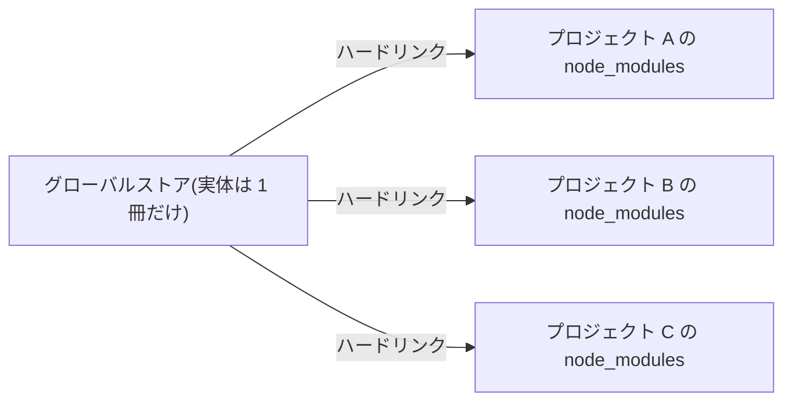
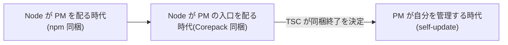

> 出典: Node.js Package Manager Guide(npmg) — https://npmg.yamauz.workers.dev/history/07-pnpm-and-next-gen.html

# 7. pnpm と新世代ツール

npm が土台を築き、yarn が競争を持ち込んだ——ここまでが前章までの物語でした。この章では第三の主役 pnpm の登場と、ランタイムごと作り直す Bun・Deno という新世代、そして 2026 年現在の勢力図までを一気に見渡します。Part II の総仕上げとして、「結局どれを選べばいいのか」にも本書なりの答えを出します。

**[ヒント] この章でわかること**

- pnpm が生まれた動機と、その基本コンセプトを説明できる
- Bun・Deno がパッケージマネージャーの地図のどこに位置するかを言える
- 2026 年時点の npm / yarn / pnpm / Bun の勢力図を把握できる
- Corepack の顛末と、いまパッケージマネージャーのバージョンをどう管理すべきかがわかる

## ディスクの無駄と緩さ — pnpm の動機

pnpm の最初のコミットは 2016 年 1 月で、以後 Zoltan Kochan 氏を中心に開発が進みました(v1 のリリースは 2017 年 6 月)。奇しくも yarn と同じ年に生まれていますが、ここで疑問が湧きます。yarn が「遅い・非決定的・オフラインに弱い」を解決したのなら、なぜもう 1 つ別のツールが必要だったのでしょうか。答えは、yarn が手を付けなかった問題にあります。yarn が「npm を速く、確実にする」ことを目指したのに対し、pnpm は当時の npm(そして yarn v1)が共有していた **2 つの構造的な問題**に切り込みました。

1 つめは**ディスクの無駄**です。3 章で見たとおり、npm も yarn v1 もプロジェクトごとに node_modules へパッケージの実ファイルをコピーします。10 個のプロジェクトで React を使えば、同じファイル一式がディスクに 10 回書き込まれる。プロジェクトが増えるほど、`node_modules` は「宇宙でもっとも重い物体」と揶揄される存在になっていきました。

2 つめは **hoisting の緩さ**です。npm v3 以降のフラット化は、宣言していないパッケージまで import できてしまう幽霊依存(phantom dependency)を常態化させました。動いているコードが、実は誰も宣言していない依存の上に立っている——この緩さは、依存を増やすほど静かにリスクを蓄積します。

速さのために正確さを犠牲にするのでも、その逆でもなく、**両方を同時に解決する**。pnpm の名は performant npm(高性能な npm)に由来しますが、その本質は性能と厳格さの両立にあります。

## pnpm のコンセプト — 詳細は 9 章で

pnpm の答えは、コピーをやめてリンクにすることです。仕組みの核心は 3 つの部品でできています。

- **グローバルストア(content-addressable store)**: すべてのパッケージのファイルを、マシン全体で 1 か所に、内容ベースで一度だけ保存する
- **ハードリンク(hard link)**: 各プロジェクトの node_modules には実ファイルをコピーせず、ストア内の実体を指すハードリンクを張る。10 プロジェクトで React を使っても、ディスク上の実体は 1 つ
- **シンボリックリンク(symbolic link)**: node_modules の中はフラット化せず、依存関係をシンボリックリンクの網で正確に表現する。ルートの node_modules には**自分が宣言した依存だけ**が見えるので、既定の構成ではアプリコードからの phantom dependency は起きない(厳密な条件は 9 章で扱います)

**[補足] 濃度盛汁流・三代目 — そして丼を離れる**

三代目にあたる pnpm が引き継いだのは、繁盛しているが厨房が散らかった店でした。丼には頼んでいない具材が乗り(全部乗せ)、同じ具材が棚のあちこちに重複して置かれている。

三代目の方針は 2 つです。ひとつ、**丼に乗せるのは品書きに書いたものだけ**。頼んでいない海苔は乗ってきません([3章](https://npmg.yamauz.workers.dev/basics/03-node-modules)の幽霊依存が起きないのはこれです)。ふたつ、**同じ具材を二度買わない**。店の裏に蔵を 1 つ構え、実体はそこに置く。

——ただし、1 玉の麺を 3 つの丼が同時に共有することは、現実の厨房では起こりません。三代目の蔵の話はここまで。この先は丼を離れ、書庫の話をします。

図書館にたとえるなら、npm/yarn v1 が「利用者全員に本の複製を 1 冊ずつ配る」方式だとすれば、pnpm は「本は書庫に 1 冊だけ置き、全員に貸出カードを渡す」方式です。ディスクという書架は節約され、しかも貸出カード(リンク)は台帳(package.json)に載っている本にしか発行されない——だから無断借用(phantom dependency)もできません。

この比喩を最小限の図にしておきます(書庫=ストア、貸出カード=リンク)。



**[注意] つまずきポイント**

「phantom dependency が原理的に発生しない」は、裏返せば「これまで偶然動いていた未宣言の import が、pnpm では**エラーになる**」ということです。既存プロジェクトを pnpm に切り替えた直後に `Cannot find module` が出たら、それは pnpm の不具合ではなく、いままで隠れていた宣言漏れが顕在化した合図です。正攻法は、その依存を package.json に明示的に追加すること。

「ハードリンクとシンボリックリンクはどう違うのか」「リンクをたどると実際に何が見えるのか」と気になった読者は、正しい勘所を掴んでいます。ただし本章では、意図的にこれ以上深入りしません。仕組みの詳細——ストアの構造、`.pnpm` ディレクトリ(virtual store)のレイアウト、リンクを 1 段ずつたどる様子——は [9章](https://npmg.yamauz.workers.dev/pnpm/09-how-pnpm-works)で、実際のディレクトリを掘りながら手を動かして確認します。歴史編のいまは「コピーではなくリンク」「フラット化しない」という 2 つのキーワードだけ持って先へ進めば十分です。

## ランタイムごと再発明する — Bun と Deno

2020 年代に入ると、「パッケージマネージャー単体」ではなく「JavaScript ランタイムごと」作り直す動きが現れます。

**Bun** は 2023 年に v1.0 が出た、Zig 言語で書かれたオールインワンツールです。Node.js 互換のランタイム、パッケージマネージャー(`bun install`)、バンドラー、テストランナーを 1 つのバイナリに同梱し、とにかく速度を武器にします。node_modules の構造自体は従来型に近いため、「ランタイムは Node のまま、インストールだけ Bun で」という使い方をするチームもあります。

**Deno** は、Node.js の原作者 Ryan Dahl 氏が Node の設計上の後悔を踏まえて作り直したランタイムです。パーミッションによるセキュリティモデルや標準ライブラリの充実など思想面の影響力は大きいものの、npm エコシステムとの互換性という点では独自路線であり、本書の主戦場(既存 Node.js プロジェクトのパッケージ管理)とはやや別の地図にいます。

[図 7-1 npm/yarn/pnpm/Bun の系譜図(2010〜2026)]

## 2026 年の勢力図

歴史の話を、現在の数字で締めくくりましょう。2026 年時点の各ツールの立ち位置は次のとおりです。

- **npm**: Node.js 同梱という配布力で、依然として**最大シェア**。「何も追加せずに使える標準」の座は揺らいでいません
- **yarn**: 現行の v4(Berry 系)は PnP を武器に大規模組織を中心に使われています。一方、前章で見たとおり多くの現場は v1 のまま
- **pnpm**: ダウンロード数は 2024 年比で 3 倍に伸び、2026 年 4 月時点で**週間約 6,000 万ダウンロード**、同年 8 月末には**約 1 億 7,500 万**に達しています(いずれも 2026-08-30 に npm レジストリの API で実測)。開発者調査 State of JS の継続利用意向(retention)では **2 年連続で Yarn を上回り**ました。2026 年 8 月 26 日には Rust で書き直された **pnpm 12** がリリースされています(コマンド・設定・lockfile は v11 互換。npm の `latest` タグは当面 v11 のままで、v12 は `pnpm self-update next-12` で導入する段階)
- **Bun**: ランタイムを含むオールインワンとして、速度面の対抗馬という位置づけ

伸び盛りの挑戦者だった pnpm は、「npm 互換のまま速く厳格に」という設計で、モノレポを中心に主要な選択肢のひとつとして定着したと言えます。

**[補足] なぜ pnpm まで Rust で書き直したのか**

pnpm 12 の Rust 化は「流行だから」ではありません。JavaScript 実装(v11)の時点で npm より数倍速かったものの、CI で毎日何百回も走るインストールの数秒は積もります。重要なのは、v12 が意図的に「マイグレーションにしない」方針を取ったことです。コマンドも設定も lockfile も引き継ぐ——yarn 2 の Berry が互換性を捨てて痛手を負った歴史の、明確な反省が読み取れます。

ただし「完全に同じ挙動」という意味ではありません。v12 にも破壊的変更はあります(git 依存を正規 HTTPS URL に解決する、`pnpm-workspace.yaml` の未知の設定キーがエラーになる、など)。移行時は公式のリリースノートで差分を確認してください。

## Corepack の顛末 — PM のバージョンは誰が管理するのか

ツールが複数ある世界では、新しい管理問題が生まれます。プロジェクトを pnpm で動かすと決めても、チームの A さんは pnpm 10、B さんは pnpm 11 を使っているかもしれない。バージョンが違えば、lockfile の書式や解決結果が食い違うこともあります。では、**パッケージマネージャー自身のバージョンは、誰が管理するべきなのでしょうか**。

Node.js の出した答えが **Corepack** でした。package.json の `packageManager` フィールド(例: `"packageManager": "pnpm@11.1.0"`)を読み取り、指定されたツールを指定されたバージョンで自動的に用意する仕組みを、Node.js 本体に同梱したのです。npm を同梱して事実上の標準にした成功体験(5 章)の延長線上にある、「Node がパッケージマネージャーの入口ごと配る」という発想でした。

ところがこの仕組みは、標準になる前に幕を下ろすことになりました。2025 年 3 月 19 日、Node.js の技術運営委員会(TSC)は **Node v25 以降で Corepack を同梱しない**ことを可決したのです。Node 14.19.0〜24.x(LTS の 24 を含む)には引き続き同梱されますが、Node 25 以降で使いたい場合は `npm install -g corepack` で別途インストールする必要があります。

つまり「誰が管理するのか」という問いの答えは、次の 3 つの時代を経て逆転しました。



では、いまはどう管理するのが正解でしょうか。実務的な指針は次の 3 点です。

- **`packageManager` フィールドは引き続き書く**: Corepack の同梱終了後も、このフィールド自体は各ツールや CI が参照する事実上の宣言として機能します
- **pnpm は自己完結の道具立てを持つ**: 自分自身の更新は `pnpm self-update`、さらに v11/v12 では Node.js のバージョン管理まで pnpm 側で担う `pnpm runtime set` が使えます。「Node が PM を配る」から「PM が Node ごと面倒を見る」への逆転です
- **Node 24 以前 + Corepack の現行構成は当面動く**: 慌てて剥がす必要はありませんが、新規プロジェクトで Corepack 前提の設計にするのは避けるのが無難です

**[注意] つまずきポイント**

`packageManager` フィールドは**宣言にすぎず、書いただけでは何も起きません**。宣言を読み取って実際にツールを用意する「実行者」(Corepack や各パッケージマネージャー)が別に必要です。Node 25 以降は Corepack が同梱されないため、「フィールドを書いたのにバージョンが切り替わらない」という混乱が起きえます。宣言(フィールド)と実行者(Corepack など)は別物、と覚えておいてください。

## どう選ぶか — 本書の立場

4 つのツールを、2 つの軸で整理してみます。横軸は「node_modules の作り方が従来型か、新方式か」、縦軸は「パッケージマネージャー専業か、ランタイム込みか」です。

[図 7-2 4 ツールのポジショニングマップ]

そのうえで、選び方の指針を正直に書きます。

- **npm** は「何も足したくない」プロジェクトの合理的な選択です。同梱されており、学習コストはゼロ。小さなツールや教材にはいまも最適です
- **yarn v4** は PnP の厳格さと速度を組織的に活かせる、専任のツーリング担当がいるような大規模組織に向きます
- **Bun** は、ランタイムごと乗り換える覚悟があるなら最速級の体験を提供します。ただしパッケージ管理の選定がランタイムの選定と一体になる点は理解しておくべきです
- **pnpm** は、node_modules という馴染みの土台と npm 互換の操作感を保ったまま、ディスク効率・速度・依存の厳格さ・モノレポ対応を手に入れられます。**新規プロジェクトでどれか 1 つ選ぶなら、本書は pnpm を推します**

もちろん、これは「pnpm 以外は間違い」という意味ではありません。npm で困っていないチームが移行する必要はありませんし、Berry の思想に共感するなら yarn v4 は優れた選択です。ただ、新しくプロジェクトを始めるとき、あるいはメンテナンスモードの yarn v1 から離れるときには、互換性を保った進化を選び続けてきた pnpm の設計哲学が、もっとも摩擦の少ない着地点になる——これが本書の立場です。

## 実験: pnpm の勢いを数字で確認する

npm レジストリはダウンロード統計の API を公開しています。pnpm 本体(これも 1 つの npm パッケージです)の直近 1 週間のダウンロード数を見てみます。

```sh
$ curl -s https://api.npmjs.org/downloads/point/last-week/pnpm
```

```json
{"downloads":175503782,"start":"2026-08-20","end":"2026-08-26","package":"pnpm"}
```

これは 2026-08-30 に実行した結果です。本文で触れた 2026 年 4 月時点の「週間約 6,000 万」から、数か月で 3 倍近くに伸びていることが確認できます(数値は実行する時期によって変わるので、手元の結果が違っていて当然です)。同じ API のパッケージ名を差し替えれば、任意のパッケージの普及度を手軽に定点観測できるので、技術選定の際の道具として覚えておくと便利です。

## まとめ

- pnpm は 2016 年 1 月に最初のコミットが行われ、Zoltan Kochan 氏を中心に開発が進んだ(v1 は 2017 年 6 月)。ディスクの無駄と hoisting の緩さを、グローバルストア + ハードリンク + シンボリックリンクで同時に解決する設計(詳細は 9 章)
- Bun(2023 年 v1.0、Zig 製)はランタイム込みのオールインワン、Deno は Node.js 原作者による再設計と、ランタイムごと作り直す潮流がある
- 2026 年現在、npm は同梱で最大シェア、yarn v4 は大規模組織中心、pnpm は週間約 1 億 7,500 万 DL・State of JS retention 2 年連続 Yarn 超えで主要選択肢に定着。pnpm 12 は Rust 書き直しながら v11 互換を貫く
- Corepack は Node 25 以降同梱されない(2025 年 3 月 TSC 決定)。`packageManager` フィールドの宣言と、pnpm 自身の `self-update` / runtime 管理が現在の実務解
- 新規プロジェクトなら pnpm が有力、というのが本書の立場。ただし文脈次第で npm / yarn v4 / Bun にもそれぞれ正当な適所がある

これで Part II の歴史編は終わりです。Part III では、モダンなパッケージマネージャーの内部構造を、最新世代の題材として pnpm を実際にインストールしながら深掘りしていきます。ここで学ぶ仕組み(内容アドレスのストア、リンクによる配置、厳格な依存解決)は、ツールを問わず通用する知識です。まずは最初の一歩から。→ [8章 pnpm はじめの一歩](https://npmg.yamauz.workers.dev/pnpm/08-getting-started)
