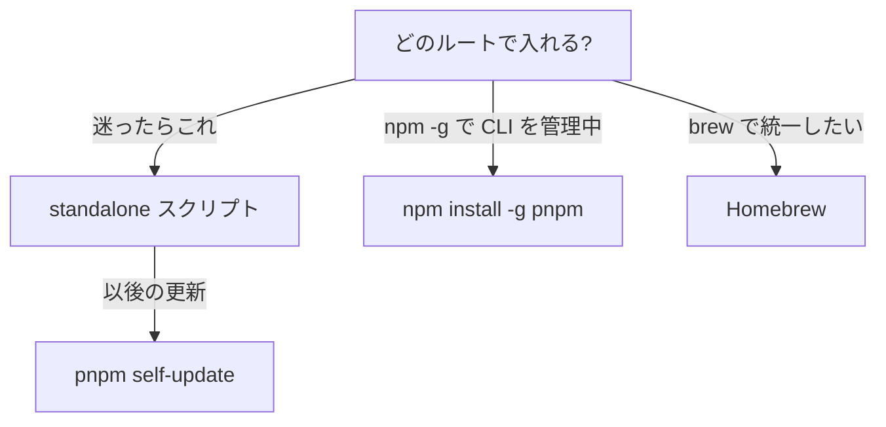

> 出典: Node.js Package Manager Guide(npmg) — https://npmg.yamauz.workers.dev/pnpm/08-getting-started

# 8. pnpm はじめの一歩

[7章](https://npmg.yamauz.workers.dev/history/07-pnpm-and-next-gen)では、pnpm が「ディスク効率」と「依存の厳格さ」を武器に生まれた経緯を見ました。ここからの Part III では、その pnpm を実際に手を動かしながら深掘りしていきます。まずはインストールと基本操作、つまり「pnpm のある生活」の初日です。

**[ヒント] この章でわかること**

- pnpm を 3 つのルートでインストールし、バージョンを管理できる
- `packageManager` フィールドでチームのバージョンを固定できる
- npm の知識を pnpm のコマンド体系に読み替えられる
- 最初のプロジェクトを作成し、開発サーバーを起動できる

## pnpm をインストールする 3 つのルート

pnpm の導入ルートは大きく 3 つあります。どれを選ぶのが正解なのでしょうか。先に結論を書いておきます — **迷ったら standalone スクリプト**です。

```sh
$ curl -fsSL https://get.pnpm.io/install.sh | sh -
```

standalone スクリプトは、pnpm を Node.js に依存しない単体バイナリとして入れます。後述の `pnpm self-update` で pnpm が自分自身を更新できるため、導入後の管理がいちばん素直です。本書もこのルートを前提に進めます。

2 つ目は、npm ユーザーにとっていちばん抵抗のない方法、npm でのグローバルインストールです。すでに npm で各種 CLI ツールを管理しているなら、これでも困りません。

```sh
$ npm install -g pnpm
```

3 つ目は macOS / Linux で定番の Homebrew です。「開発ツールは全部 brew で揃える」方針のマシンなら選択肢になりますが、バージョンアップのタイミングが Homebrew のリポジトリ更新に依存する点は覚えておいてください。

```sh
$ brew install pnpm
```

選び方を 1 枚にまとめると次のとおりです。



[図 8-1 pnpm の導入ルート 3 種]

**[補足] なぜ Corepack を使わないのか**

Node.js 14.19.0〜24.x(24 LTS を含む)には、パッケージマネージャーのバージョン管理ツール **Corepack** が同梱されており、`corepack enable pnpm` で pnpm を使い始めることもできます。しかし 2025-03-19、Node.js の TSC(技術運営委員会)は **Node 25 以降で Corepack を同梱しない**ことを可決しました。Node 25 以降で使うには `npm install -g corepack` と別途インストールが必要で、「Node に付いてくるから楽」という利点は失われています。pnpm 自身も `pnpm self-update`・`packageManager` フィールド・v11/v12 のランタイム管理(`pnpm runtime set`)で自己完結する方向に進んでいるため、本書では Corepack に依存しない導入を採用します。

## バージョンの確認と self-update

インストールできたら、バージョンを確認してみます。

```sh
$ pnpm --version
11.24.0
```

執筆時点(2026 年 8 月)では、npm の `latest` タグが指すのは **v11 系**(この時点の最新は 11.24.0)です。一方、2026-08-26 にリリースされた **v12 は Rust による書き直し版**で、当面は `next` 扱いです。試したい場合は `pnpm self-update next-12` で導入できます。本書の解説は v11 系を前提にしますが、v12 はコマンド・フラグ・設定・lockfile が v11 互換なので、そのまま読み替えられます([10章](https://npmg.yamauz.workers.dev/pnpm/10-advantages)で詳しく触れます)。

pnpm 本体の更新は、v10 で追加された `self-update` コマンド 1 つで済みます。

```sh
$ pnpm self-update
```

npm のように「npm で npm を更新する」のではなく、pnpm が自分自身を入れ替える点が standalone インストールと噛み合う設計です。

## チームでバージョンを固定する — `packageManager` フィールド

個人開発ならバージョンは自由ですが、チームでは「私の pnpm は v10、あなたは v11」という状態がトラブルの温床になります。そこで package.json の `packageManager` フィールドに、プロジェクトで使うパッケージマネージャーと正確なバージョンを宣言します。

```json
{
  "name": "my-app",
  "packageManager": "pnpm@11.24.0"
}
```

工具箱に「このネジは 2 番のドライバーで締める」とラベルを貼っておくようなものです。CI・同僚・未来の自分が、どのバージョンで lockfile が生成されたかを迷わずに済みます。[4章](https://npmg.yamauz.workers.dev/basics/04-lockfiles)で見たとおり lockfile は「仕入れ伝票」ですが、その伝票を書いたペン(パッケージマネージャーのバージョン)まで揃えるのがこのフィールドの役割です。pnpm 自身もこのフィールドを認識し、宣言と異なるバージョンでの実行を検知できます。

## 基本コマンド体系

pnpm のコマンドは、npm ユーザーなら半日で手に馴染みます。主要なものを一気に見てみましょう。

```sh
$ pnpm install          # package.json の依存をすべてインストール
$ pnpm add lodash       # 依存を追加(dependencies)
$ pnpm add -D vitest    # 開発依存として追加(devDependencies)
$ pnpm add -g pnpm      # グローバルに追加
$ pnpm remove lodash    # 依存を削除
$ pnpm run dev          # scripts の dev を実行
$ pnpm dev              # run は省略可(スクリプト名を直接実行できる)
$ pnpm dlx cowsay hello # 依存に追加せず一時取得して実行(npx 相当)
$ pnpm create vite      # プロジェクトの雛形を生成
```

ポイントは 3 つです。第一に、追加は `install` ではなく **`add`** です。pnpm では `install` は「package.json に書かれたものを揃える」専用で、役割が明確に分かれています。第二に、`pnpm dev` のように **`run` を省略してスクリプト名を直接実行**できます(pnpm の組み込みコマンド名と衝突しない限り)。第三に、`pnpm dlx`(エイリアス `pnpx`)は npx と同じく使い捨て実行ですが、v11 以降はセキュリティ機構(公開直後のパッケージの実行拒否)にも従います。これは[10章](https://npmg.yamauz.workers.dev/pnpm/10-advantages)で説明します。

**[注意] つまずきポイント**

`run` の省略記法には 1 つ罠があります。スクリプト名が pnpm の組み込みコマンドと同名の場合(たとえば `"install"` や `"add"` という名前のスクリプト)、**組み込みコマンドのほうが優先**されます。その場合は `pnpm run install` のように `run` を明示してください。

では `pnpm add` を 1 回だけ実行して、pnpm が何を報告してくるかを見てみましょう。空のプロジェクトに express を追加します。

```sh
$ mkdir add-lab && cd add-lab && pnpm init
$ pnpm add express
Packages: +66
Progress: resolved 66, reused 51, downloaded 15, added 66, done
Packages are cloned from the content-addressable store to the virtual store.
Done in 1.4s
```

コピペ用のコマンドと出力の全体は次のとおりです。

```sh
$ mkdir add-lab && cd add-lab && pnpm init
$ pnpm add express
```

```
Packages: +66
+++++++++++++
Progress: resolved 66, reused 51, downloaded 15, added 66, done
Packages are cloned from the content-addressable store to the virtual store.
  Virtual store is at:             node_modules/.pnpm

dependencies:
+ express 5.2.1

Done in 1.4s using pnpm v11.24.0
```

注目してほしいのは `Progress:` の行です。`resolved 66` は依存グラフとして解決したパッケージ数、`downloaded 15` はレジストリから実際に取得した数、そして `reused 51` は**このマシンで過去に一度使ったファイルを再利用した数**です(まっさらなマシンでの初実行なら `reused 0` になります)。npm の `added 68 packages` という素っ気ない報告と違い、pnpm は「どれだけ取得せずに済んだか」を毎回教えてくれます。では、どこから再利用しているのか — `Packages are cloned from the content-addressable store` という 1 行がその答えなのですが、「内容アドレスストア」とは何なのかは次章でじっくり解き明かします。

[図 8-2 pnpm コマンド体系マップ]

## npm ユーザーのための読み替え表

日常操作の読み替えは次の表だけで足ります。完全版のコマンド対照表(yarn を含む)は[付録A](https://npmg.yamauz.workers.dev/appendix/a-command-cheatsheet)にまとめてあるので、移行時はそちらを手元に置いてください。

| npm | pnpm |
| --- | --- |
| `npm install` | `pnpm install` |
| `npm install lodash` | `pnpm add lodash` |
| `npm install -D vitest` | `pnpm add -D vitest` |
| `npm uninstall lodash` | `pnpm remove lodash` |
| `npm run dev` | `pnpm dev`(`pnpm run dev` も可) |
| `npx create-vite` | `pnpm dlx create-vite` |

## 実験: 最初のプロジェクトを作って動かす

それでは実際に、Vite のプロジェクトを 1 つ作ってみます。まず、これから行う作成〜インストールの流れを通しで見てみましょう。

```sh
$ pnpm create vite my-app
Scaffolding project in /Users/you/pm-sandbox/my-app...
Done.
$ cd my-app
$ pnpm install
Packages: +11
Progress: resolved 11, reused 0, downloaded 11, added 11, done
Done in 3.4s using pnpm v11.24.0
$ pnpm dev
VITE v7.1.3  ready in 320 ms
Local:   http://localhost:5173/
```

同じことを手元で再現していきます。実験用ディレクトリ(例: `~/pm-sandbox`)で次を実行してください。

```sh
$ pnpm create vite my-app
```

```
✔ Select a framework: › Vanilla
✔ Select a variant: › TypeScript

Scaffolding project in /Users/you/pm-sandbox/my-app...

Done. Now run:

  cd my-app
  pnpm install
  pnpm run dev
```

案内どおりに依存をインストールし、開発サーバーを起動します。

```sh
$ cd my-app
$ pnpm install
```

```
Packages: +11
+++++++++++
Progress: resolved 11, reused 0, downloaded 11, added 11, done

devDependencies:
+ typescript 5.9.2
+ vite 7.1.3

Done in 3.4s using pnpm v11.24.0
```

```sh
$ pnpm dev
```

```
> my-app@0.0.0 dev /Users/you/pm-sandbox/my-app
> vite

  VITE v7.1.3  ready in 320 ms

  Local:   http://localhost:5173/
```

ブラウザで `http://localhost:5173/` を開けば、Vite の初期画面が表示されます。ここまでは npm とほぼ同じ体験のはずです。では最後に、node_modules の中を軽く覗いてみましょう。

```sh
$ ls -la node_modules | head
```

```
total 16
drwxr-xr-x   7 you  staff  224  8 29 10:12 .
drwxr-xr-x  10 you  staff  320  8 29 10:12 ..
drwxr-xr-x   4 you  staff  128  8 29 10:12 .bin
-rw-r--r--   1 you  staff  607  8 29 10:12 .modules.yaml
drwxr-xr-x  14 you  staff  448  8 29 10:12 .pnpm
lrwxr-xr-x   1 you  staff   47  8 29 10:12 typescript -> .pnpm/typescript@5.9.2/node_modules/typescript
lrwxr-xr-x   1 you  staff   35  8 29 10:12 vite -> .pnpm/vite@7.1.3/node_modules/vite
```

[3章](https://npmg.yamauz.workers.dev/basics/03-node-modules)で見た npm の node_modules とは、明らかに様子が違います。数百のパッケージがフラットに並ぶ代わりに、`.pnpm` という見慣れないディレクトリと、そこへ向かう矢印(`->`)付きのエントリ、つまり**シンボリックリンク**だけが並んでいます。この「矢印の正体」こそが pnpm の心臓部です。

**[注意] つまずきポイント**

node_modules の直下にパッケージの実体が見当たらなくても、壊れていません。それが pnpm の正常な姿です。ここで慌てて `npm install` を打ち直すと、npm が npm 流のフラットな node_modules と package-lock.json を作り始め、lockfile が二重になって本当に壊れます。1 つのプロジェクトで使うパッケージマネージャーは 1 つに揃えてください。

## まとめ

- pnpm の導入は standalone スクリプト・`npm install -g pnpm`・Homebrew の 3 ルート。**迷ったら standalone スクリプト**。Corepack は Node 25 以降同梱されないため本書では推奨しない
- 執筆時点の最新は v11 系(npm の `latest`)。Rust 版の v12 が `next` として公開済みで、`pnpm self-update` で本体を更新できる
- チームでは package.json の `packageManager` フィールドでバージョンを固定する
- 追加は `pnpm add`(`-D` / `-g`)、削除は `pnpm remove`、スクリプトは `pnpm dev` と直接実行できる。使い捨て実行は `pnpm dlx`。インストール出力の `reused` は「取得せずに再利用した数」を示す
- node_modules の中身は npm と大きく異なり、`.pnpm` ディレクトリとシンボリックリンクで構成される

次章では、この「様子の違う node_modules」の正体、つまり pnpm のストアとリンクの 3 層構造を解説します。本書の技術的ハイライトです。
