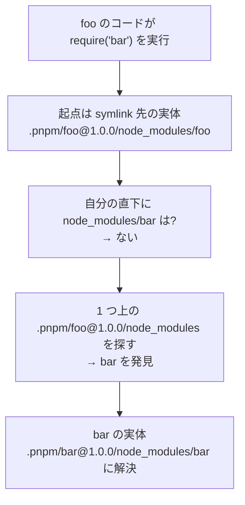
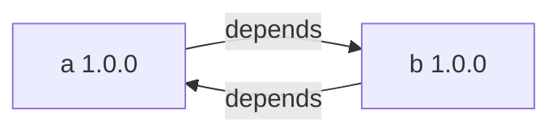
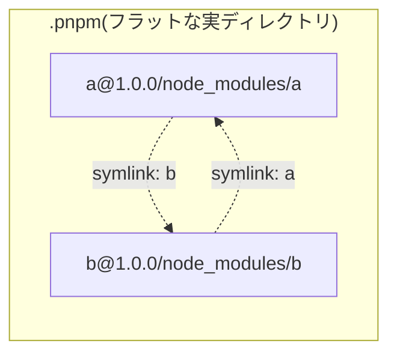
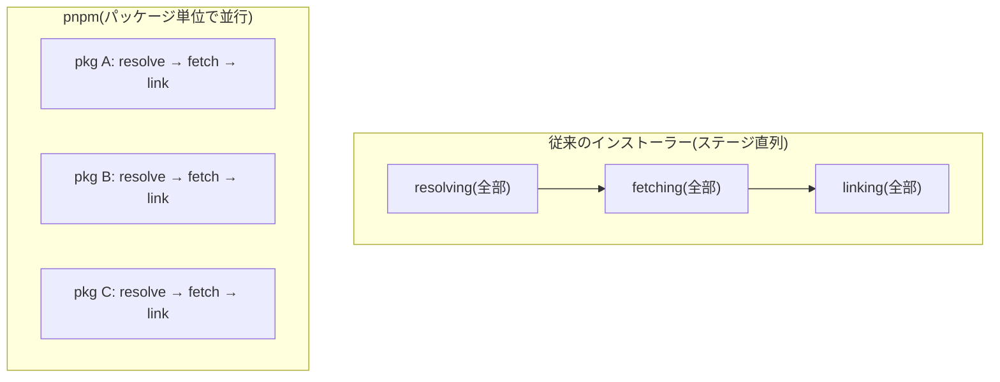

> 出典: Node.js Package Manager Guide(npmg) — https://npmg.yamauz.workers.dev/pnpm/09-how-pnpm-works.html

# 9. pnpm の仕組み — ストアとリンク

[8章](https://npmg.yamauz.workers.dev/pnpm/08-getting-started)の実験で、pnpm の node_modules には `.pnpm` ディレクトリとシンボリックリンクしかないことを確認しました。[3章](https://npmg.yamauz.workers.dev/basics/03-node-modules)で学んだ npm のフラットな node_modules とはまるで別物です。この章では、pnpm がなぜこの構造を選んだのか、その中で何が起きているのかを解き明かします。本書全体の技術的ハイライトなので、じっくり読み進めてください。

**[ヒント] この章でわかること**

- content-addressable store と「ハードリンク(または CoW クローン)」の関係を説明できる
- `.pnpm` 内のフォルダ名とシンボリックリンクの規則を、公式の最小例で読み解ける
- シンボリックリンクを挟んでも `require` の解決が変わらない理由(realpath)を説明できる
- phantom dependency と循環依存が「構造的に」問題にならない理由を説明できる

## 全体像 — 3 層構造をつかむ

pnpm のインストール結果は、次の 3 層でできています。

1. **グローバルな content-addressable store** — 既定ではマシンに 1 つ(`storeDir` 設定で変更可)。プロジェクト間で共有され、パッケージのファイル実体はここに置かれる
2. **プロジェクトの virtual store(`node_modules/.pnpm`)** — ストア内のファイルへの**ハードリンク(macOS/APFS ではコピーオンライトのクローン。後述)**として、各パッケージを組み立てた場所
3. **ルートの node_modules** — `.pnpm` 内のパッケージへの**シンボリックリンク**。package.json に宣言した依存の分だけ並ぶ

3 層のつながりを図にすると次のようになります。


図書館に例えると、ストアは**閉架書庫**です。本(ファイル)の実体は書庫に 1 冊だけあります。`.pnpm` は各プロジェクトの**閲覧室**で、そこに置かれているのは本のコピーではなく「同じ本そのものを指す索引カード」(ハードリンクまたはクローン)。そしてルートの node_modules は閲覧室の入口にある**案内板**(シンボリックリンク)で、あなたが借りると申告した本のカードだけが載っています。

[図 9-1 store → hardlink → symlink の 3 層全体図(未配置)]

## 第 1 層: content-addressable store

「content-addressable(内容アドレス方式)」とは、ファイルを**名前ではなく内容のハッシュ値で格納する**方式です。`lodash/index.js` という名前で保存するのではなく、ファイル内容から計算したハッシュをキーにして保存します。ストアの場所は `pnpm store path` で確認でき、macOS なら `~/Library/pnpm/store` 配下です。

この方式の帰結は 2 つあります。第一に、**同じ内容のファイルはマシン全体でディスク上に 1 回しか存在しません**。10 個のプロジェクトが同じ lodash を使っていても、実体は 1 つです。第二に、**バージョン更新時は差分ファイルだけが追加されます**。あるパッケージが 100 ファイルからなり、新バージョンで変わったのが 1 ファイルだけなら、ストアに追加されるのはその 1 ファイルだけ。残り 99 ファイルは内容が同じ、つまりハッシュが同じなので、既存の実体がそのまま使われます。

では、ストアからプロジェクトへはどう「配置」するのでしょうか。コピーしていたら node_modules の数だけディスクを食い、内容アドレスの意味がありません。pnpm の答えは**ハードリンク**——「1 つのファイル実体に複数の名前(パス)を付ける」仕組み——です。コピーと違いディスク消費はほぼゼロで、配置は名前を 1 つ増やすだけなので高速です。

ただし、ここに OS ごとの違いが 1 つあります。**macOS(APFS)では、pnpm は既定でハードリンクではなくコピーオンライト(Copy-on-Write、CoW)の「クローン」を使います**(設定 `packageImportMethod` の既定値 `auto` の挙動。Linux の一般的なファイルシステムではハードリンク)。実際、macOS でインストールすると次のメッセージが表示されます。

```
Packages are cloned from the content-addressable store to the virtual store.
```

クローンは「共有マニュアルのコピー機」のようなものです。全員が同じ原本のディスクブロックを共有して読み、**誰かが書き込もうとした瞬間にだけ**、その部分のコピーが作られて分離します。読むだけなら実体は 1 つのまま——ディスク節約の効果はハードリンクと同じで、さらに「あるプロジェクトがファイルを書き換えてもストアの原本が汚れない」という安全性が加わります。本書では以降、この配置を「ハードリンク(または CoW クローン)」と表記します。

なお v11 ではストアの内部形式が Store v11 に更新され、インデックスに SQLite が採用されています。

**[注意] つまずきポイント — `du` の数字が同じでも、ディスクは共有されている**

「本当に節約されているのか」を `du -sh node_modules` で確かめようとすると、混乱します。pnpm のプロジェクトでも npm とほぼ同じ 3.7M と表示されるからです。しかし **du が数えるのは論理サイズ**で、クローンやハードリンクが共有している物理ブロックの重複までは見抜けません。実際には各プロジェクトの node_modules はストアと同じブロックを指しており、2 つ目のプロジェクトを作っても物理的な消費はほとんど増えません。「du の数字が同じ=節約されていない」ではないのです。同様に、macOS では `ls -l` のリンク数も 1 のままです(ハードリンクではなくクローンだから)。数字の読み方は章末の実験で確かめます。

[図 9-4 複数プロジェクトが 1 つの store を共有する図(未配置)]

## 第 2 層: virtual store `.pnpm` のレイアウト

`.pnpm` の中は、一見すると呪文のようなフォルダ名が並びますが、規則は単純です。規則を一般論で覚える前に、公式ドキュメントが使う**最小の例**を見るのが早道です。なお公式もこの例に「peer dependencies を持つパッケージがない場合の構造を説明したもの」という但し書きを付けています。peer が絡むとフォルダ名が変わる話は、この節の最後で扱います。「foo@1.0.0 が bar@1.0.0 に 1 つだけ依存している」——それだけのプロジェクトを pnpm でインストールすると、node_modules はこうなります(`<store>` はグローバルストアからのハードリンク/クローンを表します)。

```
node_modules
├── foo -> ./.pnpm/foo@1.0.0/node_modules/foo
└── .pnpm
    ├── bar@1.0.0
    │   └── node_modules
    │       └── bar -> <store>
    └── foo@1.0.0
        └── node_modules
            ├── foo -> <store>
            └── bar -> ../../bar@1.0.0/node_modules/bar
```

パッと見は複雑ですが、リンクは 4 本しかありません。1 本ずつ読み解きましょう。

- **`node_modules/foo -> ./.pnpm/foo@1.0.0/node_modules/foo`** — 入口の案内板。あなたが宣言した foo だけが、`.pnpm` 内の実体を指すシンボリックリンクとして置かれます
- **`.pnpm/foo@1.0.0/node_modules/foo -> <store>`** — foo の実体。ストアからのハードリンク(または CoW クローン)で組み立てられた、本物のファイルたちです
- **`.pnpm/bar@1.0.0/node_modules/bar -> <store>`** — 同じく bar の実体
- **`.pnpm/foo@1.0.0/node_modules/bar -> ../../bar@1.0.0/node_modules/bar`** — ここが核心です。「foo は bar に依存する」という**依存グラフの矢印 1 本**が、隣の部屋への**相対シンボリックリンク 1 本**として表現されています

つまり `.pnpm` 直下には「このプロジェクトが使う全パッケージ × 全バージョン」が `` `<pkg>@<version>` `` 形式で**フラットに**並び、パッケージ間の依存関係は各部屋の中のシンボリックリンクで張り直されている、という二層構造です。実体の部屋は必ず次の場所にあります。

```
node_modules/.pnpm/<pkg>@<version>/node_modules/<pkg>
```

[図 9-2 .pnpm 内のレイアウト詳細(未配置)]

**[補足] なぜ `foo@1.0.0` の直下ではなく、さらに `node_modules/foo` と一段深いのか**

理由は 2 つあります。①**自己 require を可能にするため**。パッケージが自分自身のモジュールを `require('foo/package.json')` のようにフルパスで参照するケースがあり、Node.js の解決アルゴリズム上、自分の親に `node_modules/foo` が必要です。②**循環シンボリックリンクを避けるため**。依存のリンクを実体と同じ `node_modules` フォルダに並べて置けるので、foo と bar が相互依存していても、リンクはすべて「隣のフォルダへの横方向のリンク」で済み、たどると無限ループになるような循環リンクが生まれません(この章の後半で詳しく見ます)。

もう 1 つ、フォルダ名には重要なバリエーションがあります。ここまでの最小例は peer dependencies を持たない場合の構造でした(公式ドキュメントの当該ページも、その前提を明記しています)。peer dependencies を持つパッケージでは、**どの peer と組み合わせて解決されたか**がフォルダ名に刻まれます。

```
node_modules/.pnpm/foo@1.0.0(react@16.14.0)/node_modules/foo
```

同じ `foo@1.0.0` でも、react@16 と組む場合と react@17 と組む場合では別フォルダになり、それぞれ正しい peer に解決されます。なお、こうした修飾でパスが長くなりすぎる場合、v10 以降はフォルダ名の一部が SHA256 ハッシュに置き換えられます。

## 「Node は symlink を無視する」— require が壊れない理由

ここで当然の疑問が湧きます。**こんなにシンボリックリンクだらけで、Node.js は特別な対応なしに動くのでしょうか?** require のたびにリンクの迷路を解読する必要があるなら、遅そうですし、壊れそうです。

答えは「特別な対応は一切不要」。鍵は、Node.js のモジュール解決が**「require を実行したファイルの実際の場所(realpath)」を起点にする**ことです。シンボリックリンク経由で読み込まれたモジュールでも、Node.js は解決の起点を決める瞬間にリンクを実体のパスへ「剥がし」ます。公式ドキュメントはこれを "Node ignores symlinks"(Node はシンボリックリンクを無視する)と表現しています。

先ほどの foo/bar の例で、foo の中のコードが `require('bar')` を実行する様子を追ってみましょう。



順に確認します。foo のコードの実体は `.pnpm/foo@1.0.0/node_modules/foo` の中にあります(ルートの `node_modules/foo` は案内板にすぎません)。Node.js はこの**実体の場所**から、[3章](https://npmg.yamauz.workers.dev/basics/03-node-modules)で学んだルールそのままに探索を始めます。自分の直下に `node_modules` はない。では 1 つ上——そこは `.pnpm/foo@1.0.0/node_modules` で、**bar へのシンボリックリンクがちょうど置いてある**場所です。たった 1 階層で発見。リンクの先の実体が読み込まれて、解決完了です。

つまり pnpm は、Node.js の解決アルゴリズムを 1 ミリも変えていません。**Node.js から見ると、pnpm の node_modules は npm v2 の「正しいネスト構造」に見えている**のです。各パッケージの隣には、そのパッケージが宣言した依存だけが(リンクとして)並んでいる——探索ルールは 3 章のまま、hoisting のような妥協だけが消えている。これが「pnpm は完全に Node.js 互換」と言われる理由です。

## 循環依存でも壊れない — グラフは symlink が表現する

3 章で「ツリーはグラフの合流も**循環**も表現できない」と言いました。では、A が B に依存し、B が A に依存する——npm レジストリに実在する循環依存——を pnpm はどう配置するのでしょうか。symlink をたどって無限ループしそうな気がします。

まず、依存グラフの側はたしかに循環しています。



しかし、pnpm がディスクに作る実ディレクトリは**循環しません**。`.pnpm` 直下に a と b の部屋がフラットに並び、互いへの参照は「隣の部屋への相対 symlink」になるだけです。



ポイントは、**ディレクトリの「入れ子」に循環がない**ことです。npm v2 のような物理ネストで循環を表現しようとすると、`a/node_modules/b/node_modules/a/node_modules/b/...` と無限の深さが必要になり、原理的に不可能です。pnpm は発想を分離しました。**グラフのノード(パッケージ実体)は `.pnpm` 直下の平らな部屋に、グラフの辺(依存)は symlink に**。symlink は「参照」なので循環していても構いません。前のセクションで見たとおり、Node.js は require のたびに realpath へ剥がして 1 ホップずつ解決するだけで、リンクを無限にたどり続けることはないのです。

先ほどの info コラムの理由②も、ここで腹落ちするはずです。依存への symlink を実体と同じ `node_modules` に**並べて**置く(`a@1.0.0/node_modules/` の中に実体 `a` とリンク `b` が同居する)からこそ、リンクが常に「1 つ上へ出て、隣の部屋へ入る」横方向で済み、リンクの中にリンクが入れ子になる事態を避けられます。

この設計の帰結として、**依存グラフがどれだけ深くても(foo > bar > qar > ...)、ディレクトリの物理的な深さは常に一定**です。深さも循環も、すべて symlink が肩代わりしてくれるからです。

## 第 3 層: ルートの symlink — phantom dependency の防止

いよいよ[3章](https://npmg.yamauz.workers.dev/basics/03-node-modules)の伏線回収です。npm のフラットな node_modules では、hoisting によって**宣言していない推移的依存までルート直下に並び**、`import` できてしまうのでした。これが幽霊依存(phantom dependency)です。

pnpm のルート node_modules に並ぶシンボリックリンクは、**package.json に直接宣言した依存の分だけ**です。8章の実験で `typescript` と `vite` の 2 つしか見えなかったのはこのためです。vite が内部で使っている rollup や postcss は `.pnpm` の中にはありますが、ルートにリンクがないため、アプリコードから `import 'rollup'` すると **Node.js の解決アルゴリズムの時点で失敗**します。lint ルールや心がけではなく、ディレクトリ構造そのものが未宣言の import を物理的に遮断する。これが pnpm の「厳格さ」の正体です。

正確には、pnpm のデフォルトは「semi-strict(準厳格)」です。すべての依存は `.pnpm/node_modules` という隠れた場所に hoist されており、**依存パッケージ同士**は Node.js の親ディレクトリ探索でそこに届きます。つまり「行儀の悪いライブラリが未宣言の依存を require している」ケースは動いてしまいます(壊さないための互換措置です)。一方、**アプリコードからは届かない**ため、あなたのコードに幽霊依存が混入することはありません。この hoist は `hoist` 設定で無効化でき、完全に厳格な構造にもできます。

[図 9-3 npm の flat な node_modules と pnpm の strict な node_modules の対比(未配置)]

## 副産物: ネストの深さが一定になる

npm v2 以前のネスト型 node_modules は、依存の連鎖がそのままディレクトリの深さになり、Windows のパス長制限(伝統的に 260 文字)を突き破る問題を抱えていました([3章](https://npmg.yamauz.workers.dev/basics/03-node-modules))。pnpm の構造では、どんなに依存グラフが深くても、物理的なパスは常に `` `node_modules/.pnpm/<pkg>@<version>/node_modules/<pkg>` `` という**一定の深さ**に収まります。グラフの「深さ」はシンボリックリンクという横方向の参照で表現されるため、ディレクトリは深くならないのです。Windows パス長問題は、この設計の副産物として解決されています。

## インストールの 3 ステージ — 並行パイプライン

構造の話の締めくくりに、**速度**の仕組みにも触れておきます。パッケージマネージャーのインストールは、大きく 3 つのステージからなります。

1. **resolving(解決)** — 依存グラフを計算し、必要な全パッケージとバージョンを確定する
2. **fetching(取得)** — パッケージをレジストリからダウンロードする(pnpm ではストアへ)
3. **linking(配置)** — node_modules を組み立てる(pnpm ではハードリンク/クローンと symlink)

従来のインストーラーはこれを**直列**に実行していました。全依存の解決が終わるまで 1 バイトもダウンロードせず、全ダウンロードが終わるまで配置を始めない。一方 pnpm は、この 3 ステージを**パッケージ単位で並行**に流します。あるパッケージの取得を待っている間に、解決済みの別のパッケージはもう配置が始まっている——工場の流れ作業のようなパイプラインです。



ストアに実体があれば fetching はスキップされ、linking はコピーではなくリンク作成なので一瞬です。次の実験で見る `Done in 1.4s` や、2 回目以降の `downloaded 0` の背景には、この構造があります。

## 実験: express を npm と pnpm で比べる

[3章](https://npmg.yamauz.workers.dev/basics/03-node-modules)では npm で express をインストールし、hoisting の副作用を観察しました。今度は**まったく同じ express** を pnpm でインストールし、3 層構造と厳格さを実測で確かめます。

```sh
$ mkdir -p ~/pm-sandbox/pnpm-demo && cd ~/pm-sandbox/pnpm-demo
$ pnpm init
$ pnpm add express
```

```
Packages: +66
++++++++++++++++++++++++++++++++++++++++++++++++++++++++++++++++++
Progress: resolved 66, reused 51, downloaded 15, added 66, done
Packages are cloned from the content-addressable store to the virtual store.
  Virtual store is at:             node_modules/.pnpm

dependencies:
+ express 5.2.1

Done in 1.4s
```

出力がすでに雄弁です。`reused 51, downloaded 15` は、66 パッケージのうち 51 個が**ストアにあった実体の再利用**で、ダウンロードしたのは 15 個だけだったことを示します(まっさらなマシンなら全数ダウンロードになります)。そして "Packages are **cloned** from the content-addressable store" ——pnpm 自身が「クローン」と言っています。第 1 層で見た CoW クローンの実物です。

ルートの node_modules を覗きます。

```sh
$ ls -a node_modules
.  ..  .modules.yaml  .package-map.json  .pnpm  .pnpm-workspace-state-v1.json  express
```

npm では 65 個のパッケージが平らに並んでいた場所に、**管理ファイルと `.pnpm` を除けば `express` しかありません**。しかもそれはシンボリックリンクです。

```sh
$ readlink node_modules/express
.pnpm/express@5.2.1/node_modules/express
```

実体の並ぶ `.pnpm` の中はどうでしょうか。

```sh
$ ls node_modules/.pnpm | head -3
accepts@2.0.0
body-parser@2.3.0
bytes@3.1.2
$ ls node_modules/.pnpm | grep content-type
content-type@1.0.5
content-type@2.1.0
```

全パッケージが `` `<pkg>@<version>` `` 形式でフラットに並び、**content-type は 1.0.5 と 2.1.0 が堂々と同居**しています。名前にバージョンが入っているので、同名衝突がそもそも起きないのです。3 章では 2.1.0 が 3 か所にコピーされる doppelgänger を見ましたが、pnpm では**部屋は各バージョン 1 つずつ、計 2 つだけ**。誰がどちらを使うかは `pnpm why` で確認できます。

```sh
$ pnpm why content-type
```

```
content-type@1.0.5
└─┬ express@5.2.1
  └── pnpm-demo@1.0.0 (dependencies)

content-type@2.1.0
├─┬ body-parser@2.3.0
│ └─┬ express@5.2.1 …
├─┬ negotiator@1.1.0
│ └─┬ accepts@2.0.0 …
└─┬ type-is@2.1.0 …
```

express 本体は 1.0.5 を、body-parser たち孫は 2.1.0 を——npm とまったく同じ解決結果を、コピーなしで配置できています。次に express の「部屋」を見ると、foo/bar の最小例がそのまま拡大されていることがわかります。

```sh
$ ls node_modules/.pnpm/express@5.2.1/node_modules | wc -l
      29
$ cd node_modules/.pnpm/express@5.2.1/node_modules
$ readlink accepts body-parser content-disposition
../../accepts@2.0.0/node_modules/accepts
../../body-parser@2.3.0/node_modules/body-parser
../../content-disposition@1.1.0/node_modules/content-disposition
$ cd ~/pm-sandbox/pnpm-demo
```

29 個の中身は「express の実体 1 つ+直接依存 28 個への相対 symlink」。すべて `../../<pkg>@<version>/node_modules/<pkg>` という横方向のリンクで、依存グラフの矢印がそのまま並んでいます。

### 対決: 同じ phantom.js の運命が分かれる瞬間

いよいよ本番です。3 章で作った 2 行のファイル `phantom.js` を、pnpm のプロジェクトにも置きます。

```js
// phantom.js — package.json に書いていないパッケージを require してみる
const bp = require('body-parser')
console.log(typeof bp)
```

まず npm 側(3 章の flat-lab)。body-parser は未宣言なのに──

```sh
$ cd ~/pm-sandbox/flat-lab
$ node phantom.js
function
```

次に pnpm 側。**同じコード、同じ express@5.2.1 依存**です。

```sh
$ cd ~/pm-sandbox/pnpm-demo
$ node phantom.js
Error: Cannot find module 'body-parser'
```

コピペ用に静的な形でも載せておきます。

```sh
$ cd ~/pm-sandbox/flat-lab && node phantom.js
function
$ cd ~/pm-sandbox/pnpm-demo && node phantom.js
Error: Cannot find module 'body-parser'
```

ここが本書のハイライトです。npm では「たまたまルートに hoist されていたから」動いてしまった未宣言の require が、pnpm では**インストール直後から確実に失敗**します。body-parser の実体は `.pnpm` の中に確かにあるのに、ルートに symlink がないため、アプリコードからの探索は届かない。エラーが出るのは意地悪ではなく、「package.json に書いてから使ってください」という契約の強制です。事故は本番デプロイの日ではなく、コードを書いたその場で見つかります。

### クローンと再利用を数字で確かめる

最後に、第 1 層の主張を数字で検証します。まずリンク数です。

```sh
$ ls -l node_modules/.pnpm/express@5.2.1/node_modules/express/index.js | awk '{print $2}'
1
```

ハードリンクなら「ストア内の実体」と「この部屋」の 2 か所から参照されてリンク数 2 以上になるはずですが、**1** です。これこそが APFS のクローンの証拠——リンク数を増やさずに、ディスクブロックだけを共有しているのです。そして du を見ると──

```sh
$ du -sh node_modules
3.7M	node_modules
```

npm の 3.8M とほぼ同じに見えます(pnpm 側のファイル実体数は 589)。しかし先ほどの「つまずきポイント」のとおり、これは論理サイズです。物理ブロックはストアと共有されており、その効果は 2 つ目のプロジェクトを作った瞬間に表れます。

```sh
$ mkdir ~/pm-sandbox/pnpm-demo2 && cd ~/pm-sandbox/pnpm-demo2
$ pnpm init
$ pnpm add express
Packages: +66
Progress: resolved 66, reused 66, downloaded 0, added 66, done
Done in 413ms
```

```sh
$ mkdir ~/pm-sandbox/pnpm-demo2 && cd ~/pm-sandbox/pnpm-demo2
$ pnpm init && pnpm add express
```

```
Packages: +66
Progress: resolved 66, reused 66, downloaded 0, added 66, done
Done in 413ms
```

`reused 66, downloaded 0`。ネットワークには 1 バイトも触れず、ストアからのリンク作成だけで node_modules が組み上がり、初回の 1.4 秒が **413 ミリ秒**になりました。プロジェクトを 10 個作っても、express 一式の実体はマシンに 1 つのままです。

## まとめ

- pnpm は「グローバルストア → ハードリンク(macOS/APFS では CoW クローン) → シンボリックリンク」の 3 層構造で node_modules を組み立てる。`du` の論理サイズやリンク数 1 に惑わされず、物理ブロックは共有されていると読む
- ストアは content-addressable で、同じ内容のファイルはマシン全体で 1 回だけ保存され、バージョン更新は差分ファイルのみ追加される。2 つ目のプロジェクトは `reused 66, downloaded 0` で一瞬
- 実体は `` `node_modules/.pnpm/<pkg>@<version>/node_modules/<pkg>` `` に置かれ、依存グラフの矢印は隣の部屋への相対 symlink で表現される。一段深い構造は自己 require と循環 symlink 回避のため。peer は `foo@1.0.0(react@16.14.0)` のようにフォルダ名で区別される
- Node.js は require の起点を realpath で決めるため、symlink を挟んでも解決アルゴリズムは 3 章のまま(完全互換)。グラフが循環・深化してもディレクトリは常に一定の深さで、循環依存も Windows パス長問題も構造的に消える
- ルートには宣言済み依存の symlink だけが並ぶため、phantom dependency は `Cannot find module` で即座に検出される(デフォルトは semi-strict で、依存同士は `.pnpm/node_modules` 経由で解決できる)。さらに resolving / fetching / linking の並行パイプラインがインストールを速くする

次章では、この構造が実務にもたらす具体的なメリット、ディスク効率・速度・厳格さ・セキュリティなどのアドバンテージを総覧します。
